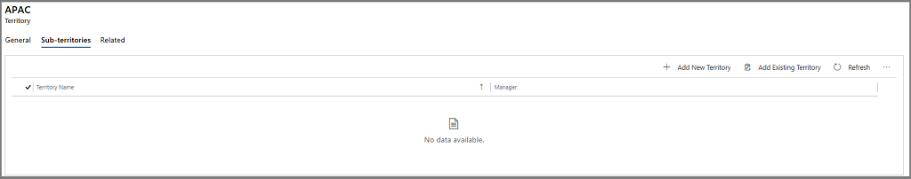

# Set up sales territories to organize business markets by geographical area

<!-- legacy procedure -->

Improve sales potential and revenues by creating territories for customer and market segments in customer engagement apps (Dynamics 365 Sales, Dynamics 365 Customer Service, Dynamics 365 Field Service, Dynamics 365 Marketing, and Dynamics 365 Project Service Automation). Then assign appropriate sales people to handle the sales and revenue opportunities for those territories.  
  
Sales territories improve the sales potential because the members of a territory are focused on the services or sales within that territory. You can associate the financials directly with a territory and its members, which simplify business analysis. Also, based on the sales territory type and size, you can define sales methodologies and the training required for those locations.  

Organizations can create a model and visualize their sales territories in a hierarchical format using out-of-the-box territory hierarchical relationship.

> [!IMPORTANT]
> - For a new organization that provisions Dynamics 365 Sales, the territory hierarchical relationship will be available and enabled by default.
> - For existing customers upgrading to the latest release, if the organization doesn't already have a hierarchical relationship created for the Territory entity, the hierarchical relationship will be available and enabled. If the organization has a hierarchical relationship created for territory, the new out-of-the-box territory hierarchical relationship will be available but not enabled.

## Create a sales territory (Sales Hub app)

1.    Make sure that you have the Manager, Vice President, CEO-Business Manager, System Administrator, or System Customizer security role or equivalent permissions.

2.    In the web app, select the Site map icon , then select ellipsis , and then select **Sales Territories**.
 
3.    To create a new sales territory, on the command bar, select **New**.

4.    In the sales territory form, fill in your information.

      a.    **Name**. Enter the geographical name for the territory such as the name of a city, country/region, or a state.

      b.    **Manager**. Enter the name of the user who is the manager for this territory. This person would typically assign leads to salespeople.

      > [!Important]
      > You can't allocate the same user to multiple territories. If you need to assign a user to a larger area (more than one existing territory), create a new territory that includes the existing territories, and then assign the user to that new territory.
        
      d.  **Parent**. Select the Lookup icon to select a parent territory. The current territory will be added as a child territory to the selected territory. For example, If you are creating sales territories California and Washington, and you can add United States of America as a parent so that a parent-child relationship is created between the sales territories and parent territory. 
      
      c.    **Description**. Enter any details that you'd like to include for this territory, for example, "Sales territory created for education and training."

5.    When you're done, on the command bar, select **Save**.

6.    Select the **Related** tab, and then select **Members**.

      
 
7.    On the **Members** tab, select **Add members**.

8.    In the **Lookup Records** pane, select the search icon, select a user record, and then select **Add**.

      

9. To add sub territories to this territory, select the **Sub-territories** tab, and select **Add New Territory**. 
 
    

    Enter the necessary information and select **Save**. This territory will be added as a sub territory in the Sub-territories grid.

10.    Select **Save**. 

## Create a sales territory (Sales app)

1. [!INCLUDE[proc_permissions_system_admin](../includes/proc-permissions-system-admin.md)]  
  
    Check your security role  
  
   - [!INCLUDE[proc_follow_steps_in_link](../includes/proc-follow-steps-in-link.md)]  
  
   - [!INCLUDE[proc_dont_have_correct_permissions](../includes/proc-dont-have-correct-permissions.md)]  
  
2. In the web app, go to **Settings** > **Business Management**.
  
3. Choose **Sales Territories**.  
  
4. On the command bar, choose **New**.  
  
5. Fill in your information.  
  
   - **Name**. Enter the geographical name for the territory such as the name of a city, country/region, or a state.  
  
   - **Manager**. Enter the name of the user who is the manager for this territory. This person would typically assign leads to salespeople.  
  
       > [!IMPORTANT]
       >  You can't allocate the same user to multiple territories. If you need to assign a user to a larger area (more than one existing territory), create a new territory that includes the existing territories, and then assign the user to that new territory.  
  
   - **Description**. Enter any details that you'd like to include for this territory, for example, "Sales territory created for education and training."  
  
6. When you're done, on the command bar, choose **Save** or **Save and Close**.  
  
7. To assign members to a sales territory, open the territory, and then in the left pane, under **Common**, choose **Members**.  
  
8. On the **Users** tab, in the **Records** group, choose **Add Members**.  
  
9. In the **Look Up Records** dialog box, select a user, and then choose **Add**.  
  
> [!TIP]
>  To make your salesperson's job easier, you can also set a default price list for a territory. [!INCLUDE[proc_more_information](../includes/proc-more-information.md)] [Define product pricing with price lists and price list items](https://docs.microsoft.com/dynamics365/sales-enterprise/create-price-lists-price-list-items-define-pricing-products)  
  
### See also  
 [Administrator and sales manager guide](https://docs.microsoft.com/dynamics365/sales-enterprise/admin-guide)   
 [Nurture sales from lead to order (Sales)](https://docs.microsoft.com/dynamics365/sales-enterprise/nurture-sales-from-lead-order-sales)
