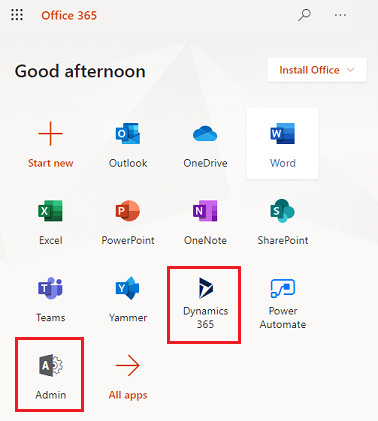

# Sign in to Dynamics 365 and Office apps

There are multiple ways to sign in and access your Dynamics 365 and Office apps.  
  
> [!TIP]
> Admins: Be sure to share this information with your end users.  
> 
> You can troubleshoot issues with signing in to Dynamics 365 apps using the Support and Recovery Assistant for Microsoft 365. For more information, see the blog [New diagnostic scenario for web sign-in](https://community.dynamics.com/crm/b/dynamicscrmsupportblog/archive/2016/11/15/new-diagnostic-scenario-for-web-sign-in).  
  
   

## Signing in to https://office.com  
For admins and end users, when you sign in to https://office.com, you will see a page with Office tiles. The tiles that appear depend on what licenses you have. For example, if you have licenses for Office and Dynamics 365 apps, you'll see tiles for Office apps like [!INCLUDE[pn_ms_Word_short](../includes/pn-ms-word-short.md)], [!INCLUDE[pn_onedrive](../includes/pn-onedrive.md)], and [!INCLUDE[pn_SharePoint_short](../includes/pn-sharepoint-short.md)], as well as a tile for Dynamics 365 apps.  

> [!div class="mx-imgBorder"] 
>   
  
Select the Dynamics 365 apps tile to go to the Dynamics 365 home page.   
  
If you're a system administrator, you'll see an **Admin** tile. Select this tile to get to the [!INCLUDE[pn_office_365_admin_center](../includes/pn-office-365-admin-center.md)], where you can see your service health, manage users, manage licenses, and more for all the online services associated with your account.  
  
From there, you can get to the [!INCLUDE[pn_dyn_365_admin_center](../includes/pn-dyn-365-admin-center.md)]. Select **Show all** > **All admin centers** > **Dynamics 365**.  
   
For other ways to access Dynamics 365 and Office apps, see [Quickly navigate with the Office app launcher and the Dynamics 365 home page](../admin/quickly-navigate-office-365-app-launcher.md).  

## Direct sign in to the Dynamics 365 home page  
**Your business apps are moving**

In the future, the home for all of your business applications across Dynamics and the Power Platform will move to the apps page on [office.com](https://office.com/apps). This will help ensure that your end-users have a single spot to find all of their apps across the Microsoft ecosystem. Once the apps on the Dynamics home page have
moved to [office.com](https://office.com/apps), we will provide a banner redirecting users to their new home.

After April 1, 2021, when users navigate to https://home.dynamics.com, they will be redirected to https://www.office.com/apps with a deep link to their business applications.

   

### See also  
 [Quickly navigate with the Office app launcher and the Dynamics 365 home page](../admin/quickly-navigate-office-365-app-launcher.md)   

