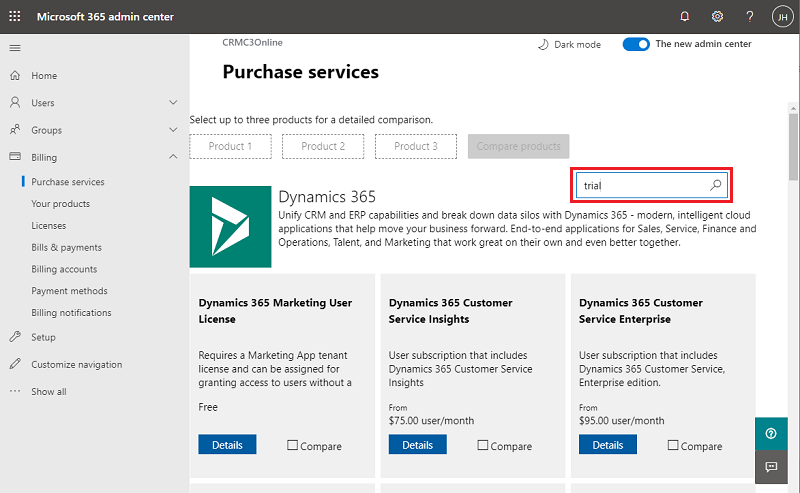

# Purchase Power Apps for your organization

This topic provides information on how to purchase Power Apps for your organization as an administrator. You can purchase Power Apps through the Power Apps website directly, through the [Microsoft 365 admin center](https://admin.microsoft.com), or through your Microsoft representative or partner. This article will also provide information about the trial options available for a Power Apps plan and then explain how to purchase a Power Apps plan as an organization. For more information, see [Manage licenses in your organization](signup-question-and-answer.md).

> [!NOTE]
> To purchase Power Apps for an organization, you must already be an Microsoft 365 Global or Billing Admin of a tenant, or you must create a tenant.
>
> Beginning January 2020, self-service purchase, subscription, and license management capabilities for Microsoft Power Platform products (Power BI, Power Apps, and Power Automate) are available for commercial cloud customers in the United States. For more information, including steps to enable or disable self-service purchasing in your organization, see [Self-service purchase FAQs](/microsoft-365/commerce/subscriptions/self-service-purchase-faq).

## Choosing the right plan
For details about what licenses you can choose for your organization, see [Licensing overview for Microsoft Power Platform](pricing-billing-skus.md).

## Purchase Power Apps directly

You can purchase Power Apps subscriptions for your organization from [Power Apps pricing](https://powerapps.microsoft.com/pricing/) page and then assign Power Apps licenses to your users. [Learn more](/office365/admin/subscriptions-and-billing/assign-licenses-to-users?view=o365-worldwide).

1. Visit the [Power Apps pricing](https://powerapps.microsoft.com/pricing/) page.

2. Select **Buy now** for the plan you want.

3. Provide information to make the purchase, and then navigate to the [Microsoft 365 admin center](https://admin.microsoft.com) to assign Power Apps licenses to your users.

## Get Power Apps through Microsoft 365

You can purchase Power Apps subscriptions for your organization from the [Microsoft 365 admin center](https://admin.microsoft.com) and then assign Power Apps licenses to your users. [Learn more](/office365/admin/subscriptions-and-billing/assign-licenses-to-users?view=o365-worldwide).

### Get a subscription trial

1. Browse to the [Microsoft 365 admin center](https://admin.microsoft.com).

2. On the left navigation pane, select **Billing -> Purchase services**.

3. In the search box, enter *trial* and then select the magnifying glass.

   > [!div class="mx-imgBorder"] 
   > 

4. Choose a trial, and then select **Get free trial**. Proceed through the order confirmation.

### Purchase a subscription

1. Browse to the [Microsoft 365 admin center](https://admin.microsoft.com).

2. On the left navigation pane, select **Billing -> Purchase services**.

3. Scroll down and select **Dynamics 365** under **Other categories that might interest you**.

4. Choose an app plan, and then select **Buy**.

5. Proceed through the purchase pages.

## Power Apps per app plan

See [About Power Apps per app plans](about-powerapps-perapp.md).

[!INCLUDE[footer-include](../includes/footer-banner.md)]