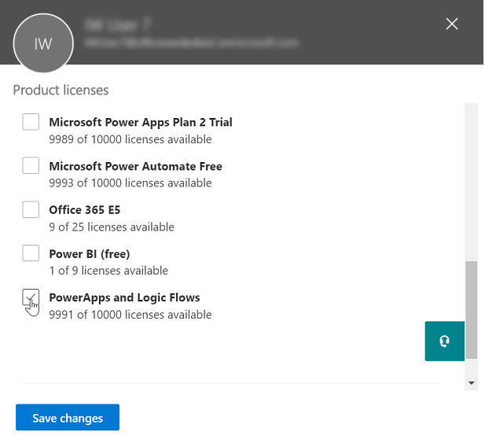
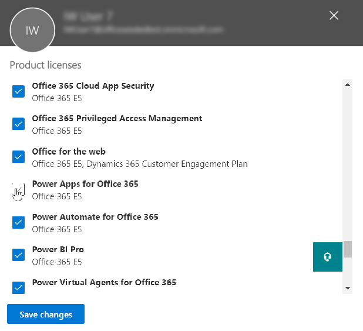
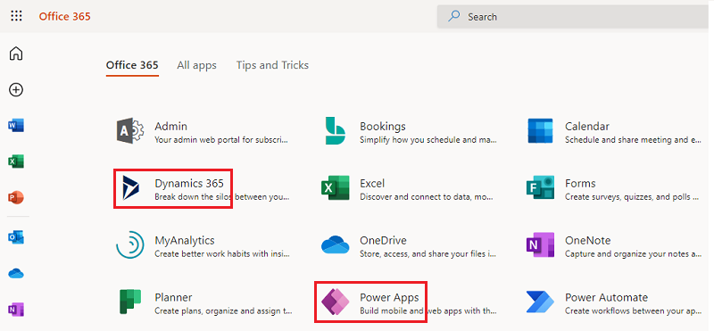
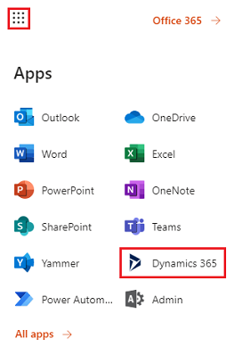

# Manage Power Apps licenses in your organization 

This topic describes how users in your organization can get access to use Power Apps, and how you can control access to the Power Apps service.

## Sign up for Power Apps
### What is Power Apps?
Microsoft Power Apps enables users to create applications for Windows, iOS, and Android mobile devices. Using these apps, you can create connections to common SaaS services, including Twitter, Microsoft 365, Dropbox, and Excel.

### How do users sign up for Power Apps?
The only sign-up option for individual users in your organization is the Power Apps trial, which they can sign up for through the Power Apps website:

##### Option 1
Users can sign up by going to [powerapps.microsoft.com](https://powerapps.microsoft.com), selecting **Sign up free**, and then completing the sign-up process for Power Apps through [admin.microsoft.com](https://admin.microsoft.com/Start?sku=powerapps).

##### Option 2
Users can sign up by going to [powerapps.microsoft.com](https://powerapps.microsoft.com), selecting **Sign in**, signing in with their work or school accounts, and sign up for the Power Apps trial by accepting the Power Apps terms of use.    

When a user in your organization signs up for Power Apps, that user is assigned a Power Apps license automatically.

> [!NOTE]
> Users who sign up for a trial license from within Power Apps don't appear in the Microsoft 365 admin portal as Power Apps trial users (unless they have another license to Microsoft 365, customer engagement apps (Dynamics 365 Sales, Dynamics 365 Customer Service, Dynamics 365 Field Service, Dynamics 365 Marketing, and Dynamics 365 Project Service Automation), or Power Apps).

See [Self-service sign up for Power Apps](/powerapps/maker/signup-for-powerapps) for more details.

### How can users in my organization gain access to Power Apps?
Users within your organization can gain access to Power Apps in three different ways:

* They can individually sign up for a Power Apps trial as outlined in the [How do users sign up for Power Apps?](#how-do-users-sign-up-for-power-apps) section.
* You can assign a Power Apps license to them within the Microsoft 365 admin portal.
* You can purchase Power Apps Per App Plans and allocate them in the Power Platform admin center. See [Power Apps per app plan](signup-for-powerapps-admin.md#power-apps-per-app-plan).
* The user has been assigned a Microsoft 365 and Dynamics 365 plans that includes access to the Power Apps service. See the [Power Apps pricing page](https://powerapps.microsoft.com/pricing) for the list of Microsoft 365 and Dynamics 365 plans that include Power Apps capabilities.

### Can I block users in my organization from signing up for Power Apps?
Any individual can try out the features of Microsoft Power Apps for 30 days, and incur no costs as outlined in the [How do users sign up for Power Apps](#how-do-users-sign-up-for-power-apps) section.  This option is available to any user in a tenant and cannot be disabled by an admin.  After the user's trial expires the user will lose access to Power Apps capabilities.  

If a person signs up for a 30 day trial of Microsoft Power Apps , and you choose to not support them inside of your organization, they can in no way incur costs to your company. When an individual signs up for Microsoft Power Apps, that is a relationship between that individual and Microsoft directly, like any many public cloud services from Microsoft, such as Bing, Wunderlist, OneDrive or Outlook.com, and does not in any way imply that the service is provided by your organization.

Finally, if your company wishes to restrict the use of organizational-only data inside of Microsoft Power Apps, that is possible through Data loss prevention (DLP) policies. For more details, See [Data loss prevention (DLP) policies](prevent-data-loss.md).

## Administration of Power Apps
### Why has the Power Apps icon appeared in the Microsoft 365 app launcher?
Microsoft Power Apps is a fundamental part of the Microsoft 365 suite and is enabled as a service as a part of existing Microsoft 365 SKU's. As users everywhere in the world can now use Microsoft Power Apps, it appears in 'All apps' in the app launcher screen. See [Licensing overview](pricing-billing-skus.md) to understand which Microsoft 365 SKUs now include Power Apps.

See the following section if you'd like to remove the Power Apps tile from 'All apps' by default.

### How do I remove Power Apps from existing users?
If a user was assigned a Power Apps license then you can take the following steps to remove the Power Apps license for that user:

1. Go to the [Microsoft 365 Admin Portal](https://portal.microsoftonline.com/).

2. In the left navigation bar, select **Users**, and then select **Active Users**.

3. Find the user you want to remove the license for, and then select their name.

4. On the user details pane, in the **Product licenses** section select **Edit**.

5. Find the Power Apps license, set the toggle to **Off**, and then select **Save**.

    

If a user has access to Power Apps through their Microsoft 365 and Dynamics 365 plan license, then you can disable their access to the Power Apps service by taking the following steps:

1. Go to the [Microsoft 365 Admin Portal](https://portal.microsoftonline.com/).

2. In the left navigation bar, select **Users**, and then select **Active Users**.

3. Find the user you want to remove access for, and then select their name.

4. On the user details pane, in the **Product licenses** section select **Edit**.

5. Expand the user's Microsoft 365 or Dynamics 365 license, disable access to the service, and then select **Save**.

    

Bulk removal of licenses is also possible through PowerShell. See [Remove Microsoft 365 licenses from user accounts with PowerShell](https://technet.microsoft.com/library/dn771774.aspx) for a detailed example.   Finally, further guidance about bulk removal of services within a license can be found at [Disable access to Microsoft 365 services with PowerShell](https://technet.microsoft.com/library/dn771769.aspx).

Removing of the Power Apps license or service for a user in your organization will also result in the removal of the Power Apps and Dynamics 365 icons from the following locations for that user:

* [Office.com](https://office.com)

    
* Microsoft 365 AppLauncher "waffle"

    

### How can I restrict my users' ability to access my organization's business data using Power Apps?
Power Apps allows you to create data zones for business and non-business data, as shown below.  Once these data loss prevention policies are implemented, users are prevented from designing or running Power Apps that combine business and non-business data. For more details, See [Data loss prevention (DLP) policies](prevent-data-loss.md).

 

### Why did 10,000 licenses for Microsoft Power Apps show up in my Microsoft 365 tenant?
As a qualifying organization, users in your organization are eligible to try out Microsoft Power Apps  for 30 days, and these trial licenses represent the available capacity for new Power Apps users in your tenant. There is no charge for these licenses. Specifically, there are two possible reasons why you may see a capacity 10,000 (trial) licenses for Power Apps showing up in the Microsoft 365 admin portal:

* If at least one user in your tenant participated in the Power Apps public preview that spanned from April 2016 to October 2016 then you will see 10,000 licenses labeled as "Microsoft Power Apps and Logic flows"

    
* If at least one user in your tenant has signed-up for a Power Apps trial by going through trial signup **Option 1** outlined in the [How do users sign up for Power Apps](#how-do-users-sign-up-for-power-apps) section then you will see 10,000 licenses labeled "Microsoft Power Apps & Power Automate"

    

You can choose to assign additional licenses to users yourself through the Microsoft 365 admin portal, but please note that these are trial licenses for Microsoft Power Apps  and they will expire after 30 days of being assigned to a user.

### Is this free? Will I be charged for these licenses?
These licenses are free trial licenses for your users to try-out the Microsoft Power Apps for 30 days.

### How will this change the way I manage identities for users in my organization today?
If your organization already has an existing Microsoft 365 environment and all users in your organization have Microsoft 365 accounts, then identity management does not change.

If your organization already has an existing Microsoft 365 environment but not all users in your organization have Microsoft 365 accounts, then we create a user in the tenant and assign licenses based on the user's work or school email address. This means that the number of users you are managing at any particular time will grow as users in your organization sign up for the service.

If your organization does not have an Microsoft 365 environment connected to your email domain, there is no change in how you manage identity. Users will be added to a new, cloud-only user directory, and you will have the option to take over as the Power Platform admin and manage them.

### What is the process to manage a tenant created by Microsoft for my users?
If a tenant was created by Microsoft, you can claim and manage that tenant using the following steps:

1. Join the tenant by signing up for Power Apps using an email address domain that matches the tenant domain you want to manage. For example, if Microsoft created the contoso.com tenant, then join the tenant with an email address ending with @contoso.com.
2. Claim admin control by verifying domain ownership: once you are in the tenant, you can promote yourself to the admin role by verifying domain ownership. To do so, follow these steps:
3. Go to [https://admin.microsoft.com](https://admin.microsoft.com/Start?sku=powerapps).
4. Select the app-launcher icon in the upper-left corner, and then choose Admin.
5. Read the instructions on the **Become the admin** page, and then choose **Yes, I want to be the admin**.  

> [!NOTE]
> If this option doesn't appear, an Microsoft 365 administrator is already in place.

### If I have multiple domains, can I control the Microsoft 365 tenant that users are added to?
If you do nothing, a tenant is created for each user email domain and subdomain.

If you want all users to be in the same tenant regardless of their email address extensions:  

* Create a target tenant ahead of time or use an existing tenant. Add all the existing domains and subdomains that you want consolidated within that tenant. Then all the users with email addresses ending in those domains and subdomains automatically join the target tenant when they sign up.

> [!IMPORTANT]
> There is no supported automated mechanism to move users across tenants once they have been created. To learn about adding domains to a single Microsoft 365 tenant, see [Add a domain to Microsoft 365](https://support.office.com/article/Add-your-users-and-domain-to-Office-365-ffdb2216-330d-4d73-832b-3e31bcb5b2a7).
