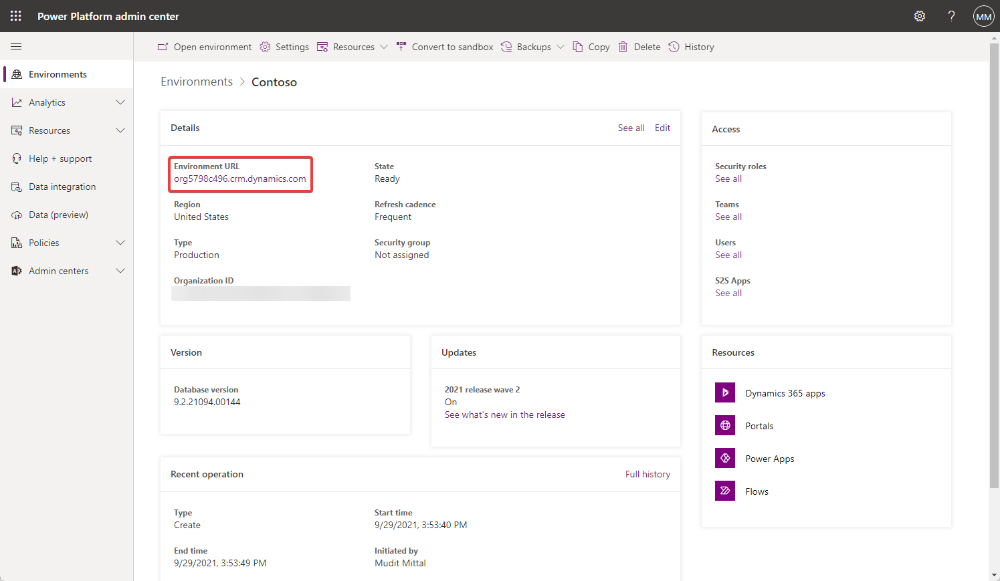
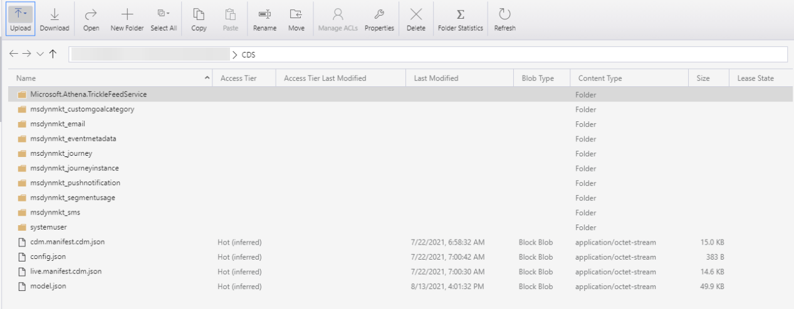

# Access your storage with a SAS token

Storage has important data from your environment. An SAS token provides secure, delegated access to resources in your storage. This article covers:

- Accessing your storage with the SAS token
- View and understand your data

## Prerequisites
This section describes the prerequisites necessary to access the storage with the SAS token and view your data.

- **Environment Maker or System Customizer Role**. You must have the **Environment Maker** role or the **System Customizer** role on the environment where you want to access the SAS token. For more information about environment roles, see [Configure user security to resources in an environment](database-security.md).

- **Storage Explorer**. [Get it now](https://azure.microsoft.com/features/storage-explorer/#overview)

## Access the storage with the SAS token

1. Navigate to the [Power Platform admin center](https://admin.powerplatform.microsoft.com/) and select an environment.

2. Copy the **Environment URL**.

    

3. Navigate to the below link by substituting the **Environment URL**.

```http
    https://<EnvironmentURL>/api/data/v9.1/datalakefolders
```

4. Locate the URL for the *containerendpoint* which specifies the **Container URL**.

5. Use the below link to access the SAS token by substituting the **Environment URL** and the **Container URL**.

```http
    https://<EnvironmentURL>/api/data/v9.1/RetrieveAnalyticsStoreAccess(Url=@a,ResourceType='Folder',Permissions='Read,List')?@a='<ContainerURL>/CDS'
```

6. Copy the SAS token and start [Azure Storage Explorer](https://storageexplorer.com/).  

7. Connect to a new storage and select the **ADLS Gen2 container or directory**. Select the **Shared access signature URL (SAS)** as the connection method.

8. Use the below link to construct the SAS URL.

```http
    https://<ContainerURL>/CDS?<SASToken>'
```

> [!NOTE]
> The SAS token will expire after **one hour**. You will need to follow the steps above to refresh the SAS token.

9. After connecting, you will have access to the data in your storage in the Common Data Model format.

    

## View and understand your data

The data in your storage is written in the [Common Data Model](https://docs.microsoft.com/common-data-model/) format. There will be a model.json file that, along with its name and version, provides a list of tables that are available in storage. Each Microsoft Dataverse table will have its own directory containing the data records as CSV files. Additionally, there will be a Microsoft.Athena.TrickleFeedService directory that contains extra metadata for each Dataverse table.

### See also

[Legacy storage capacity](legacy-capacity-storage.md) <br />
[Dataverse storage capacity](capacity-storage.md) <br />
[Free up storage space](free-storage-space.md) <br />
[Delete and recover environments](delete-environment.md)


[!INCLUDE[footer-include](../includes/footer-banner.md)]
