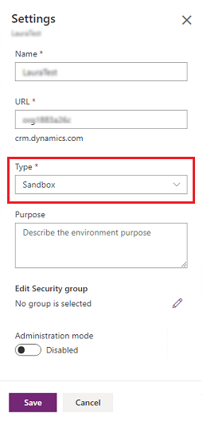

# Switch an environment

You may decide that your customization work developed and tested on a Sandbox instance is now ready to go live. If you’ve placed your Sandbox instance in administration mode, only users with System Administrator or System Customizer security roles are able to sign in to that instance. Once you switch the instance type to Production, all your users can access your organization. When you configure or edit an instance, you can switch the instance from:

- Production to Sandbox
- Sandbox to Production

**To switch an environment**: 

1. Go to the [Power Platform Admin center](https://admin.powerplatform.microsoft.com) and sign in using Environment Admin or System Administrator role credentials.

2. From the left-side menu, select **Environments**, and then select an environment to switch.

3. Select **Edit**

   > [!div class="mx-imgBorder"] 
   > 

4. Under **Type**, choose the environment type to switch to. 

5. Select **Save**.

   > [!div class="mx-imgBorder"] 
   > 
