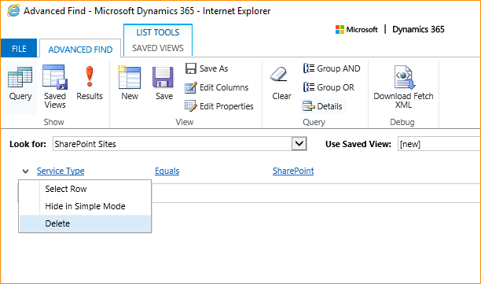
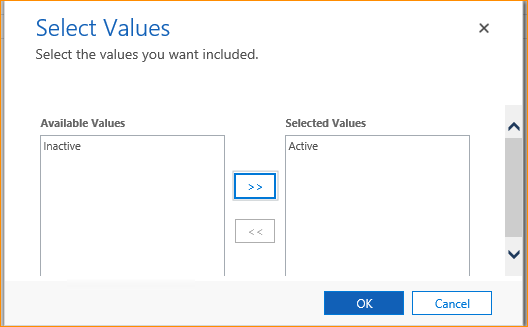
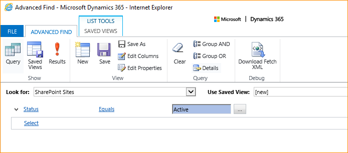

# Switch from the list component or change the SharePoint deployment

This article provides an overview about how to switch from the deprecated list component to server-based authentication. This article can also help if you change the [!INCLUDE[pn_ms_SharePoint_long](../includes/pn-ms-sharepoint-long.md)] deployment type, such as moving from [!INCLUDE[pn_SharePoint_short](../includes/pn-sharepoint-short.md)] on-premises to [!INCLUDE[pn_sharepoint_online](../includes/pn-sharepoint-online.md)].

> [!IMPORTANT]
> In 2015, [we announced the deprecation of the list component]( https://cloudblogs.microsoft.com/dynamics365/no-audience/2015/05/15/dynamics-crm-2015-update-1-list-component-deprecation/?source=crm). Notice that, the list component wasn’t released for Power Apps or the current versions of Dynamics 365 and previous versions of the list component aren’t supported with these versions. If you are using the list component you must move your document management with SharePoint to server-based authentication.
  
 
## Switch from list component to server-based authentication
 If your organization is already using the list component with [!INCLUDE[pn_ms_SharePoint_long](../includes/pn-ms-sharepoint-long.md)] for document management with model-driven apps, such as Dynamics 365 Sales and Customer Service, you can switch to server-based authentication by following these steps.  
  
1. Follow the steps to set up server-based [!INCLUDE[pn_SharePoint_short](../includes/pn-sharepoint-short.md)] integration that best fits your deployment type. For more information, see the appropriate article for your [!INCLUDE[pn_SharePoint_short](../includes/pn-sharepoint-short.md)] deployment below.  

|Environment  |Article  |
|---------|---------|
|Model-driven apps and SharePoint Online  |   [Set up model-driven apps in Dynamics 365 to use SharePoint Online](set-up-dynamics-365-online-to-use-sharepoint-online.md)        |
|Model-driven apps in Dynamics 365 and SharePoint on-premises     |   [Configure server-based authentication with model-driven apps in Dynamics 365 and SharePoint on-premises](../admin/configure-server-based-authentication-sharepoint-on-premises.md)      |
  
   > [!NOTE]
   >  If you've made changes to [!INCLUDE[pn_SharePoint_short](../includes/pn-sharepoint-short.md)], such as new [!INCLUDE[pn_SharePoint_short](../includes/pn-sharepoint-short.md)] servers, new site collections, or migrated from [!INCLUDE[pn_SharePoint_short](../includes/pn-sharepoint-short.md)] on-premises to [!INCLUDE[pn_microsoft_sharepoint_online](../includes/pn-microsoft-sharepoint-online.md)], consider deactivating outdated [!INCLUDE[pn_SharePoint_short](../includes/pn-sharepoint-short.md)] site records. When you run the Enable Server-Based SharePoint Integration wizard, the wizard will attempt to validate all active [!INCLUDE[pn_SharePoint_short](../includes/pn-sharepoint-short.md)] sites. [!INCLUDE[proc_more_information](../includes/proc-more-information.md)] [Deactivate a site](../admin/switching-list-component-changing-deployment.md#BKMK_deact_site)  
  
2. Although it is not required for server-based authentication, we recommend that you deactivate and then delete the list component [!INCLUDE[pn_SharePoint_short](../includes/pn-sharepoint-short.md)] solution from the [!INCLUDE[pn_SharePoint_short](../includes/pn-sharepoint-short.md)] site collection. To do this, after you have confirmed that server-based authentication is enabled, in a web browser follow these steps. 
      1. Sign-in to the site collection, select the **Settings** button in the top-right corner, then **Site Settings**, and then under **Web Designer Galleries**, select **Solutions**. 
      2. Choose **crmlistcomponent**, and then on the tool bar select **Deactivate**. 
      3. Choose the **crmlistcomponent** again, and then on the tool bar select **Delete**.  
  
   
## Changing the SharePoint deployment type  
  
1. After the migration of [!INCLUDE[pn_ms_SharePoint_long](../includes/pn-ms-sharepoint-long.md)] to either online or on-premises is completed, deactivate the outdated [!INCLUDE[pn_SharePoint_short](../includes/pn-sharepoint-short.md)] site records. You must do this because, when you run the Enable Server-Based SharePoint Integration wizard, the wizard will attempt to validate all active [!INCLUDE[pn_SharePoint_short](../includes/pn-sharepoint-short.md)] sites. [!INCLUDE[proc_more_information](../includes/proc-more-information.md)] [Deactivate a site](../admin/switching-list-component-changing-deployment.md#BKMK_deact_site)  
  
2. Follow the steps to set up server-based [!INCLUDE[pn_SharePoint_short](../includes/pn-sharepoint-short.md)] integration that best fits your deployment type. For more information, see the above section [Switch from list component to server-based authentication](#BKMK_switchlistcomp).  
  
   
### Deactivate a site  
  
1. In the Power Platform admin center, select an environment. 

2. Select **Settings** > **Integration** > **Document management settings** > **SharePoint Sites**.  
  
3. Select the [!INCLUDE[pn_SharePoint_short](../includes/pn-sharepoint-short.md)] site you want to remove, and then on the tool bar select **Deactivate**.  
  
4. Repeat step 3 for all sites that you want to deactivate.  

### What to do when the Enable Server-Based SharePoint Integration wizard doesn't appear
If the **Enable Server-Based SharePoint Integration** icon doesn't appear in the **Document Management** area after you deactivate all SharePoint sites, follow these steps.
1. Select Advanced Find and create the following query. 
   - **Look for**: **SharePoint Sites** 
   - **Use Saved View**: **[new]**
   -  Select the down arrow next to the **Service Type** clause and then select **Delete** to remove it. 

  

2. Add **Status** as a new clause, select **Active** as the value, and then select **OK**: 

    

3. The **Status** clause appears like this. 

    

4. Select **Results**.
    In the list of active SharePoint sites returned by the query, select all records, and then on the toolbar, select **Deactivate**.

### See also
[Set up SharePoint integration](../admin/set-up-sharepoint-integration.md) 
  
[!INCLUDE[footer-include](../includes/footer-banner.md)]

