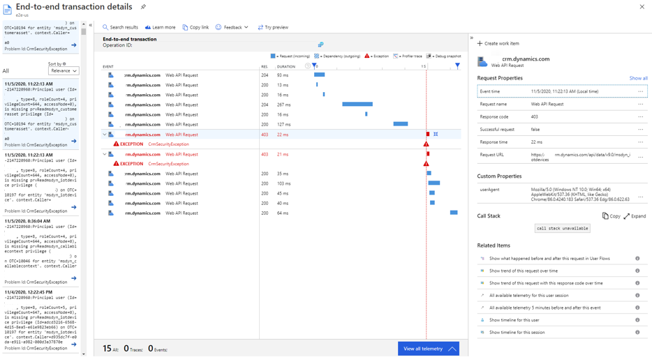

# Telemetry events for Microsoft Dataverse

The data stream currently provides performance data related to Dataverse API incoming calls, Dataverse plug-in execution calls, and Dataverse SDK calls. It also provides data for failures in plug-in and Dataverse SDK operations.

## Dataverse API incoming calls

These are calls made to the Dataverse API. They can be from Unified Interface (UCI), the legacy web client, custom clients that use the SDK, and so on. They can be found in the **requests** table of Application Insights, which has the following fields.

- **Name**: The type of request. These fall into two categories:
  - **Web API Request**: A request to the OData v4 endpoint that's commonly used by Unified Interface and modern clients. This request is transformed into an operation that's common to both. Web API is a "wrapper" to enable the RESTful programming model, but after data is received, everything becomes the same within the server. When the response is returned, it's converted to JSON if the request came from the Web API.
  - **Organization Service Request**: A request to the SOAP endpoint used by SDK clients or the legacy web client.
- **Duration**: The amount of time the server took to respond to the request.
- **Url**: The URL to which the call was made.
- **CustomDimensions**:
  - **UserAgent**: Application Insights automatically populates the user agent field with **PC** as these logs are being pushed from a server in a datacenter. Application Insights doesn't allow the user agent field to be overridden. Sometimes, the user agent field isn't available to populate. The user agent from which the call was made can be viewed by using the following query:

    ```kusto
    requests
    | summarize count() by tostring(customDimensions.userAgent)
     ```

    > [!div class="mx-imgBorder"] 
    > 

- **Operation_Name**: The readable name of the operation to display on views, such as the end-to-end transaction view.

## Dataverse plug-in execution logs

These logs for custom plug-ins running for a given operation are found in the **dependency** table. The following is a sample query:

```kusto
dependencies
| where type == "Plugin"
| take 100
```

> [!div class="mx-imgBorder"] 
> 

- **Name/Target**: The fully qualified type name for the plug-in being executed.
- **Duration**: The amount of time it took for the plug-in to be executed.
- **CustomDimensions**: 
  - **Depth**: The current [depth](/dotnet/api/microsoft.xrm.sdk.iexecutioncontext.depth?view=dynamics-general-ce-9) of the execution in the call stack.
  - **EntityName**: The name of the entity being acted on by the plug-in.
  - **IsolationType**: A [value](/dotnet/api/microsoft.xrm.sdk.iexecutioncontext.isolationmode?view=dynamics-general-ce-9) indicating whether the plug-in is being executed in the sandbox:
    - 1: None
    - 2: Sandbox
    - 3: External
  - **PluginName**: The user-friendly name of the plug-in.
  - **PluginType**: The name of the type of plug-in being executed.
  - **PluginVersion**: The version of the published plug-in. The intention here is to be able to use this information to troubleshoot version updates.
  - **Stage**: Maps to the following values:
    - PreValidation = 10
    - PreOperation = 20
    - PreOperationBeforeExternalPlugins = 15
    - PreOperationAfterExternalPlugins = 25
    - MainOperation = 30
    - PostOperationBeforeExternalPlugins = 35
    - PostOperationAfterExternalPlugins = 45
    - PostOperation = 40
    - PostOperationDeprecated = 50
  - **StepName**: The name of the SDK Message Processing step. This is usually generated by the Plug-in Registration tool by using information about the **PluginName**, **PluginType**, and the name of the operation&mdash;for instance *ErrorMessageTest.ThrowException: Creation of account*.

## Dataverse SDK logs

These are logs for SDK operations triggered as a part of an incoming request. These are logged to the **dependency** table in Application Insights, because they're tracked as dependencies for the request to execute. They're identified by the type name, starting with **SDK**. The following is a sample query:

```kusto
dependencies
| where type starts with "SDK"
| take 10
```

> [!div class="mx-imgBorder"] 
> 

- **Type**: The type of SDK request triggered. Examples include Retrieve, RetrieveMultiple, FetchXmlToQueryExpression, and WhoAmI.
- **Name/Target**: This is the name of the entity being targeted by the SDK operation.
- **CustomDimensions**: 
  - **ClientType**: The type of client the call is coming from. Some possible values are Web, UCIClient, and OutlookFull.
  - **EntityId**: The unique identifier of the entity being used.
  - **EntityName**: The name of the entity being used.

## Exceptions

You'll see details of failures in plug-in and SDK operations in Application Insights. The **exceptions** table in Application Insights powers the **Failures** panel.
These failure details correlate with the rest of the events in the plug-in and SDK calls in the end-to-end view. All available information is added to columns when possible and to **customDimensions** when there's no exact column match. 

You'll notice that some of the fields in the **exceptions** table aren't populated. This is because these fields can only be set if the Application Insights SDK is used to emit logs from the source. This feature collects platform telemetry and then pushes it into Application Insights in accordance with the Application Insights schema. 

> [!div class="mx-imgBorder"] 
> 

```kusto
exceptions
| take 10
```

This query will return all the attribute details from the **exception** table.

- **problemId/type**: The type of exception.
- **outerMessage**: The exception message.
- **customDimensions**: 
  - **clientType**: The type of client the call is coming from. Some possible values are Web, UCIClient, and OutlookFull.
  - **exceptionSource**: The plug-in or point where the exception was thrown.
  - **entityName**: The name of the entity being used.
  - **pluginName**: The name of the plug-in where the exception was thrown.

> [!div class="mx-imgBorder"] 
> 

If a user reports an error, you can use the user ID (Azure Active Directory ID) to understand details from the **exception** table.

```kusto
exceptions
| where user_Id == '12345678-68cd-4e73-908f-126342b36315'
```

The entity ID and entity name are available in **customDimensions** in the **dependency** table.

```kusto
dependencies<br />
| where type == "SDK Retrieve"
```

> [!div class="mx-imgBorder"] 
> 

### How can I determine whether my plug-in upgrade caused a performance degradation?

```kusto
dependencies
| where ['type'] == "Plugin"
| where name startswith "[InsertYourPluginName]"
| summarize avg(duration) by name
```

The plug-in name should also contain the version for custom plug-ins.

### How was the API performing prior to a reported issue, based on time of day or location? Was API degradation gradual or sudden?

```kusto
requests
| where url == "https://<URLHere>"
| summarize avg(duration), count() by bin(timestamp, 1h)
| render timechart 
```

> [!div class="mx-imgBorder"] 
> 

In this chart, we can see the performance of the API endpoint over a period of time against the number of requests being made.

You can also [set up an alert](/azure/azure-monitor/learn/tutorial-alert) based on the performance of a particular API here within Application Insights.

### Can I drill down on errors or failures at specific times or for specific users to allow for understanding the call stack?

Looking at the **Failures** panel gives an overview of the failures in a given time period. You can then narrow down to a specific failure based on the API call or dependency type to see the end-to-end view.

> [!div class="mx-imgBorder"] 
> 

### Can I create custom dashboards? 

Yes. You can build [custom dashboards](/azure/azure-monitor/learn/tutorial-app-dashboards) with Application Insights. 

### Can I determine plug-in usage performance (response time) and failure rates during peak usage? 

Yes. See the following sample query to understand how your plug-ins perform.

```kusto
dependencies
| where ['type'] == "Plugin"
| where name == "[Plugin name here]"
| summarize avg(duration) by bin(timestamp, 1h)
| render timechart
```

> [!div class="mx-imgBorder"] 
> 

### Will this telemetry have throttling? 

Yes. Basic 429 error details are currently provided.

> [!div class="mx-imgBorder"] 
> 

### Can I understand execution paths? Are calls made by the plug-in slowing the plug-in?  

Yes. You can view all the messages and plug-ins that are executed for any request.  

The duration of all message and plug-in execution is logged. If any plug-in is taking more time, you can identify that plug-in. If the plug-in is making a callback to Dataverse, the duration of that call is logged. More information about plug-ins is planned for future deployment.  

Any outbound call made by the plug-in will automatically be logged as a dependency. 

> [!div class="mx-imgBorder"] 
> 

### Can I view telemetry for a specific request? 

Dataverse returns x-ms-service-requestId in the header response to all requests. Using this requestId, you can query for all telemetry. 

```kusto
union *
| where operation_ParentId contains <requestId> 
```


