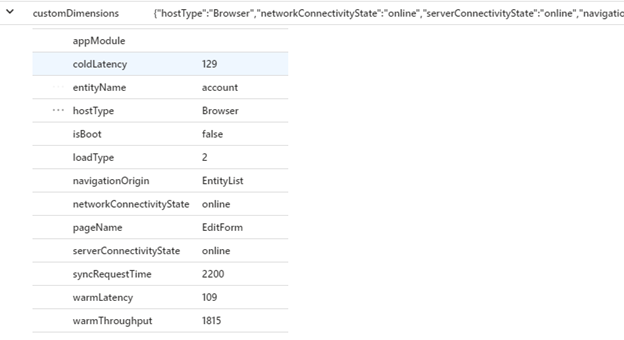
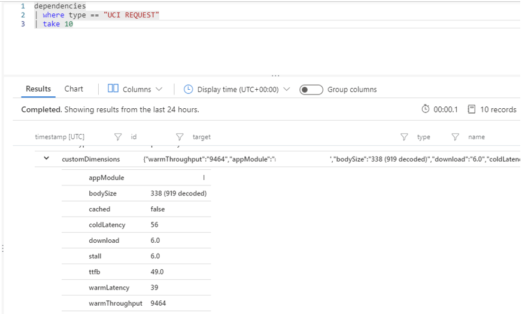
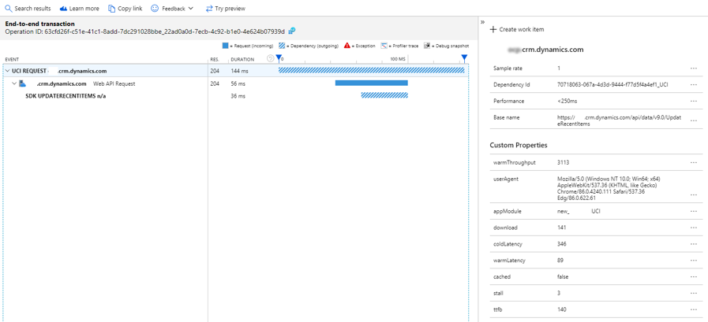
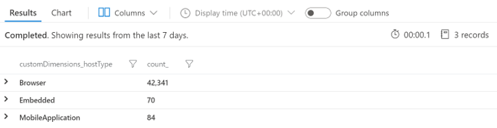
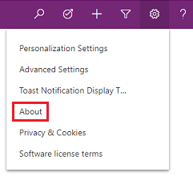
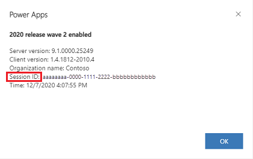
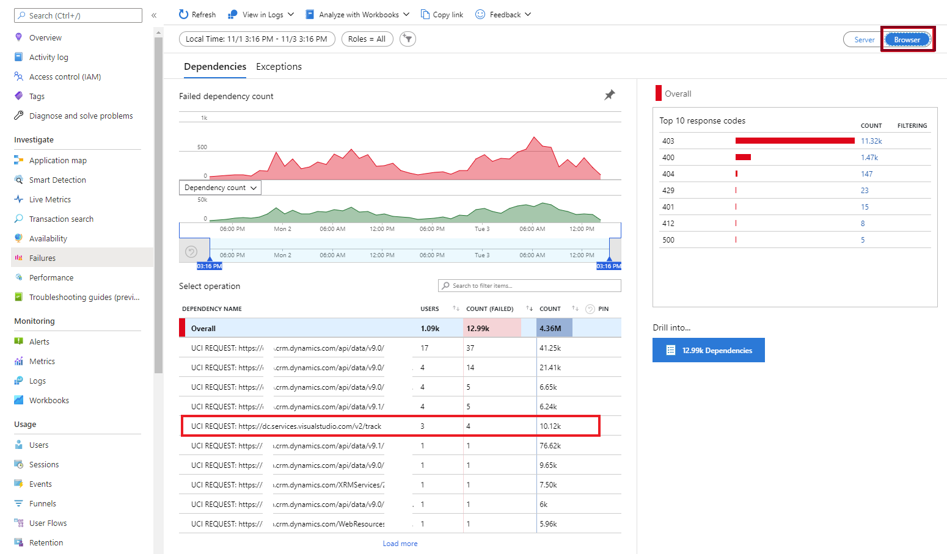

# Preview: Telemetry events for model-driven apps 

[!INCLUDE [cc-beta-prerelease-disclaimer](../includes/cc-beta-prerelease-disclaimer.md)]

## What data is available for model-driven apps?

Performance data related to page loads and Unified Interface (UCI) outbound network requests is available for model-driven apps.  

## What kind of page loads are available?

|Type  |Performance and diagnostics data available   |
|---------|---------|
|Dashboard Load (UCI) – Browser     | Yes        |
|Dashboard Load (UCI) – Embedded     | Yes        |
|Dashboard Load (UCI) - MobileApplication     | Yes        |
|Dashboard Load (UCI) – MailApp     | Yes        |
|Dashboard Load (UCI) - MobileApplication     | Yes        |
|EditForm Load (UCI) – Browser     | Yes        |
|EditForm Load (UCI) – Embedded     | Yes        |
|EditForm Load (UCI) – MailApp     | Yes        |
|EditForm Load (UCI) - MobileApplication     | Yes        |
|EntityList Load (UCI) – Browser     | Yes        |
|EntityList Load (UCI) - Embedded     | Yes        |
|EntityList Load (UCI) – MailApp     | Yes        |
|EntityList Load (UCI) - MobileApplication     | Yes        |
|Launch App - (UCI) – Browser     | Yes        |
|Launch App - (UCI) - Embedded     | Yes        |
|Launch App - (UCI) – MailApp     | Yes        |
|Launch App - (UCI) – MobileApplication     | Yes        |
|QuickCreateForm Load (UCI) – Browser     | Yes        |
|QuickCreateForm Load (UCI) – Embedded     | Yes        |
|QuickCreateForm Load (UCI) – MailApp     | Yes        |
|QuickCreateForm Load (UCI) – MobileApplication     | Yes        |
|SaveForm     | Not currently available        |
|CommandButton Actions     | Not currently available        |

## Where is the page load data available?

This data goes into the **pageView** table in Application Insights. An entry is logged every time a user loads a page in Unified Interface. The data logged will only include "clean" loads. Loads whose duration can't accurately be measured&mdash;fast navigation, switching away from the app, an alert message&mdash;won't be included. Because of this, we recommend against using this data for accurate numbers related to usage analytics.

There are additional properties in **customDimensions** that provide more details for Unified Interface page loads. For example, this query will return the values for all the attributes in the **pageView** table.

```kusto
pageView
| take 1
```

> [!div class="mx-imgBorder"] 
> 

The **pageView** table attributes include:

- **appModule**: The app module name.
- **entityName**: This attribute is present when relevant. It's available on page types like EditForm, EntityList, and Dashboards when they're [bound to an entity](/powerapps/maker/model-driven-apps/configure-interactive-experience-dashboards#create-an-entity-specific-dashboard). In some scenarios, the form isn't bound to an entity and the value appears as undefined.
- **hostType**: Browser/MobileApplication/Embedded
- **isBoot**: Is this the first load of a session?
- **loadType**
  -	0: First visit to a particular page type (for example, the first visit to a form).
  -	1: First visit to a particular configuration (for example, the first visit to an account form).
  -	2: First visit to a particular record (for example, the first visit to account record A2).
  -	3: This exact URL has been visited previously.
- **navigationOrigin**: The type of page where the user navigated from.
- **networkConnectivityState**: Whether the device has a connection.
- **pageName**: The type of page load.
- **serverConnectivityState**: Whether the app is connected to the server.
- **syncRequestTime**: The time spent waiting on synchronous requests.
- **coldLatency**: The first estimation of network latency, which includes SSL handshake time.
- **warmLatency**: The subsequent estimation of network latency, which is the typical expected latency for each request.
- **warmThroughput**: The estimated throughput of the network, in Kbps.

For Microsoft Dataverse events, the **ID** field or **operation_ParentId** in Application Insights is the **x-ms-service-request-id**. The **operationId** maps to the **activityId** on the back end for troubleshooting purposes and support requests.

## What kind of data is available for UCI outbound network requests?

These are calls to other dependencies made by Unified Interface to render a certain page. They might be outgoing calls to Dataverse or to other integrations like Azure DevOps or Office. Use the following query to get this data, which is available in the UCI Request dependency table: 

```kusto
dependencies
| where type == "UCI REQUEST"
```

The UCI Request dependency table has the following fields: 

- **Name**: The URL being invoked by Unified Interface.
- **Target**: Currently the same as **Name**.
- **Success**: Whether the call succeeded or failed. 
- **UserId**: The Dataverse system user ID of the signed-in user.
- **Duration**: The duration of the call.
- **customDimensions**: Contains the following attributes:

  > [!div class="mx-imgBorder"] 
  > 

  - **appModule**: The appModule making the call.
  - **bodySize**: The size of the response, encoded and decoded.
  - **cached**: Whether the request went to the local cache or had to go to the server. Note that this doesn't work as expected if the end user was on the Internet Explorer browser.
  - **download**: The time taken to download the response.
  - **stall**: The time where the request was waiting in the browser queue.
  - **ttfb**: The time spent waiting for the initial response, also known as the "time to first byte." This time captures the latency of a round trip to the server in addition to the time spent waiting for the server to deliver the response.
  - **coldLatency**: The first estimation of network latency, which includes SSL handshake time.
  - **warmLatency**: The subsequent estimation of network latency, which is the typical expected latency for each request.
  - **warmThroughput**: The estimated throughput of the network, in Kbps.

## Discover and analyze scenarios

### Why are some of my users experiencing slowness on Unified Interface?

One scenario where discovery and analysis can be very valuable is when a user from a region (say, Asia) reports that a form is performing slowly. This user based in Asia might be accessing an environment or organization in North America. The details will show the total load time in addition to the network-related duration. It might very well be that this is a cause of the slow performance perceived by the user.

You can use the **warmLatency**, **warmThroughput**, and **coldLatency** attributes to understand the breakdown of where time is spent on page loads and other Unified Interface requests, as shown in the following image.

> [!div class="mx-imgBorder"] 
> 

In the above request, the Unified Interface request takes longer than the actual Dataverse API (Web API) request. The breakdown in this case is the duration of the Dataverse API call (56 ms) plus the value of **CustomDimensions.warmLatency** (89 ms), which adds up to nearly the duration of the entire operation (144 ms). The **warmLatency** value is indicative of slowness for that particular client and might be an issue you can analyze at the user level by using the following query:

```kusto
dependencies
| where ['type'] == "UCI REQUEST"
| summarize avg(toint(customDimensions.warmLatency)), avg(toint(customDimensions.coldLatency)), avg(toint(customDimensions.warmThroughput)) by user_Id

pageView
| summarize avg(toint(customDimensions.warmLatency)), avg(toint(customDimensions.coldLatency)), avg(toint(customDimensions.warmThroughput)) by user_Id
```

### Can I determine how the user is accessing the system?

The **userAgent** attribute in the **customDimensions** field in the Application Insights **requests** table has this data. You can use the following query to get an overview of the different sources from where users are accessing the system:

```kusto
pageView
| summarize count() by tostring(customDimensions.userAgent), user_Id

dependencies
| where ['type'] == "UCI REQUEST"
```

|When the customDimensions.userAgent value starts with  | Where is the user accessing the system from?   |
|---------|---------|
|Mozilla     | Browser Type, version        |
|azure-logic-apps     |  Azure Logic Apps       |
|PowerApps     | Power Apps        |
|Microsoft Office Excel     | Office Excel        |
|Portals	     |  Portals       |
|DynamicsDataIntegration     | Dynamics Data Integration       |
|XrmToolBox.exe     | XrmToolBox        |
|PluginRegistration     | Plugin Registration        |
|LogicAppsDesigner     | Logic Apps Designer        |
|Apache-HttpClient     |  Apache HTTP client       |
|Microsoft Flow     | Power Automate        |
|UnifiedServiceDesk     | Unified Service Desk        |
|PostmanRuntime     | Postman        |
|OfficeGroupsConnector     | Office Groups connector        |
|Microsoft.Data.Mashup     | Power Query    |
|Apache-Olingo     | Apache Olingo        |
|Dalvik     |  Android       |
|Jakarta Commons-Http    | Jakarta        |
|Informatica     | Informatica        |
|axios     | Axios        |
|node-fetch     |  NodeJS       |
|LinkedInBot     | LinkedInBot        |

### How do I get a count of users accessing from browser, mobile, or embedded applications?

```kusto
pageView
| summarize count() by tostring(customDimensions.hostType)
```

The following image shows an example set of results from this query.

> [!div class="mx-imgBorder"] 
> 

### How do I narrow down to a specific user?

```kusto
pageView
| where user_Id == "[userid]"
| summarize count() by tostring(customDimensions.hostType)
```

### How do I use Application Insights in conjunction with Monitor?
[Azure Monitor](https://powerapps.microsoft.com/blog/monitor-now-supports-model-driven-apps/) helps with real-time troubleshooting on a session from the Unified Interface side. The end-to-end transaction requests will probably be available in Application Insights. To look at the logs for a given action, note the activity ID from a row in the event details page in Monitor. You can find the logs by using the following query:

```kusto
union *
| where operation_Id contains "[ActivityIdHere]"
```

Note that Monitor is a real-time debugging tool; however, data might not be available in it for a few hours.

### Why are users experiencing issues with a specific form?

The user can share their session ID from the **About** section in Unified Interface for the specific organization.

> [!div class="mx-imgBorder"] 
> 

> [!div class="mx-imgBorder"] 
> 

You can then use this ID to find issues by looking at all the activities in that session. Use the following query:

```kusto
union *
| where session_Id == '[sessionIdHere]'
```

### Which forms are being used in different locations, and what are the load performance of the forms in these locations?

```kusto
pageView
| summarize avg(duration) by name, client_City, client_CountryOrRegion
```

### Is an external API call the failure, and can I drill down into the error stack to help with debugging?

The **Browser** view of the **Failures** panel contains Unified Interface outgoing requests. The requests going to Dataverse or the organization contain the organization URL. There might be other requests going to other URLs (for instance, in the following image, the organization has a customization calling out to dc.services.visualstudio.com). You can look at the end-to-end transaction to further examine the failures for these external outgoing calls.

> [!div class="mx-imgBorder"] 
> 

### Can I set an alert on the performance threshold for certain form actions? When the alert is received, will it allow a maker to diagnose and troubleshoot the issue?

Yes. You can set up [alerts](/azure/azure-monitor/learn/tutorial-alert) in Application Insights to monitor the health of your application.
