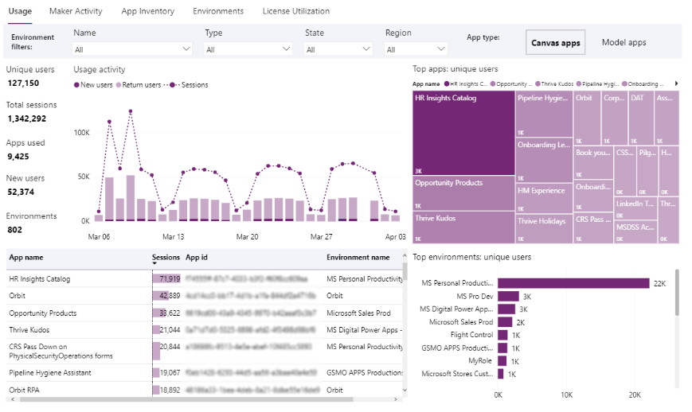

# Preview: Tenant-level analytics 

[!INCLUDE [cc-beta-prerelease-disclaimer](../includes/cc-beta-prerelease-disclaimer.md)]

Tenant admins can view reports that apply to all environments in a tenant. 

To access these reports, sign in to the Power Platform admin center and select **Analytics** > **Power Apps**. In the upper-right corner, select **Tenant level analytics** from the dropdown list. 

## Who can view these reports?

Admins with the following roles and a [license](pricing-billing-skus.md) can view the reports in Power Apps analytics:
- Environment Admin - can view reports for the environments that the admin has access to.
- Power Platform admin – can view reports for all environments.
- Dynamics 365 admin - can view reports for all environments.
- Microsoft 365 Global admin – can view reports for all environments.

For more information on the different roles for managing your tenant across the platform, see [Use service admin roles to manage your tenant](use-service-admin-role-manage-tenant.md).

## What are the available reports? 

The following tenant-level reports are available for tenant admins. 

### Power Apps - Usage reports

Power Apps reports provide insights into tenant and environment usage and inventory of all apps and connectors. The report answers questions such as:

- What is the total unique canvas/model-driven apps users across the tenant or environments? 
- What is the count of first-time users across canvas and model-driven apps?
- How many apps exist in my tenant or environment?
- Which of my environments had the most unique users? 
- What were the top apps by unique users/app sessions? 

> [!div class="mx-imgBorder"] 
> 

### Power Apps - Maker Activity report

The Power Apps Maker Activity report provide insights into tenant and environment usage and inventory of all apps and connectors. The report answers questions such as:

- What is the total number of apps created/published/modified/deleted by app makers across the tenant or environments? 
- What is the count of first-time makers across canvas and model-driven apps? 
- Who are the top makers across the tenant or environments? 
- How many of these apps are using premium or standard connectors? 
- Allow me to filter the above list based on connector type. 

:::image type="content" source="media/maker-activity-report.png" alt-text="Power Apps Maker Activity report":::

### Power Apps - Inventory report

The Power Apps Inventory report offers a complete catalog of Power Apps distributed across the tenant. This view includes filters that allow admins to search for apps based on various criteria. The report answers questions such as:

- What is the total number of model-driven and canvas apps across the tenant or environments? 
- Which apps depend on specific connectors or connector types like Premium? 
- Who are the owners of the apps hosted in one or more environments? 
- What is the distribution of canvas versus model-driven apps across the organization? 

:::image type="content" source="media/power-apps-inventory-report.png" alt-text="Power Apps Inventory report":::

## Download Inventory

Power Platform admin center reports can be downloaded directly from the report visuals.  Users have the option of choosing between Summarized and Underlying data. 

- Summarized data: select this option to download the data underlying the current report visual  
- Underlying data: select this option to download the full result set backing the report 

:::image type="content" source="media/download-inventory-report.png" alt-text="Download Inventory report":::

For more information on downloading data from the tenant level reports, see [Exporting data from Power BI visuals](/power-bi/consumer/end-user-export).

## How do I enable tenant-level analytics?

Follow these steps to enable the tenant-level analytics preview feature. 

The following admin roles are required:

- Global administrator
- Service administrator
- Delegated admin 

Environment admins are not able to do these steps. The admin doesn't need to be a licensed user. 

1. Select the **Gear** icon () in the upper-right corner of the Microsoft Power Platform site, and then select **Power Platform settings**. 

2. Turn on the option to **Enable tenant level analytics**.

   :::image type="content" source="media/enable-tenant-level-analytics.png" alt-text="Enable tenant-level analytics":::

3. **Granting consent for tenant-level analytics:** The process of collecting information for tenant-level analytics includes copying service telemetry data from other GEO locations into a central location for reporting.  Customers must explicitly enable this Power Platform operation.  For more information, see [Manage environments in the Power Platform admin center](environments-overview.md#manage-environments-in-the-power-platform-admin-center). 

   Select **Enable** to grant consent for the service to collocate service telemetry data in the location associated with the default environment. 

   :::image type="content" source="media/enable-collocate-service-telemetry-data.png" alt-text="Grant consent for the service to collocate service telemetry data":::

4. Select **Save** and then close the form. 

5. Select **Environment level analytics**, and then select **Tenant level analytics** to switch viewing modes. 

## How do I disable tenant-level analytics?

Follow these steps to disable the tenant-level analytics preview feature. 

The following admin roles are required:

- Global administrator
- Service administrator
- Delegated admin 

Environment admins are not able to do these steps. The admin doesn't need to be a licensed user. 

> [!IMPORTANT]
> When you disable the tenant-level analytics preview feature, note the following:
> - All the tenant-level aggregation of data from different environments (aggregating metrics, user object IDs, and resource names like app and flow names) will be permanently deleted. 
> - Tenant-level analytics reports will be disabled. 

1. Select the **Gear** icon () in the upper-right corner of the Microsoft Power Platform site, and then select **Power Platform settings**. 

2. Turn off the option to **Enable tenant level analytics**.

   :::image type="content" source="media/enable-tenant-level-analytics.png" alt-text="Enable tenant-level analytics":::

## Where is this feature available?

The Power Platform admin center tenant-level views are available in all supported regions in the public cloud. This feature is not yet available in other sovereign clouds. 

 

[!INCLUDE[footer-include](../includes/footer-banner.md)]