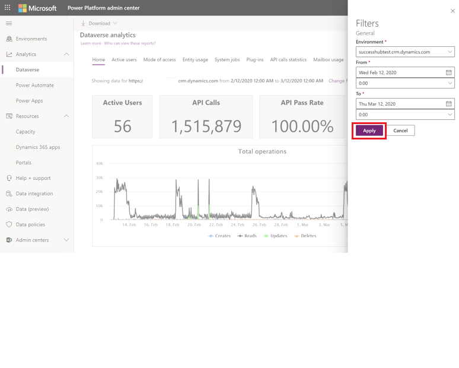

# Preview: Tenant-level analytics 

[!INCLUDE [cc-beta-prerelease-disclaimer](../includes/cc-beta-prerelease-disclaimer.md)]

Tenant admins can view reports that apply to all environments in a tenant. 

To access these reports, sign in to the Power Platform admin center and select **Analytics** > **Power Apps**. Reports appear in a menu bar at the top of the page.

## Who can view these reports?

Admins with the following roles and a [license](pricing-billing-skus.md) can view the reports in Power Apps analytics:
- Environment Admin - can view reports for the environments that the admin has access to.
- Power Platform admin – can view reports for all environments.
- Dynamics 365 admin - can view reports for all environments.
- Microsoft 365 Global admin – can view reports for all environments.

For more information on the different roles for managing your tenant across the platform, see [Use service admin roles to manage your tenant](use-service-admin-role-manage-tenant.md).

## What are the available reports? 

The following tenant-level reports are available for tenant admins. 

### Overview reports

Overview reports provide an overview of the tenant and environment of all power platform products and answer questions such as the following:

- How many total environments exist and how many were created in a selected time period? 
- What is the count of total apps and how many were created in a selected time period?
- What is the total number of custom connectors in use in the tenant across all apps and flows?
- What are the total number of environments of the various environment types?
- How many environment makers are in the tenant?

> [!div class="mx-imgBorder"] 
> 

### Power Apps reports

Power Apps reports provide insights into tenant and environment usage and inventory of all apps and connectors. Answer questions such as the following:

- What is the total unique canvas/model apps users across the tenant or environments? 
- What is the count of first-time users across canvas and model apps?
- How many apps exist in my tenant or environment?
- How many of these apps are using premium or standard connectors?
- Provide a list of all connectors for the specified environment and time period.
- Allow me to filter the above list based on connector type.

> [!div class="mx-imgBorder"] 
> 

### Power Automate reports
Power Automate reports provide insights into tenant usage and inventory of all flows and answer questions such as the following:

- How many total flow runs across the tenant or environments for the time period selected? 
- What is the total number of flow actions within all flows?
- What are the top flows? List flow name, flow type, maker, successful runs, failed run, total actions, shares with users, group shares, environment name. 

> [!div class="mx-imgBorder"] 
> 

## Download Reports

Select **Download** to view available downloads and then select any of the reports to download them into Microsoft Excel.

All the download reports, except "Active Dynamics 365 Customer Engagement Plan Users by Application", show data:   
- for an environment  
  and  
- per the timeline in the filters for the out-of-box Dataverse analytics reports. If you select a certain date range for the out-of-box Dataverse reports, the same time filter applies to the downloads.  
- The maximum duration for data availability is 30 days.

> [!div class="mx-imgBorder"] 
>   

## View data for different environments and date-time ranges

Select **Change filters**.  

> [!div class="mx-imgBorder"] 
>   

Select the environment and time-period from the drop-down lists, and then select **Apply** to save the changes. All the Dataverse analytics reports are available using this selection. 

> [!div class="mx-imgBorder"] 
>   

[!INCLUDE[footer-include](../includes/footer-banner.md)]