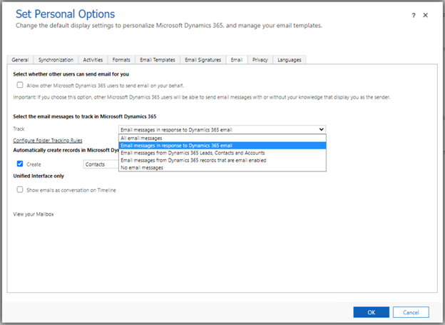

# Automatically track sent folder items with server-side synchronization 

When server-side synchronization is enabled for an Microsoft Exchange mailbox within Dynamics 365, items in the Microsoft Exchange **Inbox** are tracked automatically and created in Dynamics 365 based on acceptance and correlation logic. You can configure this option in **Set Personal Options**. 

Email messages that users send directly from an email client, such as Microsoft Office Outlook, are not tracked automatically. Emails from these email clients won't be created in Dynamics 365.  
 
## Enable Tracking for Sent Folder Items 

An administrator can configure the [OrgDbOrgSetting](OrgDbOrgSettings.md) **AutoTrackSentFolderItems**, which will enable server-side synchronization to go through emails in the **Sent items** folder on Microsoft Exchange and automatically track emails to Dynamics 365 by honoring the following email acceptance options in **[Set Personal Options](set-personal-options-affect-tracking-synchronization-between-dynamics-365-outlook-exchange.md)**. 

> [!Important]
> - This feature is disabled by default and you can enabled with the orgdborgsettings **AutoTrackSentFolderItems** setting. 
> - Thsetting is only supported with a Microsoft Exchange mailbox. 

- **Accept all email messages**: Any email in the mailbox will be tracked to Dynamics 365.

- **Email messages in response to Dynamics 365 email (DEFAULT option)**: Only email messages in reply to emails which are already present in Dynamics 365 will be tracked. 

- **Email messages from Dynamics 365 Leads, Contacts and Accounts**: Only email messages that have a matching Lead, Contact or Account within Dynamics 365 will be automatically tracked to Dynamics 365. 

- **Email messages from Dynamics 365 records that are email enabled**: Email messages sent to records that are email enabled in Dynamics 365 will be tracked. 

- **No Email messages**: No items will be automatically tracked. 

 
> [!div class="mx-imgBorder"] 
> 

 

