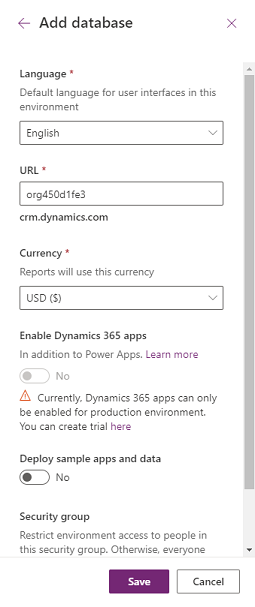
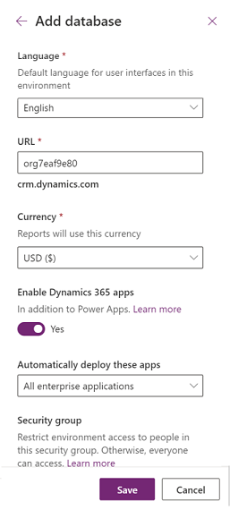
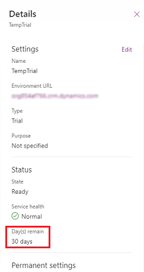
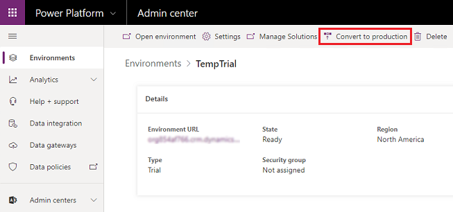

# About trials

Using the Power Platform admin center, you can create  environments of multiple types. Trial environments enable companies and customers to try out new features and solutions. There are two type of trial environments: trial (standard) and trial (subscription-based). 

> [!NOTE]
> "Trial", as documented in other topics and the user interface, refers to the trial (standard) type and not trial (subscription-based).

Companies and admins do not all have a similar approach towards trials. This is especially true when it comes to allowing users to try new capabilities. Some companies allow their users to try features in a self-serve manner. Others want admins to completely control what is being trialed and who is licensed to use the trial. The two trial types provide this level of control.

- **Trial (standard)**: This is the trial type that organizations usually rollout to allow users and department managers to try new features and quickly build low-code and no-code applications and processes. Organization (tenant) admins can enable all users to create trials or only organization admins. If allowed for users, then any user from that organization can create a 30-day trial environment. After 30 days, the environment is disabled and deleted. 
- **Trial (subscription-based)**: This is the trial type that organizations can use to develop larger, multi-user and multi-department solutions and do proof of concept reviews. Tenant admins can add a trial (subscription-based) to their tenant or new customers can sign up for a new tenant and become the Global admin. For new customers, an admin-managed subscription is created with a set number of licenses (usually 25 licenses); admins control license assignment to other users. An admin-managed subscription has a start and end date that can be extended. 

Both types of environments do not consume from paid capacity and can be converted to production environments by consuming from paid capacity which will prevent trial environment disablement and deletion. Production environments follow the paid license lifecycle. 

## Multiple ways to start a trial

The type of trial you create depends on where you start and your tenant-level permissions.

|Trial type  | Tenant-level permissions  | Create trial location  |
|---------|---------|---------|
|Trial (standard)     |  User or admin      |  Power Platform admin center. See [Creating a trial (standard) environment in the Power Platform admin center](#creating-a-trial-standard-environment-in-the-power-platform-admin-center)       |
|Trial (standard)       |  User or admin         | [https://trials.dynamics.com](https://trials.dynamics.com)     |
|Trial (subscription-based)      | admin        | Power Platform admin center. See [Creating a trial (subscription-based) environment in the Power Platform admin center](#creating-a-trial-subscription-based-environment-in-the-power-platform-admin-center)        |
|Trial (subscription-based)      |  User or admin        | Get started pages such as:   <ul><li>[https://dynamics.microsoft.com/get-started/?appname=salespro](https://dynamics.microsoft.com/get-started/?appname=salespro)</li><li>[https://dynamics.microsoft.com/get-started/?appname=customerservice](https://dynamics.microsoft.com/get-started/?appname=customerservice)</li></ul>      |

## Creating a trial (standard) environment in the Power Platform admin center

Follow these steps to create a trial (standard) environment in the Power Platform admin center.

1. Sign in to the [Power Platform admin center](https://admin.powerplatform.microsoft.com/) with admin credentials.

2. Go to **Environments**, and then select **+ New**.

   > [!div class="mx-imgBorder"] 
   >  environment")

3. Enter the following, and then select **Next**.
   
   |Setting  |Description  |
   |---------|---------|
   |Name     | The name of your environment.        |
   |Type     | Choose **Trial**.        |
   |Region     | Choose a region for the environment.        |
   |Purpose     | A description of the environment.         |
   |Create a database for this environment? | Select **Yes** to add a Common Data Service database to the trial (standard) environment. |

   > [!div class="mx-imgBorder"] 
   >  environment page two")

4. Enter the following, and then select **Save**.

   |Setting  |Description  |
   |---------|---------|
   |Language     | The default language for this environment.        |
   |Currency     | The base currency used for reporting.         |
   |Enable Dynamics 365 apps | Select **Yes** and make a selection to automatically deploy apps such as Dynamics 365 Sales and Dynamics 365 Customer Service. |
   |Deploy sample apps and data     | This setting is preset to **No** and can't be changed.      |
   |Security group | Select a security group to restrict access to this environment. |

   > [!div class="mx-imgBorder"] 
   > 

## Creating a trial (subscription-based) environment in the Power Platform admin center

Follow these steps to create a trial (subscription-based) environment in the Power Platform admin center.

1. Sign in to the [Power Platform admin center](https://admin.powerplatform.microsoft.com/) with admin credentials.

2. Go to **Environments**, and then select **New**. 

   > [!div class="mx-imgBorder"] 
   >  environment")

3. For type, select **Trial (subscription-based)**, and then fill in and select other settings. Select **Next**.

   |Setting  |Description  |
   |---------|---------|
   |Name     | The name of your environment.        |
   |Type     | Choose **Trial (subscription-based)**.      |
   |Region     | Choose a region for the environment.        |
   |Purpose     | A description of the environment.         |
   |Create a database for this environment | This setting is preset to **Yes** and can't be changed as a Common Data Services database must be created for a trial (subscription-based) environment.

   > [!div class="mx-imgBorder"] 
   >  environment page two")

4. Specify the following settings, and then select **Save**. 
   
   |Setting  |Description  |
   |---------|---------|
   |Language     | The default language for this environment.        |
   |URL | The environment name to include in the URL.     |
   |Currency     | The base currency used for reporting.         |
   |Enable Dynamics 365 apps | Select **Yes** to  display the following setting. Select **No**, to provision an environment with no applications included. **No** can be  used to trial low-code and no-code applications and flows but not the full Dynamics 365 applications platform.  |
   |Automatically deploy these apps  | If you selected **Yes** above, select **All enterprise applications**, **Customoer Service Pro**, or **Sales Pro** to deploy and try Dynamics 365 applications. Select **None** to provision an environment with no applications included.|
   |Security group | Select a security group to restrict access to this environment. |
   |Deploy sample apps and data  | This appears if you select **No** for **Enable Dynamics 365 apps**. Select **Yes** to include sample apps and data. Sample data gives you something to experiment with as you learn. |

   > [!div class="mx-imgBorder"] 
   > 

## Check the expiration date for a trial (standard) environment

To determine when a trial environment will expire:

1. Sign in to the [Power Platform admin center](https://admin.powerplatform.microsoft.com/) with admin credentials.

2. Go to **Environments** > [select a trial environment] > **See all**. Check out **Day(s) remain**.

   > [!div class="mx-imgBorder"] 
   > 

## Check the expiration date for a trial (subscription-based) environment

A trial (subscription-based) lasts as long as the subscription is active. To determine when a subscription will expire:

1. Sign in to the [Microsoft 365 admin center](https://admin.microsoft.com/) using Global admin credentials.
  
2. Select **Billing** > **Your products** > **Subscriptions** tab.
  
3. Select your Dynamics 365 subscription and review the date in the **Billing** section.

   > [!div class="mx-imgBorder"] 
   >  expiration")

## Convert either trial type to production

Follow these steps to convert a either trial type to a production environment:

1. Sign in to the [Power Platform admin center](https://admin.powerplatform.microsoft.com/) with admin credentials.

2. Go to **Environments** > [select a trial environment] > **Convert to production**.

    > [!div class="mx-imgBorder"] 
    > 

3. Select **Continue**.

It might take several hours to convert to a production environment.

## Frequently asked questions

### Who can convert a trial environment to a production environment?

The organization (tenant) admin can determine who is allowed to create trial environments and convert to production. If allowed and you have 1GB of available production database capacity, you can convert a trial environment to production. You might need to free up or purchase additional capacity if the trial environment database exceeds available production capacity. To determine the size of the trial environment database see: [Common Data Service storage capacity](capacity-storage.md).

### I can see a trial (subscription-based) environment type option but can't create this trial type
Make sure that you have an active Dynamics 365 Trial subscription.

### How can I retain my data and resources if I don't have a way to convert the trial (standard) environment to a production environment?

You can export your resources and data to another environment. If you want to retain them for a longer time, we recommend you create a production environment or an individual environment (with the [Power Apps Community Plan](https://powerapps.microsoft.com/communityplan/)) and export your resources to that environment. 

Here are some guidelines for exporting resources.

|Type of resource in the environment  |How do I export it?  |
|---------|---------|
|Apps (canvas and model-driven) and flows     |You can use [packaging](../alm/environment-and-tenant-migration.md) to export apps and flows from one environment.         |
|Data in the database (Common Data Service environment)     |You have multiple options: <ul><li>[Export to Excel](/powerapps/user/export-data-excel) and save the data. You can [import the data](/powerapps/user/import-data) into another environment.</li> <li>You can use [Data Integrator services](data-integrator.md) and APIs to export data into another environment.</li></ul> |

We delete trial (standard) environments that haven't had any activity in the environment databases for 30 days.

### See also
[Environments overview](environments-overview.md) 
[Choose the right plans for your team](https://powerapps.microsoft.com/pricing/) 
[Licensing overview](pricing-billing-skus.md)  
[Block trial licenses commands](powerapps-powershell.md#block-trial-licenses-commands)  
[Control who can create and manage environments in the Power Platform admin center](control-environment-creation.md)
