# Troubleshooting document management issues

[!INCLUDE [cc-data-platform-banner](../includes/cc-data-platform-banner.md)]

This topic explains how to use information provided in error messages to fix issues with the document management feature.
Below is an [index](#index-of-errors) that will help you to reach the right solution. The link in each cell navigates to the reason and mitigation steps for the corresponding error message.

## Error messages

The following are error messages that are possible with document management.

### Error Message 1

  Document library `<entity name>` has been renamed or deleted from SharePoint site `<SharePoint site>`. Rerun the document management wizard and try again.

### Error Message 2

  Folder `<folder name>` has been renamed or deleted from SharePoint. It was expected inside `<folder path>` path. Restore the folder on SharePoint and try again.

## Index of errors

|Error | [Error Message 1](#error-message-1) | [Error Message 2](#error-message-2) |
|----------------|-----------------|-----------------|
|Refresh the document grid for existing record    |  [Mitigation steps for missing document library](#reason-and-mitigation-steps-for-missing-document-library)      | [Mitigation steps for missing folder](#reason-and-mitigation-steps-for-missing-folder)        |
|Load the document grid after creating new record | [Mitigation steps for missing document library](#reason-and-mitigation-steps-for-missing-document-library)      | [Mitigation steps for missing folder](#reason-and-mitigation-steps-for-missing-folder) |
|Upload file   |[Mitigation steps for missing document library](#reason-and-mitigation-steps-for-missing-document-library)      | [Mitigation steps for missing folder](#reason-and-mitigation-steps-for-missing-folder) |
|Create new file/folder  |[Mitigation steps for missing document library](#reason-and-mitigation-steps-for-missing-document-library)      | [Mitigation steps for missing folder](#reason-and-mitigation-steps-for-missing-folder) |
|Add location   |[Mitigation steps for missing document library](#reason-and-mitigation-steps-for-missing-document-library)      | [Mitigation steps for missing folder](#reason-and-mitigation-steps-for-missing-folder) |
|Edit location  |[Mitigation steps for missing document library](#reason-and-mitigation-steps-for-missing-document-library)      | [Mitigation steps for missing folder](#reason-and-mitigation-steps-for-missing-folder) |

## Reason and mitigation steps for missing document library

Error message displayed for missing document library:

"Document library `<entity name>` has been renamed or deleted from SharePoint site `<SharePoint site>`. Rerun the document management wizard and try again."

- Error message in Unified Interface:

  > [!div class="mx-imgBorder"]
  > 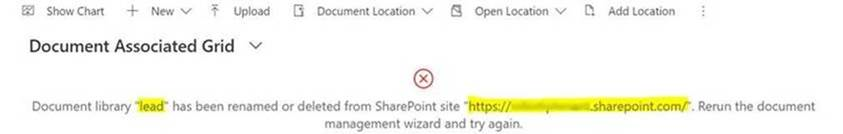

  *or*

  > [!div class="mx-imgBorder"]
  > 

- Error message in the web client:

  > [!div class="mx-imgBorder"]
  > 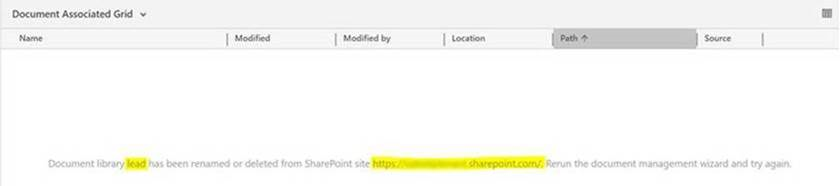

  *or*

  > [!div class="mx-imgBorder"]
  > 

  Log file:

  > [!div class="mx-imgBorder"]
  > 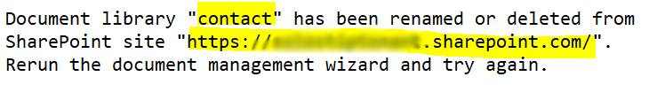

### Reason

This error typically occurs when the SharePoint document library was created for the record. Because of some changes in SharePoint, the document library doesn’t exist anymore. This can happen because the document library was deleted or moved to a different SharePoint site.

### Mitigation steps for missing document library

1.  The error message shows the name of the document library that is missing. It also shows the path where the document library is expected on the SharePoint site.

2.  Select **Settings**  -> **Document Management Settings**.

3.  Make sure the entity for the document library found from step 1 is selected and a valid SharePoint URL is specified.

4.  Complete the Document Management Settings wizard.

5.  The last step of wizard should have the status of document library as succeeded.

      > [!div class="mx-imgBorder"]
      > 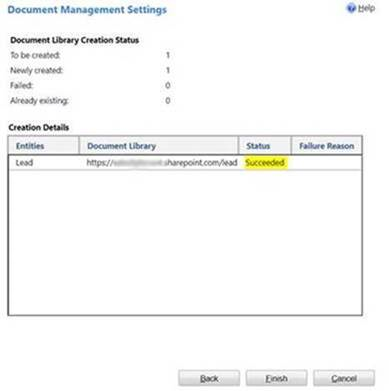

6.  Once complete, verify that document library is now present on the SharePoint site in the path shown in the error message.

7.  Launch the application and repeat the operation that produced the error.

## Reason and mitigation steps for missing folder

Error message displayed for missing folder:

  "Folder "`<folder name>`" has been renamed or deleted from SharePoint. It was expected inside "`<folder path>`" path. Restore the folder on SharePoint and try again.

- Error message when the entity-based folder structure is not enabled.

  Folder path is `../<entity name>/<record name>`

  - Error message in the Unified Interface:

    > [!div class="mx-imgBorder"]
    > 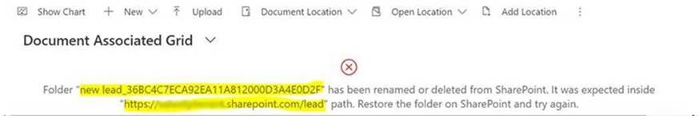

    *or*

    > [!div class="mx-imgBorder"]
    > 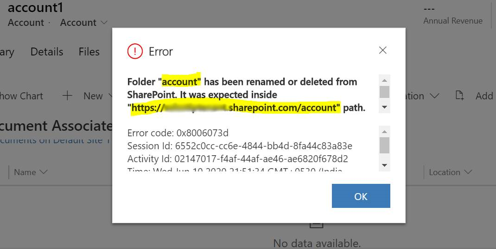

  - Error message in the web client:

    > [!div class="mx-imgBorder"]
    > 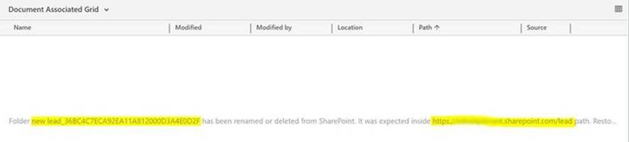

    *or*

    > [!div class="mx-imgBorder"]
    > 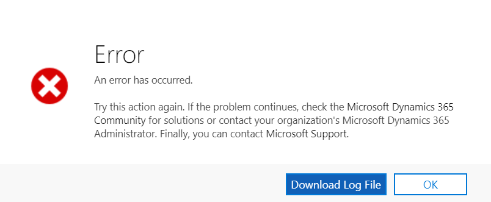

    Log file:

    > [!div class="mx-imgBorder"]
    > 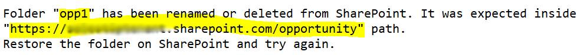

- Error message when the entity-based folder structure is enabled.

  Folder path is `../<account or contact>/<account or contact name>/<entity name>/<record name>`

  - Error message in the Unified Interface:

    > [!div class="mx-imgBorder"]
    > 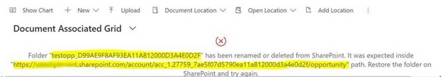

    *or*

    > [!div class="mx-imgBorder"]
    > 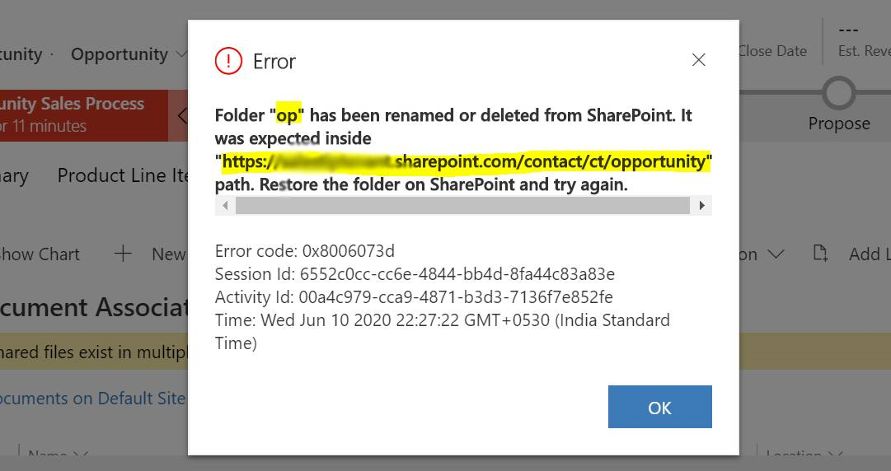

  - Error message in the web client:

    > [!div class="mx-imgBorder"]
    > 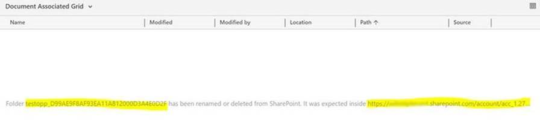

    *or*

    > [!div class="mx-imgBorder"]
    > 

    Log file:

    > [!div class="mx-imgBorder"]
    > 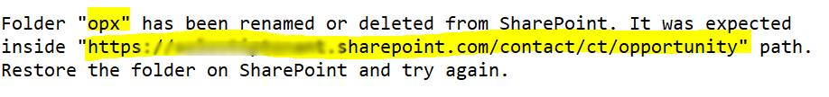

### Reason

This error typically occurs when the SharePoint folder was created for the record. Because of a change in SharePoint, the folder doesn’t exist anymore. This can happen because the folder for this record was either renamed, deleted, or moved to different location.

### Mitigation steps for missing folder

1.  The error message shows the name of the folder which is missing. It also shows the path where the folder was expected on the SharePoint site. Navigate to this path in SharePoint.

2.	Create a new folder on SharePoint with the name the same as the folder name provided in error message.

3.	Once complete, verify that folder is now present on the SharePoint site in the path shown in the error message.

4.	Launch the application and repeat the operation that produced the error.

### See also
[Known issues with document management](doc-management-known-issues.md) 
