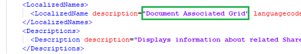
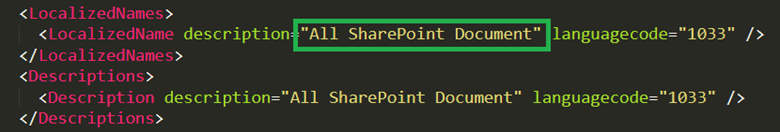
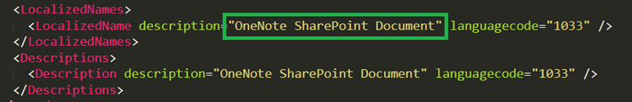

# Troubleshoot SharePoint integration

<!-- legacy procedure -->

[!INCLUDE [cc-data-platform-banner](../includes/cc-data-platform-banner.md)]

This topic explains how to fix common issues that may occur with SharePoint document management.

## Missing Documents button - validate and fix 

If **Documents** is missing from entities such as account, use the following to restore.


1. Make sure you have the System Administrator security role or equivalent permissions.
    Check your security role:
    a. Follow the steps in [View your user profile](https://docs.microsoft.com/powerapps/user/view-your-user-profile).
    b. Don't have the correct permissions? Contact your system administrator.

2. Fix the missing **Documents** button. Follow these steps:

   1. Identity the entity for which the documents link should be visible (e.g. account, contact, opportunity...etc.).
   2. Go to **Settings** > **Document Management Settings**.
   3. Make sure the entity you wished to have documents link (selected in Step 1) are selected and a valid SharePoint URL is specified. 
   4. Complete the wizard.
   5. Verify the **Documents** button appears.

For more information, see [Enable SharePoint document management for specific entities](enable-sharepoint-document-management-specific-entities.md).

## Malformed FetchXML or LayoutXML - validate and fix

Malformed FetchXML or LayoutXML can cause any of the following issues:

* Documents associated grid is missing
* Unable to view folders
* Unable to view documents inside folders
* Document is not getting deleted
* Error Message – "Required parameter is null or undefined: url" while opening the documents tab
* Error Message – "System.NullReferenceException" while uploading a document
* Document being downloaded instead of opening in new tab

There can be many causes for FetchXML or LayoutXML to be malformed. The most common cause is customizing the entity/grid view, adding/removing columns, and other similar customizations.

If FetchXML or LayoutXML are malformed, use the following to restore.

1. Make sure you have the System Administrator security role or equivalent permissions.
    Check your security role:
    1. Follow the steps in [View your user profile](https://docs.microsoft.com/powerapps/user/view-your-user-profile).
    2. Don't have the correct permissions? Contact your system administrator.
2. In the web app, go to **Settings** > **Customizations** > **Solutions**. 
3. Create a solution (named SharePointDocumentSolution). For more information, see [Create a solution](https://docs.microsoft.com/powerapps/maker/canvas-apps/add-app-solution).
4. Choose **Entities** > **Add Existing** > **Entity** > find and add **SharePoint Document** entity  (select all fields, forms, views). 
5. Select **Save** and **Close**.
6. Publish all customizations.
7. Select the created (SharePointDocumentSolution) solution.
8. Export the solution and choose the Package type as "Unmanaged". SharePointDocumentSolution.zip will be downloaded. 
9. Delete the solution that was created during step 3 from the organization.
<!-- 10. Browse the folder, locate and open customization.xml.
11. Search LayoutXml of Document associated grid (search for *Document Associated*).
    
    > [!div class="mx-imgBorder"] 
    >   -->

10.    Extract the exported solution zip file (downloaded file from Step 8).  
11.    In the solution contents folder, locate and then open **Solution.xml**.
12.    Change the following value in **Solution.xml**, and then save it. <br />
    From `<Managed>0</Managed>` to `<Managed>1</Managed>`.
13.    In the solution contents folder, locate and open **customization.xml**.
14.    Search the `<SavedQuery>` element where the **savedqueryid** attribute is equal to "0016f9f3-41cc-4276-9d11-04308d15858d".
15.    If you can't find a saved query with the ID specified in the previous step, go to step 19. However, if the `<SavedQuery>` element found in step 14 is similar to 
`<SavedQuery unmodified="1">`, remove the **unmodified="n"** attribute. 
16. Search layoutxml of Document associated grid (search for *Document Associated*).
    
    > [!div class="mx-imgBorder"] 
    > 

17. Make the changes as indicated below for the layoutxml section:

    ```xml
    <layoutxml>
     <grid name="sharepointdocument" object="9507" jump="fullname" select="1" icon="0" preview="1">
      <row name="sharepointdocument" id="sharepointdocumentid">
            <cell name="fullname" width="300" imageproviderfunctionname="DocumentManagement.FileTypeIcon.loadSharePointFileTypeIcon" imageproviderwebresource="$webresource:SharePoint_main_system_library.js" />
            <cell name="modified" width="150" />
            <cell name="sharepointmodifiedby" width="150" />
            <cell name="relativelocation" width="200" />
            <cell name="servicetype" width="90" />
            <cell name="documentid" ishidden="1" />
            <cell name="title" ishidden="1" />
            <cell name="author" ishidden="1" />
            <cell name="sharepointcreatedon" ishidden="1" />
            <cell name="sharepointdocumentid" ishidden="1" />
            <cell name="filetype" ishidden="1" />
            <cell name="readurl" ishidden="1" />
            <cell name="editurl" ishidden="1" />
            <cell name="ischeckedout" ishidden="1" />
            <cell name="absoluteurl" ishidden="1" />
            <cell name="locationid" ishidden="1" />
            <cell name="iconclassname" ishidden="1" />
      </row>
     </grid>
    </layoutxml>
    ``` 

    > [!IMPORTANT]
    >  All the attributes configured in the layout xml require their corresponding respective attributes to be present in the Fetch XML. The grid will return an error when this configuration is incorrect.  

18. Make the changes as below for the FetchXml section:

    ```xml
    <fetch distinct="false" mapping="logical">
      <entity name="sharepointdocument">
        <attribute name="documentid" />
        <attribute name="fullname" />
        <attribute name="relativelocation" />
        <attribute name="sharepointcreatedon" />
        <attribute name="ischeckedout" />
        <attribute name="filetype" />
        <attribute name="modified" />
        <attribute name="sharepointmodifiedby" />
        <attribute name="servicetype" />
        <attribute name="absoluteurl" />
        <attribute name="title" />
        <attribute name="author" />
        <attribute name="sharepointdocumentid" />
        <attribute name="readurl" />
        <attribute name="editurl" />
        <attribute name="locationid" />
        <attribute name="iconclassname" />
        <order attribute="relativelocation" descending="false" />
        <filter>
          <condition attribute="isrecursivefetch" operator="eq" value="0" />
        </filter>
      </entity>
    </fetch>
    ```  

19. Similarly search the `<SavedQuery>` element where the **savedqueryid** attribute is equal to "a5b008ac-07d9-4554-8509-2c05767bff51".

20. If you can't find a saved query with the ID specified in the previous step, go to step 24. However, if the `<SavedQuery>` element found in step 19 is similar to `<SavedQuery unmodified="1">`, remove the **unmodified="n"** attribute.

21. Search layoutxml of All SharePoint Document (search for *All SharePoint Document*).

    > [!div class="mx-imgBorder"] 
    > 

22. Make the changes as indicated below for the layoutxml section:

    ```xml
    <layoutxml>
      <grid name="sharepointdocument" jump="fullname" select="1" icon="0" preview="1">
        <row name="sharepointdocument" id="sharepointdocumentid">
          <cell name="fullname" width="300" imageproviderfunctionname="DocumentManagement.FileTypeIcon.loadSharePointFileTypeIcon" imageproviderwebresource="$webresource:SharePoint_main_system_library.js" />
          <cell name="relativelocation" width="200" />
          <cell name="modified" width="150" />
          <cell name="sharepointmodifiedby" width="150" />
          <cell name="sharepointcreatedon" width="300" />
          <cell name="documentid" ishidden="1" />
          <cell name="title" ishidden="1" />
          <cell name="readurl" ishidden="1" />
          <cell name="editurl" ishidden="1" />
          <cell name="author" ishidden="1" />
          <cell name="absoluteurl" ishidden="1" />
          <cell name="sharepointdocumentid" ishidden="1" />
          <cell name="filetype" ishidden="1" />
          <cell name="ischeckedout" ishidden="1" />
          <cell name="locationid" ishidden="1" />
          <cell name="iconclassname" ishidden="1" />
        </row>
      </grid>
    </layoutxml>
    ```

23. Make the changes as below for the FetchXml section:

    ```xml
    <fetch distinct="false" mapping="logical">
      <entity name="sharepointdocument">
        <attribute name="documentid" />
        <attribute name="fullname" />
        <attribute name="relativelocation" />
        <attribute name="sharepointcreatedon" />
        <attribute name="filetype" />
        <attribute name="absoluteurl" />
        <attribute name="modified" />
        <attribute name="sharepointmodifiedby" />
        <attribute name="title" />
        <attribute name="readurl" />
        <attribute name="editurl" />
        <attribute name="author" />
        <attribute name="sharepointdocumentid" />
        <attribute name="ischeckedout" />
        <attribute name="locationid" />
        <attribute name="iconclassname" />
        <filter>
          <condition attribute="isrecursivefetch" operator="eq" value="1" />
        </filter>
        <order attribute="relativelocation" descending="false" />
      </entity>
    </fetch>
    ```

24. Similarly search the `<SavedQuery>` element where the **savedqueryid** attribute is equal to "cb177797-b2ac-42a8-9773-5412321a965c".

25. If you can't find a saved query with the ID specified in the previous step, go to step 29. However, if the `<SavedQuery>` element found in step 24 is similar to `<SavedQuery unmodified="1">`, remove the **unmodified="n"** attribute.

26. Search layoutxml of OneNote SharePoint Document (search for *OneNote SharePoint Document*).

    > [!div class="mx-imgBorder"] 
    > 

27. Make the changes as indicated below for the layoutxml section:

    ```xml
    <layoutxml>
      <grid name="sharepointdocument" jump="fullname" select="1" icon="0" preview="1">
        <row name="sharepointdocument" id="sharepointdocumentid">
          <cell name="fullname" width="300" imageproviderfunctionname="DocumentManagement.FileTypeIcon.loadSharePointFileTypeIcon" imageproviderwebresource="$webresource:SharePoint_main_system_library.js" />
          <cell name="relativelocation" width="200" />
          <cell name="modified" width="150" />
          <cell name="sharepointmodifiedby" width="150" />
          <cell name="sharepointcreatedon" width="300" />
          <cell name="title" ishidden="1" />
          <cell name="readurl" ishidden="1" />
          <cell name="editurl" ishidden="1" />
          <cell name="author" ishidden="1" />
          <cell name="absoluteurl" ishidden="1" />
          <cell name="filetype" ishidden="1" />
          <cell name="ischeckedout" ishidden="1" />
          <cell name="locationid" ishidden="1" />
          <cell name="iconclassname" ishidden="1" />
        </row>
      </grid>
    </layoutxml>
    ```

28. Make the changes as below for the FetchXml section:

    ```xml
    <fetch distinct="false" mapping="logical">
      <entity name="sharepointdocument">
        <attribute name="documentid" />
        <attribute name="fullname" />
        <attribute name="relativelocation" />
        <attribute name="sharepointcreatedon" />
        <attribute name="filetype" />
        <attribute name="modified" />
        <attribute name="sharepointmodifiedby" />
        <attribute name="title" />
        <attribute name="readurl" />
        <attribute name="editurl" />
        <attribute name="author" />
        <attribute name="absoluteurl" />
        <attribute name="ischeckedout" />
        <attribute name="locationid" />
        <attribute name="iconclassname" />
        <filter type="and">
          <condition attribute="documentlocationtype" operator="eq" value="1" />
          <condition attribute="isrecursivefetch" operator="eq" value="0" />
          <filter type="or">
            <condition attribute="filetype" operator="eq" value="one" />
            <condition attribute="filetype" operator="eq" value="onetoc2" />
          </filter>
        </filter>
        <order attribute="sharepointcreatedon" descending="true" />
      </entity>
    </fetch>
    ```

29. Save the file.
30. Zip the folder.
31. Open a model-driven app in Dynamics 365.
32. Navigate to **Settings** > **Solutions**
33. Import the solution (zipped file in Step 8).
34. Publish all customizations.
35. Verify that any of the issues associated with the malformed FetchXML or LayoutXML are resolved. For example, verify that Document associated grid displays in all the required SharePoint documents.

## Validate and fix SharePoint site URLs

In customer engagement apps (such as Dynamics 365 Sales and Customer Service), [!INCLUDE[pn_SharePoint_short](../includes/pn-sharepoint-short.md)] site and document location records contain links to site collections, site, document libraries, and folders in [!INCLUDE[pn_SharePoint_short](../includes/pn-sharepoint-short.md)]. These site and document location records are associated with records so that the documents for records can be stored in [!INCLUDE[pn_SharePoint_short](../includes/pn-sharepoint-short.md)].  
  
 When the links between customer engagement apps and [!INCLUDE[pn_SharePoint_short](../includes/pn-sharepoint-short.md)] break, you must validate and fix the links so that the records continue to point to the correct document libraries and folders for managing the documents.  
  
1. [!INCLUDE[proc_permissions_system_admin](../includes/proc-permissions-system-admin.md)]  
  
    Check your security role  
  
   - [!INCLUDE[proc_check_your_security_role](../includes/proc-check-your-security-role.md)]  
  
   - [!INCLUDE[proc_dont_have_correct_permissions](../includes/proc-dont-have-correct-permissions.md)]  
  
2. Find and fix the URLs. To do this, follow these steps.  
  
   1. [!INCLUDE[proc_settings_doc_mgmt](../includes/proc-settings-doc-mgmt.md)]  
  
   2. Click **[!INCLUDE[pn_SharePoint_short](../includes/pn-sharepoint-short.md)] Sites**.  
  
   3. Select the site URLs that you want to validate, and then click or tap **Validate**.  
  
3. Customer engagement apps validate all the selected site URLs and their immediate subordinate site and document library URLs. It then displays the results in **Validating Sites**.  
  
4. To fix a URL, open the site record, and enter the correct URL. [!INCLUDE[proc_more_information](../includes/proc-more-information.md)] [Create or edit site records](edit-existing-sharepoint-site-records.md).  
  
5. Click **Save & Close**.  


## Users receive "You don't have permissions to view files in this location" message
This error message can occur when the SharePoint site that is configured with document management has been renamed, but the SharePoint sites URL record has not been updated to reflect the change. 

1. Go to **Settings** > **Document Management** > **SharePoint Sites**.
2. Open the **SharePoint Site** record that has been renamed and enter the **Absolute URL** with new URL.

    > [!div class="mx-imgBorder"] 
    > 

3. Select **Save & Close**.


### See also
[Troubleshooting server-based authentication](troubleshooting-server-based-authentication.md) 
