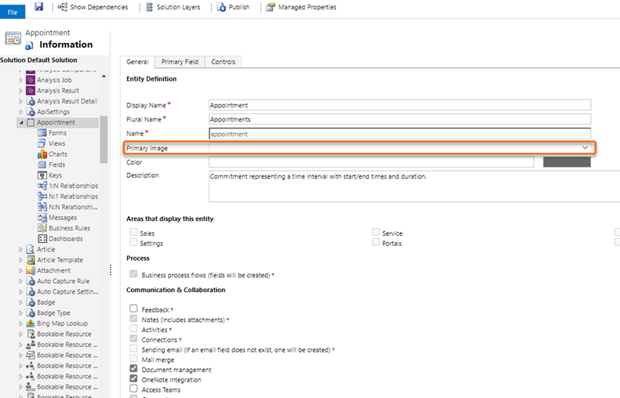
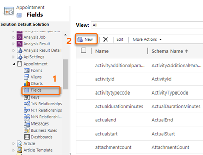
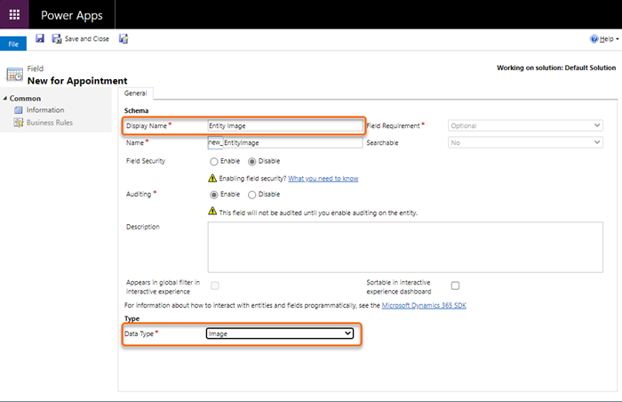
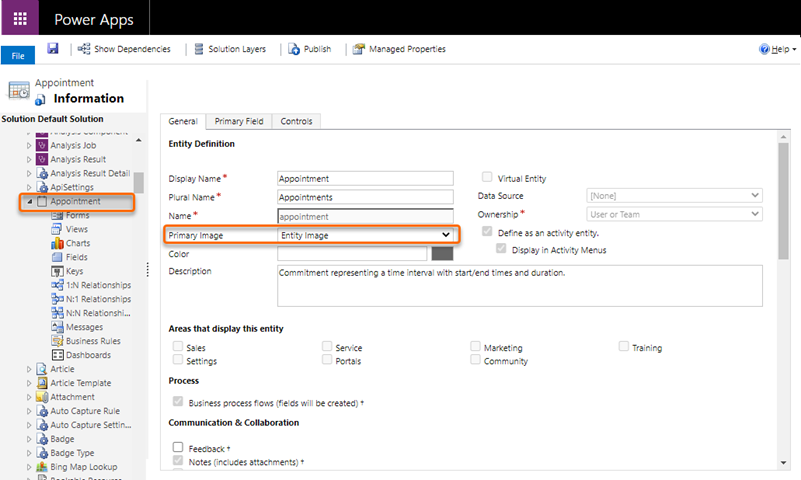
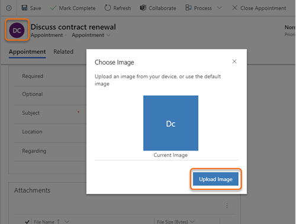
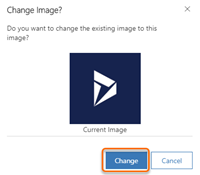
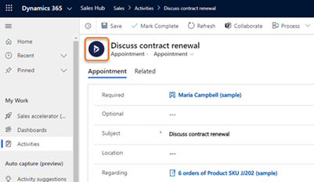
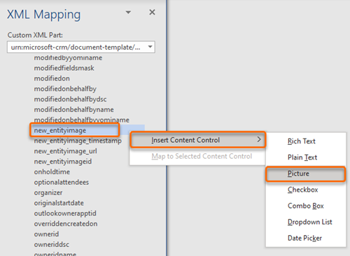

# Troubleshooting Word templates

[!INCLUDE [cc-data-platform-banner](../includes/cc-data-platform-banner.md)]

This article helps you troubleshoot and resolve issues related to Word templates.

## I'm unable to see an entity image in a Word template for certain out-of-the-box and custom entities

### Reason

By default, only a few out-of-the-box entities&mdash;such as Account, Contact, Opportunity, Order, Invoice, Product, Lead, Goal, and Territory&mdash;include an **EntityImage** value for the **Primary Image** field, which you can use to upload the image to a Word template. However, for other out-of-the-box (such as Quote, Business Unit, Appointment, and Email) and custom entities, **EntityImage** isn't available.

### Resolution

To show an image for entities that don't have an **EntityImage** by default, you create an image field for the entity, upload the entity image to a record, and then add the entity image to the Word template. In the following example, we add an **EntityImage** for a **Discuss contract renewal** appointment. 

**To create an image field for the entity**

  1.	Go to **Settings** > **Customizations** > **Customize the System**.

  2.	In the solution explorer, under **Components**, expand **Entities**, and then select the entity. In this example, we're selecting the **Appointment** entity.

  > [!div class="mx-imgBorder"]
  > 

  3.	In the **Appointment** entity, select **Fields**, and then select **New**.

  > [!div class="mx-imgBorder"]
  > 
    
  4.	In the new field form, enter **Entity Image** for the **Display Name**, enter **EntityImage** for the **Name**, and for **Data Type**, select **Image**.

  > [!div class="mx-imgBorder"]
  >  

  5.	Save and close the form. 

  6.	Verify that the new field has been added by selecting the entity name. In this example, we've added **Entity Image** as a value for the **Primary Image** field for the **Appointment** entity.

  > [!div class="mx-imgBorder"]
  > 

  7.	Publish the customizations.

**To upload the entity image to the record**

1. Open the entity record. In this example, we're opening a **Discuss contract renewal** appointment.

   > [!div class="mx-imgBorder"]
   > 

2. Select the image, and in the **Choose Image** dialog box, select **Upload Image**.

   > [!div class="mx-imgBorder"]
   > 

3. Select the image, and then select **Change**.

   > [!div class="mx-imgBorder"]
   > 

  The image appears beside the entity.

  > [!div class="mx-imgBorder"]
  > 

**To add the entity image to the Word template** 

1. Download and open the Word template.

   The downloaded template is saved in the following format: *recordType organizationDateFormat time localDateFormat time*.docx For example, the downloaded template name for the appointment is: **Appointment 2020-7-15 15-39-27 17-7-2020 12-28-00 PM.docx**.

2. Open the **XML Mapping** pane, right-click to select **new_entityimage**, and then select **Insert Content Control** > **Picture**.

    > [!div class="mx-imgBorder"]
    > 

    The entity image field with the image is added to the Word template.

3. Save and upload the Word template to your Dynamics 365 Sales Hub app.

Now, when you download and open a document based on this template, it will contain the image you added.

  >[!NOTE]
  >Similarly, if you add an image to an entity form, follow this process to upload the image to the Word template.

### See also

[Use Word templates to create standardized documents](using-word-templates-dynamics-365.md)
