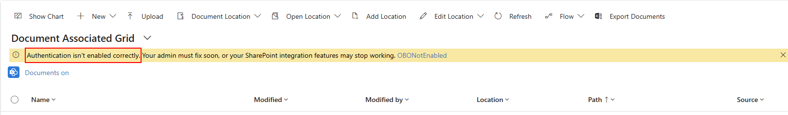

# Troubleshooting conditional access authentication

With security improvements in SharePoint integration authentication, it's suggested to keep the SharePoint Online and Dataverse aligned to avoid conditional access mismatch. These sections outline how to review and align conditional access

## Conditional access isn't enabled correctly

When the Document Associated grid shows a warning message "Conditional access isn't enabled correctly", the error code at the end of the message guides addressing the configuration.

  

### Document Associated Grid warning AADSTS50076 or AADSTS50079 

In this case, an external security challenge is required but not satisfied. A common cause is when Multi-Factor Authentication is enabled for SharePoint but not for Dataverse. Use these steps to ensure both are aligned.

1. Open the Microsoft Entra admin center to **SharePoint Access Policy**
1. Select **Access controls** > **Grant** to open the Grant dialog
1. Under **Grant access** check if **Require multifactor authentication** and optionally **Require authentication strength** is checked
1. If either item is checked, then enable the related Dataverse conditional access policy if it's not enabled

There are other situations which might cause this issue, if you checked it's not MFA related contact Microsoft support and open a ticket requesting support.

### Document Associated Grid warning AADSTS50158 

When message shown is AADSTS53000, the error can be related to either Multi-Factor Authentication or conditional access policy. 

### Document Associated Grid warning AADSTS53003 

When message shown is AADSTS53000, a conditional access is configured to block issuing a token.

### Document Associated Grid warning AADSTS53001

When message shown is AADSTS53000, the device isn't in a domain joined status. Use these steps to fix.

1. Log out or restart your device if you're already logged in 
1. Sign in to your device using your work or school account 
1. Connect to your organization's network through a virtual private network (VPN) or DirectAccess 
1. Clear your browser's cache and restart the browser 
1. Try to use SharePoint integration feature again

### Document Associated Grid warning AADSTS53000

When message shown is AADSTS53000, the device is managed by a SharePoint conditional access policy to access the resource. If the blocked access is expected, inform the user how to access within the conditional access policy. If blocked access isn't expected, review the SharePoint conditional access within Microsoft Entra admin center **SharePoint Access Policy**.

1. Open the Microsoft Entra admin center to **SharePoint Access Policy**
1. Select **Access controls** > **Grant** to open the Grant dialog
1. Under **Grant access** check if **Require device to be marked as compliant** or **Require Microsoft Entra hybrid joined device** is checked

## Authentication isn't enabled correctly

When the Document Associated grid shows a warning message "Authentication isn't enabled correctly", contact support to confirm that authentication is enabled for the environment.

  

## Find conditional access setup

### Find SharePoint Online conditional access

1. Open Microsoft Entra as tenant admin: https://entra.microsoft.com
1. Select **Applications** > **Enterprise Applications** in the left menu
1. Clear the filter "Application type == Enterprise Applications"

     

1. Search for **Office 365 SharePoint Online** and select the item in the list

     

1. Select **Conditional Access** to show the list of Policy names

     

### Find Dataverse conditional access

1. Open Microsoft Entra as tenant admin: https://entra.microsoft.com
1. Select **Applications** > **Enterprise Applications** in the left menu
1. Clear the filter "Application type == Enterprise Applications"
   
     

1. Search for **Dataverse** and select in the list
1. Select **Conditional Access** to show the list of Policy names

     
