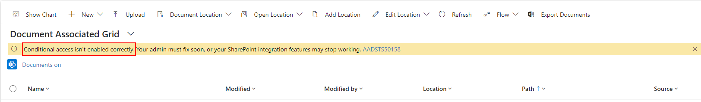
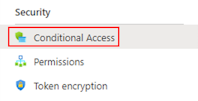

# Troubleshooting conditional access authentication

This page outlines how to address warning messages related to conditional access authentication improvements.

With security improvements in SharePoint integration authentication, you need to keep SharePoint Online and Dataverse conditional access aligned to avoid issues. These sections outline how to review and align conditional access

## Conditional access isn't enabled correctly

When the Document Associated grid shows a warning message "Conditional access isn't enabled correctly", the error code at the end of the message guides addressing the configuration.

  

### SharePoint Document Grid warning AADSTS50076 or AADSTS50079 

In this case, an external security challenge is required but not satisfied. A common cause is when multifactor authentication is enabled for SharePoint but not for Dataverse. Use these steps to ensure both are aligned.

1. Open the Microsoft Entra admin center to **SharePoint Access Policy** using [Find SharePoint Online conditional access](#find-sharepoint-online-conditional-access)
1. Select **Access controls** > **Grant** to open the Grant dialog
1. Under **Grant access** check if **Require multifactor authentication** and optionally **Require authentication strength** is checked
1. If either item is checked, then enable the related Dataverse conditional access policy if not enabled already using [Find Dataverse conditional access](#find-dataverse-conditional-access)

There are other situations which might cause this issue, if you checked and it's not multifactor authentication related contact Microsoft support and open a ticket requesting support.

### SharePoint Document Grid warning AADSTS50158 

When message shown is AADSTS53000, the error can be related to either multifactor authentication or conditional access policy.

First, check if multifactor authentication is enabled in Dataverse following steps in [AADSTS50076](#sharepoint-document-grid-warning-aadsts50076-or-aadsts50079). If needed enable the Dataverse multifactor authentication.

If multifactor authentication is enabled on both Dataverse and SharePoint, then you need to check SharePoint conditional access.

1. When the devic is managed, open **Extra SharePoint Access Policy** using [Find SharePoint Online conditional access](#find-sharepoint-online-conditional-access)
1. Check if the device has any network conditions
   1. Select link under **Network**
   1. Review network conditions selected under **Include** and **Exclude**
1. Check if the device is in locations conditions
   1. Select link under **Conditions**
   1. Select link under **Locations**
   1. Review selected network or physical locations

### SharePoint Document Grid warning AADSTS53001

When message shown is AADSTS53000, the device isn't in a domain joined status. Use these steps to fix.

1. Log out or restart your device if you're already logged in 
1. Sign in to your device using your work or school account 
1. Connect to your organization's network through a virtual private network (VPN) or DirectAccess 
1. Clear your browser's cache and restart the browser 
1. Try to use SharePoint integration feature again

### SharePoint Document Grid warning AADSTS53000

When message shown is AADSTS53000, a SharePoint conditional access policy is preventing the device access to the resource. If the blocked access is expected, inform the user how to access within the conditional access policy. If blocked access isn't expected, review the SharePoint conditional access within Microsoft Entra admin center **SharePoint Access Policy**.

1. Open the Microsoft Entra admin center to **SharePoint Access Policy** using [Find SharePoint Online conditional access](#find-sharepoint-online-conditional-access)
1. Select **Access controls** > **Grant** to open the Grant dialog
1. Under **Grant access** check if **Require device to be marked as compliant** or **Require Microsoft Entra hybrid joined device** is checked

### SharePoint Document Grid warning AADSTS530003 

When message shown is AADSTS530003, the access is related to a device. First use [AADSTS53000](#sharepoint-document-grid-warning-aadsts53000) to check if the device is managed and then follow these steps.

1. When the devic is managed, open **Extra SharePoint Access Policy** using [Find SharePoint Online conditional access](#find-sharepoint-online-conditional-access)
1. Check if the device is in the supported list
   1. Select link under **Conditions**
   1. Select link under **Device platforms**
   1. Review platforms selected under **Include** and **Exclude**
1. Check if the device is in the supported list
   1. Select link under **Conditions**
   1. Select link under **Client apps**
   1. Review selected client apps
 1. Check if the device is filtered
   1. Select link under **Conditions**
   1. Select link under **Filter for devices**
   1. Review filtered devices

## Authentication isn't enabled correctly

When the Document Associated grid shows a warning message "Authentication isn't enabled correctly", contact support to confirm that authentication is enabled for the environment.

  

## Find conditional access setup

### Find SharePoint Online conditional access

1. Open Microsoft Entra as tenant admin: https://entra.microsoft.com
1. Select **Applications** > **Enterprise Applications** in the left menu
1. Clear the filter "Application type == Enterprise Applications"

     

1. Search for **Office 365 SharePoint Online** and select the item in the list

     

1. Select **Conditional Access** to show the list of Policy names

   

1. Select **SharePoint Access Policy** in the policy list

### Find Dataverse conditional access

1. Open Microsoft Entra as tenant admin: https://entra.microsoft.com
1. Select **Applications** > **Enterprise Applications** in the left menu
1. Clear the filter "Application type == Enterprise Applications"
   
     

1. Search for **Dataverse** and select in the list

     
  
1. Select **Conditional Access** to show the list of Policy names

     
