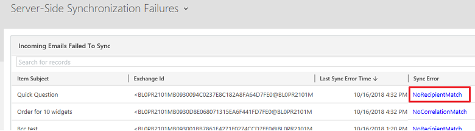
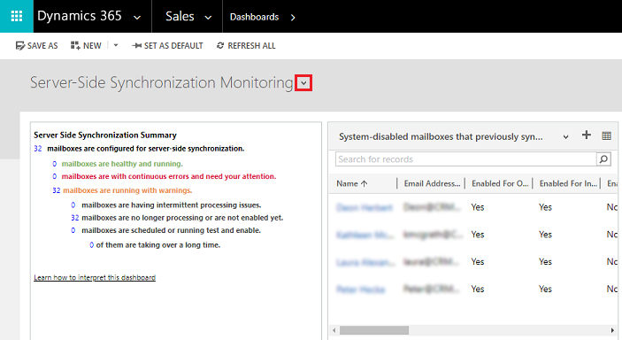
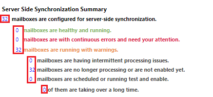
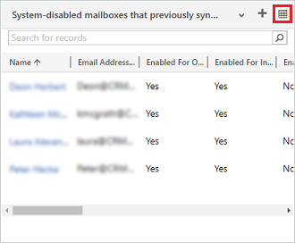

# Troubleshooting and monitoring server-side synchronization 

<!-- legacy procedure -->

[!INCLUDE [cc-data-platform-banner](../includes/cc-data-platform-banner.md)]

This page is your source for issues and resolutions for troubleshooting server-side synchronization. Check back for updated information as issues are discovered and resolutions recorded.  
 
## The Server-Side Snychronization Failures dashboard

Follow the steps in this [KB article](https://support.microsoft.com/help/4468755/troubleshoot-item-level-server-side-synchronization-issues-with-dynami) to enable and use a dashboard to get information on synchronization errors.

> [!div class="mx-imgBorder"] 
> 

 
   

## The Server-Side Synchronization Monitoring dashboard  
 You can use the Server-Side Synchronization Monitoring dashboard to get a quick look at the health of mailboxes using server-side sync.  
  
 Go to any dashboard, click Select  next to the dashboard title, and then click **Server-Side Synchronization Monitoring**.  

> [!div class="mx-imgBorder"] 
>   
  
 This dashboard is made up of multiple charts, each providing insights into your organization's server-side sync performance.  
  
 Click on a number in the list of mailboxes configured for server-side sync to get a specific mailbox status.  
  
> [!div class="mx-imgBorder"] 
>   
  
 Click on the grid icon in each chart to view the records that are used to generate the chart.  
  
> [!div class="mx-imgBorder"] 
>   

## Common alerts and recommended resolutions  
  
### Mailbox disabled for synchronization  
**Alert:** The mailbox has been disabled for synchronizing appointments, contacts, and tasks for the mailbox because an error occurred while establishing a secure connection to the Exchange server. The owner of the email server profile has been notified.  
  
 **Solution:**  [https://support.microsoft.com/kb/2993502](https://support.microsoft.com/kb/2993502)  
  
### Error while establishing a secure connection  
**Alert:** Email cannot be received for the mailbox because an error occurred while establishing a secure connection to the email server. The mailbox has been disabled for receiving email and the owner of the email server profile has been notified.  
  
 **Solution:**  [https://support.microsoft.com/kb/2993502](https://support.microsoft.com/kb/2993502)  
  
### Email message has "Pending Send" status  
If you create an email message in customer engagement apps (Dynamics 365 Sales, Dynamics 365 Customer Service, Dynamics 365 Field Service, Dynamics 365 Marketing, and Dynamics 365 Project Service Automation), and click the **Send** button, the message will not be sent unless email integration has been correctly configured and enabled for sending email from customer engagement apps.  
  
 Verify that the user who sent the email is enabled for sending email.  

1. In the Power Platform admin center, select an environment. 

2. Select **Settings** > **Email** > **Mailboxes**.  
  
3. Change the view to **Active Mailboxes.**  
  
4. Select the mailbox record for the user who sent the email, and then click the **Edit** button.  
  
5. Verify the user is correctly configured and enabled for sending email:  
  
   - If the user's mailbox record is configured to use server-side synchronization for outgoing email, verify the user's email address is approved and is also tested and enabled.  For more information about configuring server-side synchronization, see [Set up server-side synchronization of email, appointments, contacts, and tasks](../admin/set-up-server-side-synchronization-of-email-appointments-contacts-and-tasks.md).  
  
### Email address requires approval by Microsoft 365 administrator  
 **Alert:** Email cannot be sent/received because the email address of the mailbox \<User Name> requires an approval by an Microsoft 365 administrator. The mailbox has been disabled for sending/receiving email and the owner of the email server profile Exchange Online has been notified.  
  
 **Cause:**  
  
 This error will occur if a user is configured to use the [!INCLUDE[pn_Microsoft_Exchange_Online](../includes/pn-microsoft-exchange-online.md)] email server profile but their email address has not been approved by an [!INCLUDE[pn_Office_365](../includes/pn-office-365.md)] administrator. A user with the global administrator role in [!INCLUDE[pn_Office_365](../includes/pn-office-365.md)] needs to approve the email address for each user that uses the [!INCLUDE[pn_Microsoft_Exchange_Online](../includes/pn-microsoft-exchange-online.md)] email server profile. The [!INCLUDE[pn_Microsoft_Exchange_Online](../includes/pn-microsoft-exchange-online.md)] profile uses server-to-server authentication between customer engagement apps and [!INCLUDE[pn_Exchange_Online](../includes/pn-exchange-online.md)]. This authentication is dependent on a trust between customer engagement apps and [!INCLUDE[pn_Exchange_Online](../includes/pn-exchange-online.md)]. By verifying the email address in customer engagement apps as an [!INCLUDE[pn_Office_365](../includes/pn-office-365.md)] global administrator, customer engagement apps be able to send and receive email for that user without the need to provide any email credentials within customer engagement apps.  
  
 **Solution:**  
  
 To approve one or more mailboxes:  
  
1. In the Power Platform admin center, select an environment. 

2. Select **Settings** > **Email** > **Mailboxes**.  
  
3. Select **Active Mailboxes** or perform an **Advanced Find** query to identify a list of mailboxes to update.  
  
4. Select the list of mailboxes you want to approve and then click **Approve Email**.  
  
5. Click **OK** to approve the email addresses.  
  
6. Click **Test & Enable Mailboxes** to retest email processing for the enabled mailboxes.  
  
### Email addresses must be approved  
 **Alert:** One or more mailboxes have been disabled for sending/receiving email because their email addresses have not been approved. Approve the email addresses, and then enable the mailboxes for sending/receiving email." or "Email cannot be received for the mailbox \<Mailbox Name> because the email address of the mailbox \<Mailbox Name> is not approved and the mailbox has been disabled. The owner of the associated email server profile \<Email Server Profile name> has been notified.  
  
 **Solution:**  
  
 Mailboxes must be approved before the email will be processed. To approve mailboxes:  
  
1. In the Power Platform admin center, select an environment. 

2. Select **Settings** > **Email** > **Mailboxes**.  
  
3. Select **Active Mailboxes** or perform an **Advanced Find** query to identify a list of mailboxes to update.  
  
4. Select the list of mailboxes you want to approve and then click **Approve Email**.  
  
5. Click **OK** to approve the email addresses.  
  
6. Click **Test & Enable Mailboxes** to retest email processing for the enabled mailboxes.  
  
> [!NOTE]
> You can remove the requirement for approving mailboxes using: **Settings** > **Administration** > **System Settings** > **Email** tab. Uncheck **Process emails only for approved users** and **Process emails only for approved queues**, then click **OK**. If you are using the [!INCLUDE[pn_Microsoft_Exchange_Online](../includes/pn-microsoft-exchange-online.md)] profile, email addresses must still be approved by an [!INCLUDE[pn_Office_365](../includes/pn-office-365.md)] global administrator.  
  
### Mailbox location could not be determined  
 **Alert:** The mailbox location could not be determined while sending/receiving the email message \<Message Subject>. The mailbox \<Mailbox Name> has been disabled for sending/receiving email and the owner of the associated email server profile \<Email Server Profile name> has been notified.  
  
 **Solution:** You will see this alert if your email server profile (**Settings** > **Email Configuration** > **Email Server Profiles**) is configured to use the **Auto Discover Server Location** option but auto discover cannot detect the location of your mailbox. If this issue occurs, check with your [!INCLUDE[pn_Exchange](../includes/pn-exchange.md)] administrator to verify your network is configured for auto discover. You can update the email server profile and click **No** for **Auto Discover Server Location**. Then provide the [!INCLUDE[pn_Exchange](../includes/pn-exchange.md)] web services URL for your [!INCLUDE[pn_Exchange](../includes/pn-exchange.md)] deployment. For example: https://ExchangeServerName/EWS/Exchange.asmx.  
  
### Credentials are incorrect or have insufficient permissions  
 **Alert:** Email cannot be sent/received because the credentials specified in the associated email server profile are incorrect or have insufficient permissions for sending/receiving email. The mailbox \<Mailbox Name> has been disabled for sending/receiving email and the owner of the email server profile \<Email Server Profile name> has been notified.  
  
 **Solution:**  
  
 This error can appear if incorrect credentials are provided or if the user account specified to access the mailbox does not have sufficient permissions to the mailbox. Check credentials and permissions for the mailbox. If you are providing credentials within an email server profile, make sure the user has impersonation permissions and mailbox access to each associated mailbox.  
  
 For more information on configuring [!INCLUDE[pn_Exchange](../includes/pn-exchange.md)] impersonation and granting mailbox access, see:  
  
-   [Configuring Exchange Impersonation](https://technet.microsoft.com/library/bb204095.aspx)  
  
-   [Allow Mailbox Access](https://technet.microsoft.com/library/aa996343\(v=exchg.141\).aspx)  
  
### Appointments can't be synchronized  
 **Alert:** Appointments can't be synchronized because the Organizer field is not present.  
  
 **Cause:** The Organizer field is required for appointment records to synchronize. By default, this field isn't included on the appointment form.  
  
 **Solution:**  
  
 To add the Organizer field to the appointment form:  
  
1.  In the web app, go to **Settings** > **Customizations** > **Customize the System**  
  
2.  Under **Components**, expand **Entities** > **Appointment**, and then click **Forms**.  
  
3.  Click **Appointment**, and then drag the **Organizer** field onto the form.  
  
4.  Click **Save** > **Publish**.  
  
### Appointments, contacts, and tasks can't be synchronized  
 **Alert:** Appointments, contacts, and tasks can't be synchronized because the email address of the mailbox \<Mailbox Name> is configured with another organization. The best practice is to overwrite the configuration when you test and enable the mailbox in your primary organization. Also, change the synchronization method for your mailbox in non-primary organizations to None.  
  
 **Solution:**  
  
 To change the primary synchronization organization and overwrite the setting stored in [!INCLUDE[pn_Exchange](../includes/pn-exchange.md)], click: **Settings** > **Email Configuration** > **Mailbox** > open a mailbox > **Test & Enable Mailbox** > select **Sync items with Exchange from this Organization only, even if Exchanges was set to sync with a different Organization**. This will allow server-side synchronization to work for this environment but the other environment would no longer work for synching that mailbox through server-side synchronization. To change the synchronization method for Appointments, Contacts, and Tasks, click: **Settings** > **Email Configuration** > **Mailbox** > open a mailbox > select **None** for **Appointments, Contacts, and Tasks**.  
  
 For more information, see: [When would I want to use this check box?](when-would-want-use-check-box.md)  
  
## Potential issues and resolutions  
  
   

### Email fails to be sent or received when server-side synchronization is configured with Gmail  
 If customer engagement apps is configured to use Server-Side Synchronization with Gmail, you may encounter one of the following errors:  
  
-   Email cannot be received for the mailbox \<Mailbox Name>. Make sure that the credentials specified in the mailbox are correct and have sufficient permissions for receiving email. Then, enable the mailbox for email processing.  
  
-   An unknown error occurred while sending the email message "Test Message". Mailbox \<Mailbox Name> didn't synchronize. The owner of the associated email server profile \<Email Server Profile Name> has been notified.  
  
For more information, see this [kb article](https://support.microsoft.com/kb/3185281).  
  
   

### Using Dynamics 365 apps with Exchange Online  
 If your company is using [!INCLUDE[pn_Exchange_Online](../includes/pn-exchange-online.md)] with customer engagement apps, note the following:  
  
 Customer engagement apps support server-side synchronization with [!INCLUDE[pn_Exchange_Online](../includes/pn-exchange-online.md)] in the same tenant with Server to Server Authentication. Other authentication methods or settings are not recommended or supported, including:  
  
- Using Credentials Specified by a User or Queue  
  
- Using Credentials Specified in Email Server Profile  
  
- Using Impersonation  
  
- Setting Auto Discover Server Location to No  
  
- Using an email server profile other than [!INCLUDE[pn_Exchange_Online](../includes/pn-exchange-online.md)]  
  
- Using model-driven apps with Exchange Online in a different tenant is currently not supported.
  
### Mailbox deliveries regularly disabled  
 Mailbox delivery errors are classified as follows:  
  
1. A permanent error (for example, 401 Unauthorized) or a transient error (for example, a network issue).  
  
2. A server error (for example, invalid profile credentials) or a mailbox error (for example, invalid mailbox credentials).  
  
   Customer engagement apps respond to the error as follows:  
  
-   For server or mailbox permanent errors, the mailbox is disabled as soon as the error is detected.  
  
-   For server or mailbox transient errors, delivery is retried up to 10 times with a 5 minute gap between attempts. If delivery fails after 10 attempts, the error is considered permanent and the mailbox is disabled.  
  
Review the troubleshooting steps in this topic and if the issue is successfully resolved, enable the mailbox.  
  
### Unsupported email service configurations  
 Server-side synchronization doesn't support the following scenarios:  
  
- Mix of [!INCLUDE[pn_Exchange](../includes/pn-exchange.md)]/SMTP and POP3/[!INCLUDE[pn_Exchange](../includes/pn-exchange.md)].  
  
- Creation of mass email marketing campaigns.  
  
- Extensibility scenarios like extending EWS/POP3/SMTP protocols and creating custom email providers.  
  
- [!INCLUDE[pn_ms_Exchange_Server_2003_short](../includes/pn-ms-exchange-server-2003-short.md)] and [!INCLUDE[pn_ms_Exchange_Server_2007_short](../includes/pn-ms-exchange-server-2007-short.md)].  
  
- Server-side synchronization in customer engagement apps require a [!INCLUDE[pn_POP3_short](../includes/pn-pop3-short.md)]/SMTP email server that is also FIPS 140-2 compliant. Some email servers are not FIPS 140-2 compliant, such as MSN, Outlook.com, or Windows Live Mail.  
  
For most situations not supported by server-side synchronization, you can use the [!INCLUDE[pn_CRM_E-Mail_Router](../includes/pn-crm-e-mail-router.md)]. [!INCLUDE[proc_more_information](../includes/proc-more-information.md)] [Integrate your email system](../admin/integrate-synchronize-your-email-system.md)  
  
> [!NOTE]
>  We recommend that you don't use a mixed configuration of [!INCLUDE[pn_Outlook_short](../includes/pn-outlook-short.md)] synchronization and server-side synchronization for appointments, contacts, and tasks in the same organization, because it may result in updated Dynamics 365 apps data not synchronizing to all attendees.  
  
### Appointment record is not created when tracked by invitee  
 Consider the following scenario regarding tracking an event:  
  
1. An event organizer uses [!INCLUDE[pn_Outlook_short](../includes/pn-outlook-short.md)] for the synchronization method.  
  
2. An event invitee uses server-side synchronization for the synchronization method.  
  
3. In [!INCLUDE[pn_crm_for_outlook_short](../includes/pn-crm-for-outlook-short.md)], the organizer creates an appointment and sends an invite to the invitee.  
  
4. In [!INCLUDE[pn_crm_for_outlook_short](../includes/pn-crm-for-outlook-short.md)], the invitee tracks the appointment.  
  
5. The invitee logs in to customer engagement apps and navigates to **Marketing** > **Activities** > **Appointment** > **My Appointments**  
  
Result: the appointment is not created for the invitee.  
  
This is a known issue and is not supported. If the organizer is someone outside of the organization, a user who is an invitee can still track the appointment and have the record created.  
   
### Service Appointments and Activities don't synchronize from Outlook to customer engagement apps 
 Changes made to Service Appointments and Activities will update in [!INCLUDE[pn_crm_for_outlook_short](../includes/pn-crm-for-outlook-short.md)] when you synchronize but the reverse is not true. When you make changes to Service Appointments or Activities in [!INCLUDE[pn_crm_for_outlook_short](../includes/pn-crm-for-outlook-short.md)], the changes are not synchronized to customer engagement apps. Service appointments are scheduled by an agent and need free/busy information for resources available only in customer engagement apps.  
  
### Be aware of Exchange Online receiving and sending limits  
 For enterprise customers with a large mail flow, make sure you're not running up against Exchange Online receiving and sending limits. See [Exchange Online Limits](https://technet.microsoft.com/library/exchange-online-limits.aspx)  
  
### See also  
[Server-side synchronization](../admin/server-side-synchronization.md) 
[Best practices and things to know about server-side synchronization](../admin/best-practices-server-side-synchronization.md)   
[{Hidden Gem}Understanding Server Side sync Performance Dashboard](https://dynamicsofdynamicscrm.wordpress.com/2015/07/27/hidden-gemunderstanding-server-side-sync-performance-dashboard/)   

