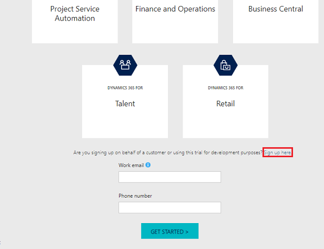
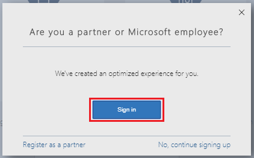
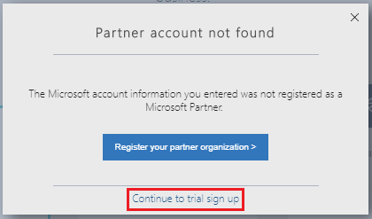
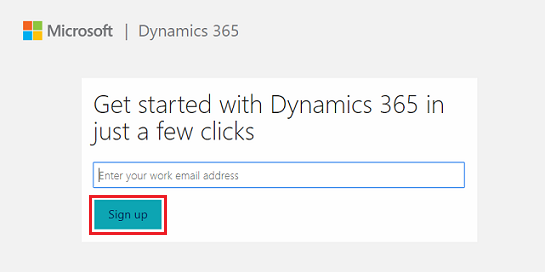
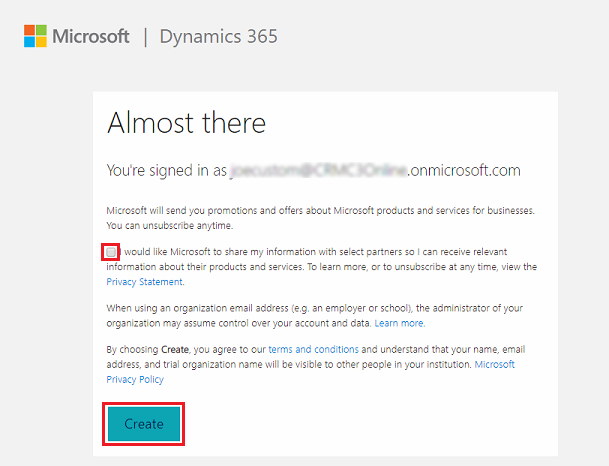
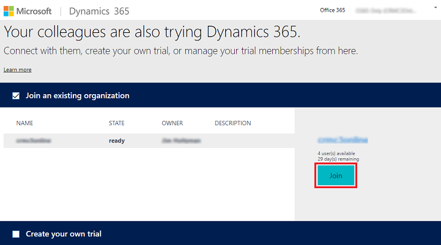
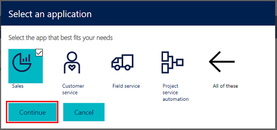
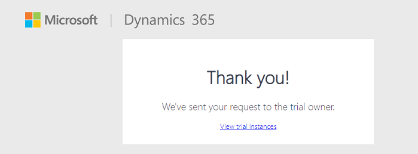

# Try Dynamics 365 apps

[!INCLUDE [cc-settings-moving](../includes/cc-settings-moving.md)] 

We're excited about the release of [!INCLUDE [pn-crm-9-0-0-online](../includes/pn-crm-9-0-0-online.md)] and hope you're eager to try it out. New and existing customers have different options to take a look at [!INCLUDE [pn-crm-online](../includes/pn-crm-online.md)].  

## Partners and Customizers
If you are a partner signing up on behalf of a customer, or are using this trial for development purposes, go to [https://trials.dynamics.com/Dynamics365/Signup/#](https://trials.dynamics.com/Dynamics365/Signup/#). You'll have the choice to add your trial to an existing tenant. You will also need to decide which apps to install when you start your trial. For more information on which scenario is right for you, see [Installation options](#installation-options) below. 

## New Dynamics 365 apps customers  
 If you're a new customer, we've made onboarding quick and easy. See the following for information on these applications available with [!INCLUDE[pn-crm-online](../includes/pn-crm-online.md)].  

-   [Dynamics 365 for Customer Engagement apps for Sales](https://www.microsoft.com/dynamics365/sales)  
-   [Dynamics 365 for Customer Engagement apps for Customer Service](https://www.microsoft.com/dynamics365/customer-service)  
-   [Dynamics 365 for Customer Engagement apps for Field Service](https://www.microsoft.com/dynamics365/field-service)    
-   [Dynamics 365 for Customer Engagement apps for Project Service Automation](https://www.microsoft.com/dynamics365/project-service-automation)  

On any of the above pages, scroll down and click **Get Started** to start a 30-day trial. For more information on which scenario is right for you, see the [Installation options](#installation-options) section below.

## Current Dynamics 365 apps customers  
 If you already have a [!INCLUDE[pn_dyn_365](../includes/pn-crm-shortest.md)] subscription, there are a couple ways to see the latest version in action.  

### Start a trial  
 You can start a 30-day trial of [!INCLUDE [pn-crm-online](../includes/pn-crm-online.md)] and try out one or all of the customer engagement applications. This trial uses the [!INCLUDE [pn-dyn-365](../includes/pn-crm-shortest.md)] Customer Engagement Plan license.  

<!--   -->

> [!NOTE]
>  You're allowed one trial per tenant. If you've already done a trial of [!INCLUDE[pn-crm_online_shortest](../includes/pn-crm-online-shortest.md)], you cannot do another trial. However, you can reset a Sandbox instance to the latest version or to one of the previous versions. See [Use a Sandbox instance](#use-a-sandbox-instance) below.  

__To start a trial__

1. Go to [https://trials.dynamics.com/Dynamics365/Signup/](https://trials.dynamics.com/Dynamics365/Signup/)

   

2. Choose an app. You can add more apps later.

3. If you are customer, fill in the information and choose **Get Started** (#1).

   -OR-

   If you are a partner signing up on behalf of a customer, or are using this trial for development purposes, choose [**Sign up here**](https://trials.dynamics.com/Dynamics365/Signup/#) (#2).

For more information about the scenario choices, see the [Installation options](#installation-options) section below.

> [!TIP]
>  Check out the following videos:  
>   
> -   [Get the most out of your free 30-day Dynamics 365 for Customer Engagement apps trial](https://go.microsoft.com/fwlink/p/?linkid=835893).  
> -   [How to buy Dynamics 365 for Customer Engagement](https://go.microsoft.com/fwlink/p/?linkid=835890).  

### Use a Sandbox instance  
 If you already have a [!INCLUDE[pn_dyn_365](../includes/pn-crm-shortest.md)] subscription, you can use a Sandbox instance to try the latest version of [!INCLUDE [pn-crm-online](../includes/pn-crm-online.md)].  

  Follow these steps to set up a Sandbox instance of [!INCLUDE [pn-crm-online](../includes/pn-crm-online.md)]:  

1. [!INCLUDE[proc_office365_signin](../includes/proc-office365-signin.md)]  

2. [!INCLUDE[proc_office365_choose_admin_crm](../includes/proc-office365-choose-admin-crm.md)]  

3. Choose the **Instances** tab.  

4. Select the Sandbox instance that you want to provision with the latest version of [!INCLUDE [pn-crm-online](../includes/pn-crm-online.md)], and then click **Reset**.  

5. Select the **Target version**, and then select [!INCLUDE[pn-crm-online](../includes/pn-crm-online.md)].  

   Select a scenario. For more information about the scenario choices, see the [Installation options](#installation-options) section below.

     

   > [!TIP]
   > Choose the "None" option to have a blank slate for building your own custom application.

6. Click **Reset**.  

## Installation options
You can choose to start a trial for all Customer Engagement offerings, a mix of offerings, or none. Each choice installs a different set of apps, which are displayed in the app switcher.

  

The following table shows what’s installed for each choice, what you see in the app switcher, and where you can use it.

|                                      Installation options                                       |           App modules installed/shown in app switcher            |                                                            Description                                                             | Available for  |
|-------------------------------------------------------------------------------------------------|------------------------------------------------------------------|------------------------------------------------------------------------------------------------------------------------------------|----------------|
|                Sales See: [Sales Overview](/dynamics365/customer-engagement/sales-enterprise/overview.md)                |                              Sales                               |                                      Full-featured desktop-optimized app for sales scenarios                                       |      Web       |
|                                                                                                 |                            Sales Hub                             |                                    Mobile-optimized app for sales scenarios (Unified Interface)                                    | Web and Mobile |
|                                                                                                 | Dynamics 365 - custom |  Full suite of [!INCLUDE[pn-crm-online](../includes/pn-crm-online.md)] capabilities, including administration  |      Web       |
|     Customer Service See: [Customer Service Overview](../customer-service/overview.md)     |                         Customer Service                         |           Full-featured desktop-optimized app for service scenarios (does not include knowledge management capabilities)           |      Web       |
|                                                                                                 |                       Customer Service Hub                       | Desktop (recommended for knowledge management only) and mobile-optimized app (recommended for case management) (Unified Interface) | Web and Mobile |
|                                                                                                 | Dynamics 365 - custom |  Full suite of [!INCLUDE[pn-crm-online](../includes/pn-crm-online.md)] capabilities, including administration  |      Web       |
|         Field Service See: [Field Service Overview](../field-service/overview.md)          |                          Field Service                           |                                  Full-featured desktop-optimized app for field service scenarios                                   |      Web       |
|                                                                                                 |                        Field Resource Hub                        |                                Mobile-optimized app for field service scenarios (Unified Interface)                                | Web and Mobile |
|                                                                                                 | Dynamics 365 - custom |  Full suite of [!INCLUDE[pn-crm-online](../includes/pn-crm-online.md)] capabilities, including administration  |      Web       |
| Project Service Automation See: [Project Service Overview](../project-service/overview.md) |                    Project Service Automation                    |                                 Full-featured desktop-optimized app for project service scenarios                                  |      Web       |
|                                                                                                 |                       Project Resource Hub                       |                               Mobile-optimized app for project service scenarios (Unified Interface)                               | Web and Mobile |
|                                                                                                 | Dynamics 365 - custom |  Full suite of [!INCLUDE[pn-crm-online](../includes/pn-crm-online.md)] capabilities, including administration  |      Web       |
|                                               All                                               |                       All apps shown above                       |                                                                                                                                    |                |
|                                                                                                 | Dynamics 365 - custom |  Full suite of [!INCLUDE[pn-crm-online](../includes/pn-crm-online.md)] capabilities, including administration  |      Web       |
|                                              None                                               |                             CRM Hub                              |    Mobile-optimized app that provides core CRM functionality, including accounts, contacts, and activities (Unified Interface)     |     Mobile     |
|                                                                                                 | Dynamics 365 - custom |  Full suite of [!INCLUDE[pn-crm-online](../includes/pn-crm-online.md)] capabilities, including administration  |      Web       |

## Add new users to a trial

New users can follow these steps to start a trial of Customer Engagement. 

The user should:
- Not already be licensed for Customer Engagement
- Have an email account in the Customer Engagement tenant

> [!NOTE]
> Only five users can join a trial organization and a maximum of five trial organizations can be added to the same tenant.

1. Go to [https://trials.dynamics.com ](https://trials.dynamics.com )

2. Select **Sign in here**.

   > [!div class="mx-imgBorder"] 
   > 

3. Select **Sign in**.

   > [!div class="mx-imgBorder"] 
   > 

4. Select **Continue to trial**.

   > [!div class="mx-imgBorder"] 
   > 

5. Enter the user's email address and then select **Sign up**.

   > [!div class="mx-imgBorder"] 
   > 

6. Select **Sign in**.

   > [!div class="mx-imgBorder"] 
   > 

7. Enter your password and select **Sign in**.

8. Optionally, you can share information with partners. Select **Create**. 

   > [!div class="mx-imgBorder"] 
   > 

9. Select a trial organization and then select **Join**.

   > [!div class="mx-imgBorder"] 
   > 

   > [!NOTE]
   > This page shows the number of users available to join the organization. Only five users can join a trial organization and a maximum of five trial organizations can be added to the same tenant.

10. Choose the Customer Engagement apps to include in the trial organization, and then select **Continue**.

    > [!div class="mx-imgBorder"] 
    > 

11. Your request is confirmed.

    > [!div class="mx-imgBorder"] 
    > 

The trial owner will receive an email with your request. Once approved, you'll receive an email with access instructions.

### See also  
 [Onboard your organization and users to Dynamics 365 apps](onboard-your-organization-and-users-to-dynamics-365-online.md)   
 [Business apps in Dynamics 365 for Customer Engagement](/dynamics365/customer-engagement/basics/business-apps-dynamics-365.md) 
 [Manage Microsoft Dynamics 365 apps instances](../admin/manage-online-instances.md)   
 [Manage subscriptions, licenses, and user accounts](../admin/manage-subscriptions-licenses-user-accounts.md)
