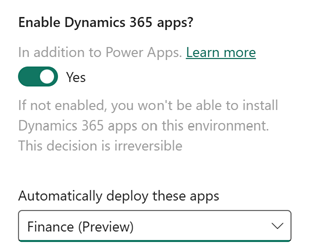

# Tutorial: Provision a new environment with an ERP-based template (preview)

[!INCLUDE [cc-beta-prerelease-disclaimer](../includes/cc-beta-prerelease-disclaimer.md)]

Finance and operations apps have been re-imagined as an application hosted by Microsoft Dataverse.  No longer do customers need to deploy their enterprise resource planning (ERP) system separately from their low-code and other Dynamics 365 platform applications.  Additionally, most administrative actions in Power Platform are available via UI and API based experience.

In this tutorial, you'll learn how to:

- Visit the admin center and create a new environment using a template based on your assigned license
- Deploy a developer-focused sandbox using PowerShell to use with X++
- Delete the environment when no longer in use

As an example of this scenario, a customer who operates their finance and operations apps environments via Lifecycle Services (LCS) portal today would like to try deploying one of the newer developer-focused sandboxes in Power Platform admin center.  

> [!IMPORTANT]
> Unified admin experiences for finance and operations apps are in preview.  Portions of this tutorial may change in the future.

## Environment deployment

The easiest way to get finance and operations apps up and running in Power Platform is to create a new environment via template.  A template is simply an efficiency in terms of creating a Dataverse-based Power Platform enviornment with several applications pre-installed.  In this scenario, the finance and operations ERP application will be installed automatically upon environment creation.

### Before you begin

You cannot deploy finance and operations apps in Power Platform unless you have a license assigned that grants this permission.  An example license is Dynamics 365 Finance or Dynamics 365 Supply Chain Management for customers, and Dynamics 365 Operations Application Partner Sandbox for partners and ISVs.  This must be assigned by your license administrator to your user account in Microsoft Entra (formerly known as Azure Active Directory).  You can review the licenses currently assigned to you under the Subscription table on the [MyAccount](https://portal.office.com/account/?ref=MeControl) page.

You also must have at least 1 gigabyte of available Operations and Dataverse database capacities.  For more information see [Manage storage and capacity](../finance-operations-storage-capacity.md).

# [Power Platform admin center](#tab/PPAC)

### Create from the admin center

Inside of the Power Platform admin center, visit the Environments tab.  From there, click on the **New** button and a slider window will load on the right hand side of the screen.


Give the new environment a name.  Environment names do not need to be unique in Power Platform unlike in Lifecycle Services.  Choose your deployment region and ensure the environment type is Sandbox.

Thereafter, enable the Dataverse option and click **Next**.

On the next screen, fill out the Dataverse required fields and then select **Enable Dynamics 365 apps** and choose the appropriate template for your license:



# [PowerShell](#tab/PowerShell)

### Create from PowerShell

Load up your PowerShell console and execute the following commands to generate the environment.  Note the variables so that you can change the input values as required.

```powershell
#Install the module
Install-Module -Name Microsoft.PowerApps.Administration.PowerShell

# Set variables for your session
$TenantId = "YOUR_TENANT_GUID_FROM_AAD"
$SPNId = "YOUR_AZURE_APPLICATION_REGISTRATION_CLIENT_ID"
$ClientSecret = "YOUR_AZURE_APPLICATION_CLIENT_SECRET"
$capacityDetailsList = @()

Write-Host "Creating a session against the Power Platform API"

Add-PowerAppsAccount -Endpoint prod -TenantID $TenantId -ApplicationId $SPNId -ClientSecret $ClientSecret
```
---

## Delete the environment
In this step, we will clean up the environment we previously created.  This is also commonly done by admins who wish to reclaim capacity for other purposes.

# [Power Platform admin center](#tab/PPAC)

### Cleanup from the UI

Highlight the given environment, and then click the **Delete** button in the action bar across the top of the page.  

Confirm that you wish to delete the environment and proceed.  This will start the deletion process and will eventually free up the Dataverse and Operations storage consumed by this environment for other needs.

> [!div class="mx-imgBorder"] 
> 

# [PowerShell](#tab/PowerShell)

### Cleanup via PowerShell
Use the below script to delete the previously created enviornment.  Note to change the environmentID to one that matches your environment.

```powershell
#fetch environment list with capacity populated.  This is only possible when calling full environment list
$environmentsList = Get-AdminPowerAppEnvironment -Capacity
```
---

## Related articles
