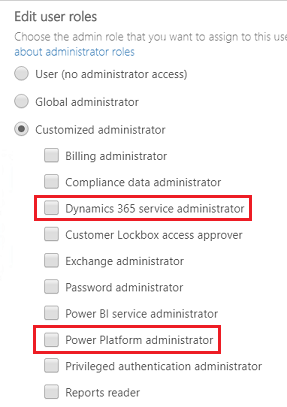

# Use service admin roles to manage your tenant

To help you administer environments and settings for Power Platform, you can assign users to manage at the tenant level without having to assign the more powerful Microsoft 365 global admin privilege.  

There are two Power Platform related service admin roles you can assign to provide a high level of admin management.

## Dynamics 365 service administrator

The Dynamics 365 service admin can:

- Sign in to and manage multiple environments. If an environment uses a security group, a service admin would need to be added to the security group in order to manage that environment. Not assigning to an in place security group essentially locks these admins out of any admin management. 
- Perform admin functions in Power Platform because they have the system admin role. The service admin must be assigned a license.  

## Power Platform administrator 
  
 Users with the Power Platform admin role can:  
  
- Sign in to and manage multiple environments. Power Platform admins **are not affected** by security group membership and can manage environments even if not added to an environment's security group.
- Perform admin functions in Power Platform because they have the system admin role. The Power Platform admin must be assigned a license.  
  
Both service admin roles cannot do functions restricted to the Microsoft 365 global admin such as manage user accounts, manage subscriptions, access settings for Microsoft 365 apps like Microsoft Exchange or Microsoft SharePoint.  
  
## Assign a service admin role to a user

Follow these steps to assign a service admin role.

1. Sign in to the [Microsoft 365 admin center](https://admin.microsoft.com/) as a global admin.

2. Go to **Users** > **Active users** and select a user or users.
  
3. Select to expand **Show all by category**.

4. Under **Collaboration** select either **Dynamics 365 service administrator** or **Power Platform administrator**. 

   > [!div class="mx-imgBorder"] 
   >   
  
5. Select **Save changes**.

## Service administrator permission matrix

The following matrix shows what management is possible with the various service admin roles compared to the Microsoft 365 global admin role.

|    |Microsoft 365 Global admin   |Power Platform Service admin    |Dynamics 365 Service admin   | Power BI Service admin   |
|---------|---------|---------|---------|---------|
|**POWER PLATFORM** |||||  
|**Environments** |||||  
|Create|Yes|Yes|*Yes|No|  
|Backup and restore|Yes|Yes| *Yes|No|  
|Copy |Yes|Yes|*Yes|No|  
|**Analytics**|||||
|Capacity|Yes|Yes|*Yes|No|  
|Capacity allocation (Power Apps per app plans, Power Automate, AI Builder, and Portal) |Yes|Yes|*Yes|No|
|Common Data Service|Yes|Yes|*Yes|No|  
|Power Automate|Yes|Yes|*Yes|No|  
|Power Apps|Yes|Yes|*Yes|No|  
|**Help + support**|||||
|Create and access support requests|Yes|Yes|*Yes|No|  
|**Data integration**|||||
|Create new project and connection set|Yes|Yes|*Yes|No|  
|**Data gateways**|||||
|View gateways|Yes|Yes|*Yes|No|  
|**Data policies**|||||
|View and manage tenant policies|Yes|Yes|*Yes|No|  
|View and manage environment policies|Yes|Yes|*Yes|No|  
||||||
|**POWER BI**|||||  
|Manage the Power BI tenant|Yes|Yes|No|Yes|  
|Acquire and assign Power BI licenses|Yes|No|No|No|  
||||||
|**MICROSOFT 365**|||||  
|Create users|Yes|No|No|No|  
|Add security roles|Yes|No|No|No|  
|Add licenses|Yes|No|No|No|  

*If a security group is assigned to the environment and the user with this role added to the security group

### See also  
[Environments overview](environments-overview.md) 
[What is Power BI administration?](https://docs.microsoft.com/power-bi/service-admin-administering-power-bi-in-your-organization)
