# Use Word templates to create standardized documents

<!-- legacy procedure -->

  After you create and import [!INCLUDE[pn_MS_Word_Full](../includes/pn-ms-word-full.md)] templates into customer engagement apps (Dynamics 365 Sales, Dynamics 365 Customer Service, Dynamics 365 Field Service, Dynamics 365 Marketing, and Dynamics 365 Project Service Automation), users select one button to generate standardized documents automatically populated with data. This feature has some special considerations you need to know to successfully create [!INCLUDE[pn_ms_Word_short](../includes/pn-ms-word-short.md)] templates.

> [!WARNING]
> There's a known issue when creating templates in [!INCLUDE[pn_ms_Word_short](../includes/pn-ms-word-short.md)]. To prevent interactions that could potentially destabilize [!INCLUDE[pn_ms_Word_short](../includes/pn-ms-word-short.md)], review and follow the guidance in the [Avoid a known issue when creating templates](#avoid-a-known-issue-when-creating-templates) section of this article.

 **Supported versions of [!INCLUDE[pn_ms_Word_short](../includes/pn-ms-word-short.md)]**  

|                                                                          Area                                                                           | [!INCLUDE[pn_ms_Word_short](../includes/pn-ms-word-short.md)] Version |
|---------------------------------------------------------------------------------------------------------------------------------------------------------|-----------------------------------------------------------------------|
|                                    Creating a [!INCLUDE[pn_ms_Word_short](../includes/pn-ms-word-short.md)] template                                    |                              2013, 2016                               |
| Using a [!INCLUDE[pn_ms_Word_short](../includes/pn-ms-word-short.md)] document generated in customer engagement apps |                           2010, 2013, 2016                            |

> [!NOTE]
> Macro-enabled Word documents (.docm) aren't supported.

 Follow the steps in this article to successfully create and use [!INCLUDE[pn_ms_Word_short](../includes/pn-ms-word-short.md)] templates in customer engagement apps.  

## Step 1: Create a [!INCLUDE[pn_ms_Word_short](../includes/pn-ms-word-short.md)] template  

You can create a [!INCLUDE[pn_ms_Word_short](../includes/pn-ms-word-short.md)] template from the Power Platform admin center or from a record in customer engagement apps. Creating a template from the admin center makes it available to all users in your organization, while creating a template from a record creates a personal template that's only available to you.

### Create a Word template from Power Platform admin center

Access requires sufficient permissions, such as System Administrator or System Customizer role. To check your security role, see [View your user profile](/powerapps/user/view-your-user-profile). If you don't have the correct permissions, contact your system administrator.

1. Sign in to the [Power Platform admin center](https://admin.powerplatform.microsoft.com/).
1. In the navigation pane, select **Manage**.
1. In the **Manage** pane, select **Environments** and choose an environment.
1. On the Environments page, go to the command bar and select **Settings**.
1. Expand **Templates**, and then select **Document templates**.
1. In the **Available Templates View** page, go to the command bar and select **New** to open the *Create template from Dynamics 365 data* dialog box.
1. In the **Create template from Dynamics 365 data** dialog, select **Word Template**.
1. Select the entity for which you want to create the template and then select **Select Entity**.  
   :::image type="content" source="media/create-word-template-platform.png" alt-text="Screenshot of Create template from Dynamics 365 data dialog.":::
1. Specify the entity relationships that you want to use in the template. For example, if you select the Account entity, you can specify 1:N relationship to the Contact entity to include contact information in the template. Learn more about relationships in [What are 1:N, N:1, and N:N relationships?](#what-are-1n-n1-and-nn-relationships)
   > [!NOTE]
   >- The relationships you select on this screen determine what entities and fields are available later when you define the [!INCLUDE[pn_ms_Word_short](../includes/pn-ms-word-short.md)] template.
   >- Select only the relationships you need to add data to the [!INCLUDE[pn_ms_Word_short](../includes/pn-ms-word-short.md)] template.
   :::image type="content" source="media/platform-select-entity.png" alt-text="Screenshot of the entity selection dialog.":::
1. Select **Download Template** to create a [!INCLUDE[pn_ms_Word_short](../includes/pn-ms-word-short.md)] file on your local computer with the exported entity included as XML data.
   > [!IMPORTANT]
   > You can only use a document template in the environment where you downloaded it. Environment-to-environment migration for Word or Excel templates isn't supported.
    
### Create a personal Word template from a record

As a Dynamics 365 user, you can create a personal [!INCLUDE[pn_ms_Word_short](../includes/pn-ms-word-short.md)] template that you can use for your own sales documents. These templates are only available to you. The following steps are for Dynamics 365 Sales, but the process is similar in other customer engagement apps.

1. Sign in to the **Sales Hub** app.
1. Select the entity for which you want to create the template. For example, if you want to create a template for customer accounts, select **Accounts**.
1. Open any record. On the command bar, select **Word Templates** > **Download Template**.
   The entity is selected by default based on the record you opened.
   :::image type="content" source="media/create-word-template-dynamics365.png" alt-text="Screenshot of the Download file to create a template dialog.":::
1. Specify the entity relationships that you want to use in the template. For example, if you select the Account entity, you can specify 1:N relationship to the Contact entity to include contact information in the template. Learn more about relationships in [What are 1:N, N:1, and N:N relationships?](#what-are-1n-n1-and-nn-relationships)
   > [!NOTE]
   >- The relationships you select on this screen determine what entities and fields are available later when you define the [!INCLUDE[pn_ms_Word_short](../includes/pn-ms-word-short.md)] template.
   >- Select only the relationships you need to add data to the [!INCLUDE[pn_ms_Word_short](../includes/pn-ms-word-short.md)] template.  
1. Select **Download** to create a [!INCLUDE[pn_ms_Word_short](../includes/pn-ms-word-short.md)] file on your local computer with the exported entity included as XML data.
   > [!IMPORTANT]
   > You can only use a document template in the environment where you downloaded it. Environment-to-environment migration for Word or Excel templates isn't supported.
    
### What are 1:N, N:1, and N:N relationships?

 This screen requires an understanding of your customer engagement apps data structure. Your admin or customizer can provide information about entity relationships. For admin content, see: [Entity relationships overview](/powerapps/maker/common-data-service/relationships-overview).  

 Here are some example relationships for the Account entity.  

|Relationship|Description|  
|------------------|-----------------|  
|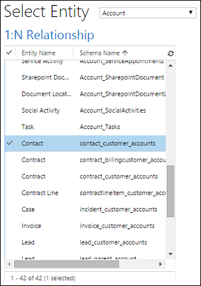|An account can have multiple contacts.|  
|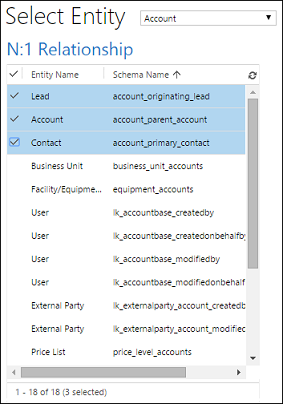|A lead, account, or contact can have multiple accounts.|  
|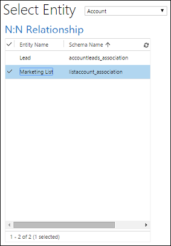|An account can have multiple marketing lists.   A marketing list can have multiple accounts.|  

> [!NOTE]
> To ensure documents download quickly, only return up to 100 related records for each relationship. For example, if you export a template for an account, and want to include a list of its contacts, the document returns at most 100 of the account's contacts.  

## Step 2: Enable the Developer tab

Open the [!INCLUDE[pn_ms_Word_short](../includes/pn-ms-word-short.md)] template file. At this point, the document appears to be blank.  

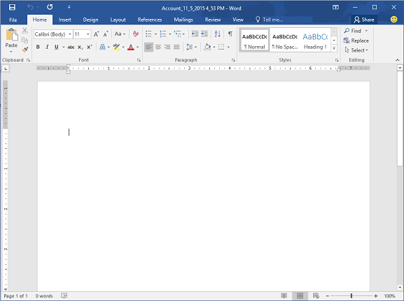  

To see and add customer engagement apps XML data, you need to enable the [!INCLUDE[pn_ms_Word_short](../includes/pn-ms-word-short.md)] Developer tab.  

1. Go to **File** > **Options** > **Customize Ribbon**, and then enable **Developer**.  

   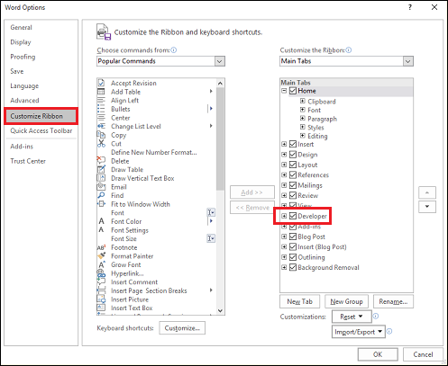  

1. Select **OK**.  

   **Developer** now appears in the [!INCLUDE[pn_ms_Word_short](../includes/pn-ms-word-short.md)] ribbon.  

   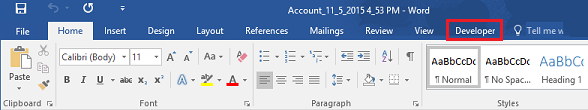  

### Avoid a known issue when creating templates

 There's a known issue with customer engagement apps' apps-generated [!INCLUDE[pn_ms_Word_short](../includes/pn-ms-word-short.md)] templates and [!INCLUDE[pn_MS_Word_Full](../includes/pn-ms-word-full.md)]. Follow the guidance in this section to prevent issues with control fields before going to [step three](#step-3-define-the-template) where you add XML content control fields to the [!INCLUDE[pn_ms_Word_short](../includes/pn-ms-word-short.md)] template.

> [!WARNING]
> A few things  can cause [!INCLUDE[pn_ms_Word_short](../includes/pn-ms-word-short.md)] to freeze, requiring you to use [!INCLUDE[pn_ms_TaskManager_short](../includes/pn-ms-taskmanager-short.md)] to stop [!INCLUDE[pn_ms_Word_short](../includes/pn-ms-word-short.md)]:  
>
> - You insert a content control other than **Picture** or **Plain Text**.  
> - You make a textual change, such as changing the capitalization or adding text, to a content control. These changes can occur through AutoCorrect as well as user edits. By default, Microsoft [!INCLUDE[pn_ms_Word_short](../includes/pn-ms-word-short.md)] AutoCorrect capitalizes sentences. When you add a content control field, [!INCLUDE[pn_ms_Word_short](../includes/pn-ms-word-short.md)] sees it as a new sentence and capitalizes it when focus shifts away from the field.  

#### Only add fields as Plain Text or Picture

You use the XML Mapping Pane to add entity fields to your [!INCLUDE[pn_ms_Word_short](../includes/pn-ms-word-short.md)] template. Be sure to only add fields as **Plain Text** or **Picture**.  

   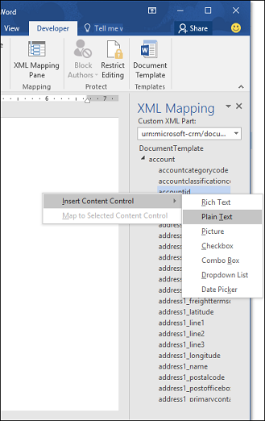  

#### Do not make any textual changes to the added content control  

You can format the content control fields, such as making them bold or changing the font color. However, don't make any textual changes to the content control fields, including capitalization changes.

   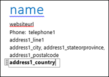  

   If you experience [!INCLUDE[pn_ms_Word_short](../includes/pn-ms-word-short.md)] freezing or performance degradation, try turning off **AutoCorrect**.  

#### Turn off AutoCorrect  

1. With the template file open in [!INCLUDE[pn_ms_Word_short](../includes/pn-ms-word-short.md)], go to **File** > **Options** > **Proofing** > **AutoCorrect Options**.  

   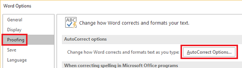  

1. Clear **Capitalize first letter of sentences** and **Automatically use suggestions from the spelling checker**.  

   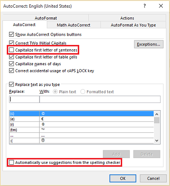  

1. Clear **Hyphens (--) with dash (-)** on the **AutoFormat** and **AutoFormat as You Type** tabs.  

1. Select **OK**.

## Step 3: Define the template  

Use the XML Mapping Pane to define the [!INCLUDE[pn_ms_Word_short](../includes/pn-ms-word-short.md)] template with entity fields.  

1. In your [!INCLUDE[pn_ms_Word_short](../includes/pn-ms-word-short.md)] template, select **Developer** > **XML Mapping Pane** to select the default XML schema.  

   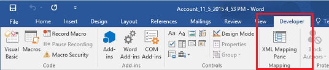  

   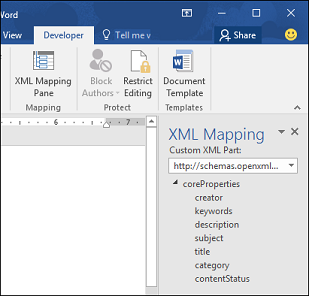  

2. Select the XML schema. It starts with "urn:microsoft-crm/document-template/".  

   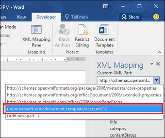  

   > [!IMPORTANT]
   > If you have frequent accidental edits that cause [!INCLUDE[pn_ms_Word_short](../includes/pn-ms-word-short.md)] to freeze or have performance degradation, be sure to turn off the AutoCorrect options according to the section, [Avoid a known issue when creating templates](#avoid-a-known-issue-when-creating-templates).  

3. Expand the entity, right-click the entity field, and then select **Insert Content Control** > **Plain Text**.  

     

   The entity field is added to the [!INCLUDE[pn_ms_Word_short](../includes/pn-ms-word-short.md)] template.  

   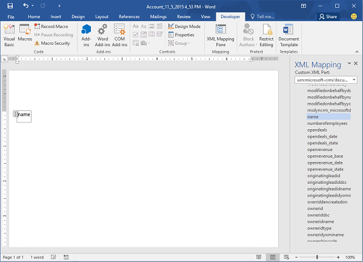  

   Add additional entity fields, add descriptive labels and text, and format the document.  

   A completed template might look like this:  

   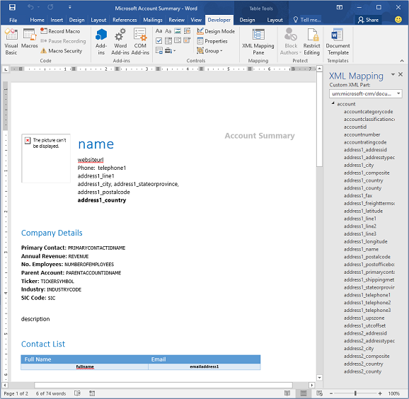  

   Some content control fields you entered likely have multiple lines of data. For example, accounts have more than one contact. To include all the data in your [!INCLUDE[pn_ms_Word_short](../includes/pn-ms-word-short.md)] template, set the content control field to repeat.  

### Set content control fields to repeat  

1. Put fields with repeating data in a table row.  

1. Select the entire table row in the template.  

   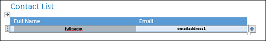  

1. In the XML Mapping Pane, right-click the relationship containing the content control fields, and then select **Repeating**.  

   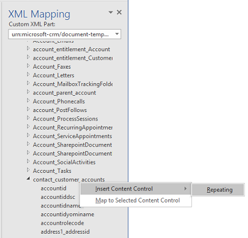  

   When you use the [!INCLUDE[pn_ms_Word_short](../includes/pn-ms-word-short.md)] template in customer engagement apps to create a document, the table populates with multiple rows of data.  

   When the template has the fields and formatting you want, save it and upload it into customer engagement apps.

## Step 4: Upload the Word template back into customer engagement apps

When you have your [!INCLUDE[pn_ms_Word_short](../includes/pn-ms-word-short.md)] template built the way you want, save it so you can upload it into customer engagement apps.  

 Access to the newly created Word template depends on how you uploaded it and the access granted to the security role. Be sure to check out [Use Security Roles to control access to templates](../admin/using-word-templates-dynamics-365.md#BKMK_SecurityRoles).  

 Administrators can use the **Settings** page to upload the [!INCLUDE[pn_ms_Word_short](../includes/pn-ms-word-short.md)] template into customer engagement apps. All users in your organization can use a template uploaded in **Settings**.  

### Upload the Word template from Power Platform admin center

1. Sign in to the [Power Platform admin center](https://admin.powerplatform.microsoft.com/).
1. Open the environment where you want to upload the template.
1. Go to **Settings** > **Templates** > **Document Templates**.  
1. Select **Upload Template**.  

1. Drag the [!INCLUDE[pn_ms_Word_short](../includes/pn-ms-word-short.md)] file in the dialog box or browse to the file.  

   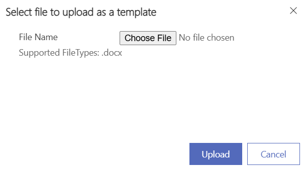  

1. Select **Upload**.  

   Non-admin users can upload a template for their own use from a list of records.  

### Upload the personal Word template from a record 

1. Open a record for the entity type that matches the template you created. For example, open a customer account record in Sales if you created an account template.

2. On the command bar, select  **Word Templates** > **Upload Template**.  

3. Browse to the file and select **Upload**.  

## Step 5: Generate a document from the [!INCLUDE[pn_ms_Word_short](../includes/pn-ms-word-short.md)] template  

 To use the [!INCLUDE[pn_ms_Word_short](../includes/pn-ms-word-short.md)] template you created, complete the following steps:  

1. Open a record that matches the entity type of the template you created. For example, open a customer account record in Sales if you created an account template. 

2. On the command bar, select **Word Templates**, and then under **Word Templates** select the template you created.  

    If you don't see the template you created, two possibilities exist:  

    - You selected a record type (entity) that doesn't match the template. The system only displays templates built for the selected record type. For example, if you open an opportunity record, you won't see a template you created with the Account entity.  

    - You need to refresh customer engagement apps to see the template. Either refresh your browser or close and reopen customer engagement apps.  

    The system generates a Word document with data from the record you opened and downloads it to your computer. Open the document to see the data and template in action.  

  

### Try out the sample [!INCLUDE[pn_ms_Word_short](../includes/pn-ms-word-short.md)] templates  

 Customer engagement apps include five sample [!INCLUDE[pn_ms_Word_short](../includes/pn-ms-word-short.md)] templates.    

 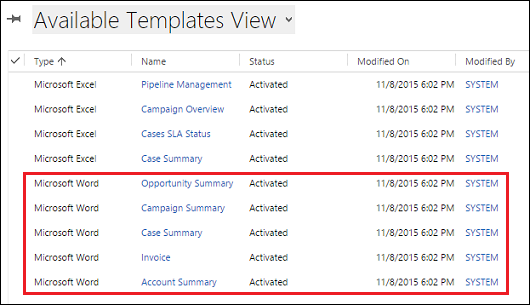  

 The sample [!INCLUDE[pn_ms_Word_short](../includes/pn-ms-word-short.md)] templates are designed for a specific record type (entity). You can only apply the template to records of the same record type.  

|Name|Entity|  
|----------|------------|  
|Opportunity Summary|Opportunity (Sales area)|  
|Campaign Summary|Campaign (Marketing area)|  
|Case Summary|Case (Service area)|  
|Invoice|Invoice (Sales area)|  
|Account Summary|Client_Account (Sales, Service, and Marketing areas)|  

### To apply a sample [!INCLUDE[pn_ms_Word_short](../includes/pn-ms-word-short.md)] template  

1. Open a record with information that uses the entity type that matches the sample template. For example, open a customer account record in Sales to apply the Account Summary template.  

2. On the command bar, select **Word Templates**, and then under **Word Templates** select the sample template.  
   The system generates a Word document with data from the record you opened and downloads it to your computer. Open the document to see the data and template in action.

> [!NOTE]
> The sample templates are meant to be a starting point for you to create your own templates. You can't edit them. 

## Additional considerations  

### Use security roles to control access to templates  

 Administrators can control access to Word templates with some granularity. For example, you can give salespeople Read but not Write access to a Word template.  

1. Select **Settings** > **Security** > **Security Roles**.  

2. Select a role, and then select the **Business Management** tab.  

3. Select **Document Template** to set access for templates available to the entire organization. Select **Personal Document Template** for templates shared to individual users.  

4. Select the circles to adjust the level of access.  

   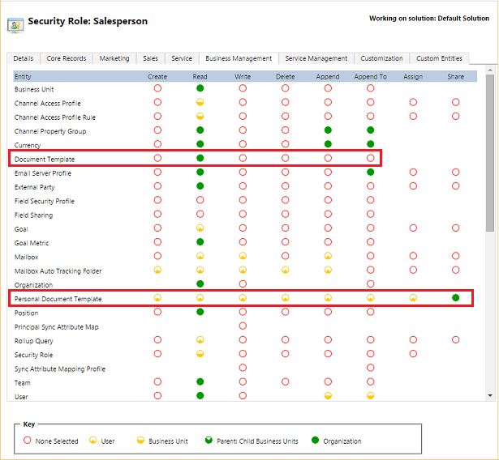  

### Lists in created documents aren't in the same order as records  

 Lists of records created from a custom template might not appear in the same order in [!INCLUDE[pn_ms_Word_short](../includes/pn-ms-word-short.md)] documents as the order in customer engagement apps. The app lists records in the order of the date and time they were created.  

### Issue with right-to-left languages

Content in right-to-left (RTL) languages might have some formatting problems in the Word file after the document is created.

### See also  

[Analyze your data with Excel templates](../admin/analyze-your-data-with-excel-templates.md)

[Troubleshooting Word templates](troubleshoot-word-templates-dynamics-365.md)

[!INCLUDE[footer-include](../includes/footer-banner.md)]
