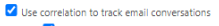

# View known issues (preview)

[!INCLUDE [preview-banner](~/../shared-content/shared/preview-includes/preview-banner.md)]

Customer trust and transparency are important to us. You can now view existing product issues, or known issues, for which a fix has been identified or is in progress. A workaround and expected time to fix the issue is also provided, when available.  
  
The ability to view known issues is currently in preview and is only available for Power Automate and Power Apps products.

[!INCLUDE [preview-note](~/../shared-content/shared/preview-includes/preview-note.md)]

## View known issues  
  
1.  Sign in to the [Power Platform admin center](https://admin.powerplatform.microsoft.com/).
1.  Select **Help + support** in the navigation pane.
1.  Select the **Known issues (Preview)** tab.
1.  Narrow down your search for a known issue by using the available filters and search.

    - **Product Category:** Choose one or multiple products. By default, all products with a known issue are selected.
     - **Status:** Select the status of known issues that you want to view.
         
        - **All:** All known issues are listed.
        - **Active:** Known issues that are currently being worked on are listed.
        - **Resolved:** Known issues that have been fixed, but not necesssarily deployed are listed.

    - **Search:** Enter key words to surface the known issue you're looking for.
    
1.  Select a known issue to see more details, including a description of the problem and a workaround, if available.

    

> [!Tip]
> Bookmark the URL of the known issue page and come back directly to view updates.

## View known issues when creating a support request

1. When [creating a support request](get-help-support.md#view-solutions-or-create-a-support-request), if a known issue is applicable to the search query, it displays at the top of the **Solutions** tab.

    

1. Select the title of the issue to obtain more information.
     
    

1. If the information resolved your query, click **Yes** to close the support request. To see more solutions, select **No, I still need help**.

## Frequently asked questions (FAQs)

### Why am I seeing known issues for Power Automate and Power Apps products only?

The ability to view known issues is currently in preview and supports limited product features within Power Automate and Power Apps only.
 
### Should I create a support request if my issue is listed under known issues?

No, a fix is in progress and an update will be shared on the known issue details page as soon as it's available. The **Status** will also be updated to reflect progress.

##### What does a known issue's Status (Active/Resolved) mean?

Status signifies the progress of the issue. Issues being worked on are in the **Active** state, while issues that have been fixed, but not necessarily deployed, are in **Resolved** state.

##### While Microsoft works on a fix, is there any interim solution?

When available, a workaround will be shared in the **Workaround** field of the known issue details page. (Select a known issue to see more details and a possible workaround).

##### Do you provide an estimated time of arrival (ETA) on the issue fix?

When available, more information on the release schedule will be shared in the **Workaround** field of the known issue details page.

#####  How do I know if there has been any update on the issue?

We recommend bookmarking the URL on issue information page and revisiting to see the updated information.
