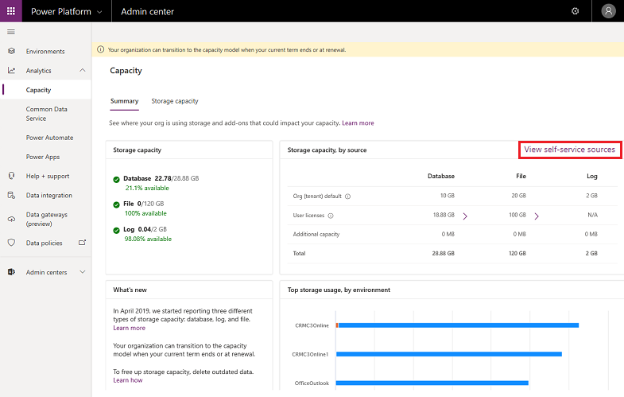
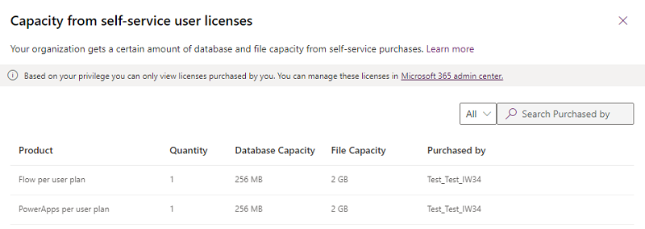

# View self-service storage capacity

With the introduction of [self-service purchases](https://docs.microsoft.com/microsoft-365/commerce/subscriptions/self-service-purchase-faq) for Power Platform products, license purchases are no longer restricted to Power Platform admins. With this change comes the need to be able to view self-service capacity data. Use the steps below to view the storage capacity provided with purchased licenses. 

1. Sign in to the Power Platform admin center at [https://admin.powerplatform.microsoft.com](https://admin.powerplatform.microsoft.com) with admin or end-user credentials.

2. Select **Resources** > **Capacity** > **Summary** tab.

   > [!NOTE]
   > Admins and end users will see the same tenant capacity on this page.

3. In the **Storage capacity, by source** tile, select **View self-service sources**.

   > [!div class="mx-imgBorder"] 
   > 

### If you are signed in as a Power Platform admin 
You will see all licenses purchased by users in the tenant. You can filter or search for licenses to shorten the list.

  > [!div class="mx-imgBorder"] 
  > 

### If you are signed in as an end user 
You will see the license and capacity information for the licenses you have purchased.

  > [!div class="mx-imgBorder"] 
  > 

### If there are no licenses purchased by tenant users 
The **Capacity from self-service user licenses** page will be blank.
