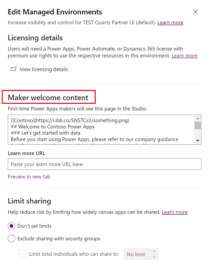

# Enable maker welcome content (Preview)

[!INCLUDE [cc-beta-prerelease-disclaimer](../includes/cc-beta-prerelease-disclaimer.md)]


In Managed Environments, admins can provide customized welcome content to help their makers get started with [Power Apps](https://make.powerapps.com). When you add your own help content, it replaces the default Power Apps first-time help experience for makers. 

When the welcome content is enabled, upon signing in to Power Apps, makers will be greeted with customized getting started information. More information: [Use the learn hub](/power-apps/maker/common/learn-hub#from-your-org-preview)

> [!div class="mx-imgBorder"] 
>  

## Add welcome content

1. Sign in to the [Power Platform admin center](https://admin.powerplatform.microsoft.com).

2. Select **Environments** in the left navigation pane, select a managed environment, and then select **Edit Managed Environment** on the top menu bar.

   > [!div class="mx-imgBorder"] 
   >  

3. Enter the help content in the text box under **Maker Welcome content**. 
 
    > [!div class="mx-imgBorder"] 
    >  
   
   
    You can enter plain text or use Markdown, as demonstrated in this example.
   
     ```
    
    ## Welcome to Contoso Power Apps
    ### Let's get started with data
    Before you start using Power Apps, please refer to our company guidance
    1. **Get trained:** [Learning Videos]() and [training guides]()
    2. **Contribute ideas:** Submit an idea for a new app or flow idea at [Suggestion box]()
    3. **Learn from others:** [Top tips]() by expert makers at Contoso
    ```
    
    >[!NOTE]
    >For help with Markdown, see [Getting Started](https://www.markdownguide.org/getting-started/).

4. Enter your own link to a wiki, internal site, or other reference material in the **Learn more URL** box.

5. Select **Preview in a new tab** to see how the text you entered, or Markdown will render.

   > [!div class="mx-imgBorder"] 
   >  


 

