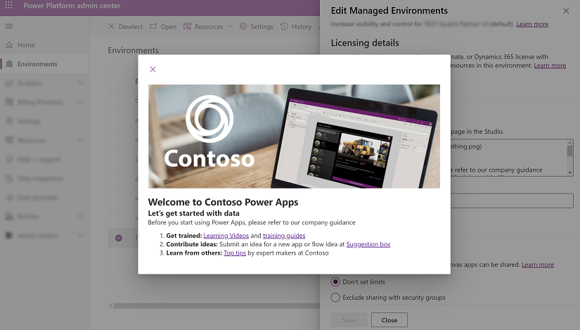

# Enable maker welcome content (Preview)

>[!IMPORTANT]
>This is a preview feature.
>[!INCLUDE[cc_preview_features_definition](../../includes/cc-preview-features-definition.md)]

In Managed Environments, admins can provide makers with thier own customized content to help makers get started with [Power Apps](https://make.powerapps.com). When you enable your own welcome content, it will replace the default Power Apps first-time help experience for makers. 

> [!div class="mx-imgBorder"] 
>  

## Enable welcome content

1. Sign in to the [Power Platform admin center](https://admin.powerplatform.microsoft.com).

2. Select **Environments** in the left navigation pane, select a managed environment, and then select **Edit Managed Environment** on the top menu bar.

  > [!div class="mx-imgBorder"] 
  >  

3. On the **Edit Management Environments** pane, enter your organization specific information in the text box under **Maker Welcome content** such as the exmaple below:
   
     ```
    
    ## Welcome to Contoso Power Apps
    ### Let's get started with data
    Before you start using Power Apps, please refer to our company guidance
    1. **Get trained:** [Learning Videos]() and [training guides]()
    2. **Contribute ideas:** Submit an idea for a new app or flow idea at [Suggestion box]()
    3. **Learn from others:** [Top tips]() by expert makers at Contoso
       
    ```
 
   > [!div class="mx-imgBorder"] 
   >  
   

    
    >[!NOTE]
    >For help with Markdown, see [Getting Started](https://www.markdownguide.org/getting-started/).

4. Enter your own link to a wiki, internal site, or other reference material in the **Learn more URL** box.

5. Select **Preview in a new tab** to see how the text you entered, or markdown will render.

   > [!div class="mx-imgBorder"] 
   >  


## First-time experience for makers

Once the maker welcome content is enabled, when a maker signs in Power Apps with a managed environment, they will see the customized getting started information.


   > [!div class="mx-imgBorder"] 
   >  


If you select **Don't show this again here,** you can still access the getting starting information from the **Learn** hub.

-   Select **Learn** on the left pane and then select, **From your org**.


 

