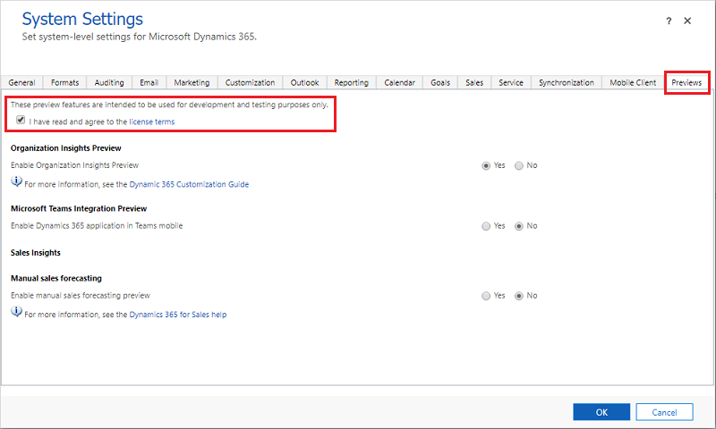

# What are Preview features, and how do I enable them? 

<!-- legacy procedure -->

Preview features are features that aren't complete, but are made available on a "preview" basis so customers can get early access and provide feedback. Preview features:  
  
- Are subject to separate [Supplemental Terms of Use](/dynamics365/legal/supp-dynamics365-preview).  
  
- **Are not supported by [!INCLUDE[pn_Microsoft_Support](../includes/pn-microsoft-support.md)]**.  
  
- May have limited or restricted functionality.  
  
- Aren't meant for production use.  
  
- May be available only in selected geographic areas.  
  
## How do I enable a Preview feature?  
To enable a Preview feature, you must be an administrator.  
  
1. Sign in to [Power Apps](https://make.powerapps.com).

2. Select **Settings** () > **Advanced Settings**.

3. Select **Settings** > **Administration**.
  
4. Select **System Settings**, and then select the **Previews** tab.  
  
5. Read the [Supplemental Terms of Use](/dynamics365/legal/supp-dynamics365-preview), and if you agree, select the **I've read and agree to the license terms** check box.  
  
6. For each Preview feature you want to enable, select **Yes**.  
  

## How do I report an issue or provide other feedback?  
If you'd like to provide feedback, offer suggestions, or report issues for a Preview feature, please go to [Application Ideas](https://experience.dynamics.com/ideas/). This website provides a collaboration platform for gathering actionable feedback to build and improve products and services.

[!INCLUDE[footer-include](../includes/footer-banner.md)]
