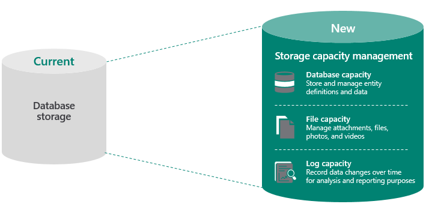
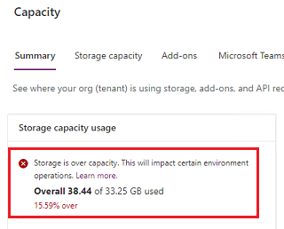
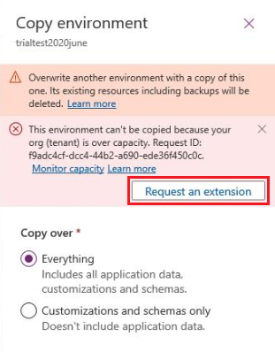

# What's new about storage 

We've made some key enhancements to admin experiences for the Microsoft Power Platform admin center:

- Storage reporting is based on customer licenses and capacity add-ons.
- Changes have been implemented for exceeding storage capacity entitlements.

We're rolling out these features now so check back if your user experience varies from the following content.

## Updates to storage reporting 

In April 2019, we introduced Microsoft Dataverse capacity storage that's optimized for relational data (database), attachments (file), and audit logs (log). New customers of Power Apps, Power Automate, and customer engagement apps (Dynamics 365 Sales, Dynamics 365 Customer Service, Dynamics 365 Field Service, Dynamics 365 Marketing, and Dynamics 365 Project Service Automation) receive a tenant-wide default entitlement for each of these three storage types and additional per user subscription license entitlements. Additional storage can be purchased in 1-GB increments. Existing customers won't be affected by this change until the end of their current Power Apps or Dynamics 365 subscription, when renewal is required.

Some of the benefits of this change include:

- Scalability with purpose-built storage management solutions.
- The ability to enable new business scenarios.
- Reduced need to [free up storage space](free-storage-space.md).
- Support for a variety of data types.
- Additional default and full user entitlements.
- Flexibility to create new environments.

Following the introduction of Dataverse capacity, we updated our capacity reporting to show database, file, and log entitlement for all our customers. This change in reporting isn't visible to those who are still on the legacy licensing storage model.

### Two versions of storage reporting

There are two versions for storage capacity reporting: 

- **Legacy capacity model**: Organizations with the [previous licensing model](legacy-capacity-storage.md#licenses-for-the-legacy-storage-model) for storage. Users with these licenses will see a single capacity for entitlement. More information: [Legacy storage capacity](legacy-capacity-storage.md)

- **New capacity model**: Organizations with the [new licensing model](capacity-storage.md#licenses-for-the-new-storage-model) for storage. Users with these licenses will see the storage capacity entitlement and usage by database, file, and log. More information: [Dataverse storage capacity](capacity-storage.md)

## What happens when my organization exceeds storage entitlements?

If you exceed your storage capacity, you'll receive email notifications alerting you to the over-capacity usage.  For new model email notification details, see [Changes for exceeding storage capacity entitlements](capacity-storage.md#changes-for-exceeding-storage-capacity-entitlements). For legacy model email notification details, see [Changes for exceeding storage capacity entitlements](legacy-capacity-storage.md#changes-for-exceeding-storage-capacity-entitlements). There is also a notification banner in the Power Platform admin center when a tenant has exceeded storage capacity. The following admin operations won't be available when a tenant exceeds storage capacity entitlements:

- Create new environment (requires minimum 1GB capacity available)
- Copy an environment (requires minimum 1GB capacity available)
- Restore an environment (requires minimum 1GB capacity available)

Please review:
- [Do we have any database size restriction to take a backup or restore an organization through user interface (UI) or API?](backup-restore-environments.md#do-we-have-any-database-size-restriction-to-take-a-backup-or-restore-an-organization-through-user-interface-ui-or-api)
- [Actions to take for a storage capacity deficit](capacity-storage.md#actions-to-take-for-a-storage-capacity-deficit).
- For the legacy capacity storage model, see [Example storage capacity scenario](legacy-capacity-storage.md#example-storage-capacity-scenario). 
- For the new capacity storage model, see [Example storage capacity scenarios, overage enforcement](capacity-storage.md#example-storage-capacity-scenarios-overage-enforcement).

### Request a temporary extension

If your database storage is over capacity, admins will be unable to do a copy or restore any of their environments. 

> [!div class="mx-imgBorder"] 
> 
   

You can request a temporary (30-day) extension that allows copy and restore operations for the duration of the extension. To do so, follow these steps.

#### Extension request for Copy

1. Sign in as a tenant admin to the [Power Platform admin center](https://admin.powerplatform.microsoft.com), and then select an environment.
2. Select **Copy** from the top menu bar.
3. Select and enter the various copy options, and then select **Copy**.
4. Select **Confirm**.
5. The **Copy environment** page appears where you can select **Request an extension**.

   > [!div class="mx-imgBorder"] 
   > 

#### Extension request for Restore

1. Sign in as a tenant admin to the [Power Platform admin center](https://admin.powerplatform.microsoft.com), and then select an environment.
2. Select **Backups** > **Restore or manage** from the top menu bar.
3. Select the backup type, the date and time, and then select **Continue**.
4. Select the various restore options, and then select **Restore**.
5. Select **Confirm**.
6. The **Restore backup** page appears where you can select **Request an extension**.

#### About extensions

- An extension is at the tenant level.
- An extension applies to both the legacy and new storage capacity models.
- An extension doesn't allow you to create an environment.
- An extension allows admins to copy and restore environments for a maximum of 30 days while over the capacity limit.
- Your organization can request an extension only once.
- After the one-time extension, copying and restoring environments will again be blocked if the tenant doesn't have available storage capacity. To avoid this, admins should reduce storage usage and/or purchase additional storage capacity.

## Change log for major updates in storage

|Date  |Description  |
|---------|---------|
| June 2021 | Storage capacity notification emails have been introduced and will be rolled out in phases.  Tenant admins now receive emails when their tenant’s entitled storage capacity is running out of, or exceeding available capacity.  For details for new model storage, see [Changes for exceeding storage capacity entitlements](capacity-storage.md#changes-for-exceeding-storage-capacity-entitlements). For legacy model details, see [Changes for exceeding storage capacity entitlements](legacy-capacity-storage.md#changes-for-exceeding-storage-capacity-entitlements). |
| January 2021 | We've added database, log, and file storage capacity that is included with the Project for the Web licenses. See [Project for the web and Microsoft Dataverse](/office365/servicedescriptions/project-online-service-description/project-online-service-description#project-roadmap-and-power-automate). |
| January 2021 |   The amount of default Dataverse database capacity entitled per tenant for both the per app and per flow licenses has been increased from **1GB** to **5GB**. The corresponding update to the ["Subscription Capacity" section of the Power Apps and Power Automate Licensing Guide](https://go.microsoft.com/fwlink/?linkid=2085130) is in progress and should be published soon. |
|December 2020     |  As part of our storage optimization efforts, we continue to make improvements. In December 2020, we included most of the *WebResourceBase* table and *RibbonClientMetadataBase* table as part of file storage. Customers will see file storage consumption increase and database consumption reduced based on the amount of data in these tables. This effort will continue for other tables in the future. Check back here to see when additional tables go through a similar transition.    |

### See also
[Legacy storage capacity](legacy-capacity-storage.md)  
[Dataverse storage capacity](capacity-storage.md)  
[Free up storage space](free-storage-space.md)  
[Delete and recover environments](delete-environment.md)

[!INCLUDE[footer-include](../includes/footer-banner.md)]

