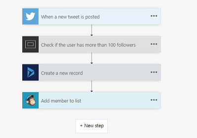
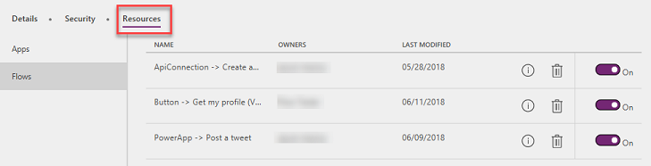

# About Microsoft Flow

[!INCLUDE [cc-beta-prerelease-disclaimer](../includes/cc-beta-prerelease-disclaimer.md)]

Microsoft Flow is an online workflow service that allows automating tasks across multiple services using connectors. Flows are started when a triggering event occurs, this could be a record is created or a scheduled execution, or even a button click from the Microsoft Flow mobile application. Once triggered, the flow proceeds to execute the actions in the flow. Conditions are used to guide the flow to the proper actions. You may find that it helpful to create some flows yourself to support your administration of your company’s PowerApp environments.

The following is a simple example of a Flow, with a trigger using the Twitter connector and three other actions that will run in sequence.

## User access to Flows

By default, only the owner of the flow can execute the flow. The owner can invite other users and groups to be owners and this creates a “team flow”. All owners of a team flow can view the history, manage properties on the flow, edit the flow, add and remove other owners (but not the creator), and delete the flow.

## Microsoft Flow vs Logic Apps

Microsoft Flow is built on top of Logic Apps. Logic Apps is an orchestration engine and part of the Microsoft Azure cloud service. Both services can be used to automate tasks and perform integration across systems. Using Logic Apps directly is more Pro Developer/Integrator focused and whereas Microsoft Flow is more focused on individual and team productivity. As flows start being able to be packaged with the CDS solution framework (coming soon) and moved between environments together with other CDS customizations expect to see more enterprise line of business applications relying on Flow in places where Logic Apps might have been the previously preferred solution.

A key advantage of Microsoft Flow is that it shares the same environments and connectors as PowerApps. This allows for easy interoperability between PowerApps and Flow. A PowerApp can directly invoke a Flow: for example, a scheduling app could call a Flow that asynchronously sends calendar invites to attendees. Or a Flow could use the push notification connector to send notifications to users’ mobile devices.

When used directly Logic Apps run in the context of an Azure subscription and you pay for each action that is invoked in the Logic App run. Microsoft Flows on the other hand are owned and run in the context of a user and the billing model counts the full execution towards an allotment you get with your licenses.

## Exporting and Importing Flows

Flows can be exported and then re-imported into other environments, both in the same tenant and in different tenants. Today, flows export into their own zip file, separate from applications and CDS other components. In the future, flow export functionality will be included in the CDS solution framework allowing you to have one solution package that represents all the components in your application.

Flows can also be exported in a Logic App format, allowing conversion of the flow to a Logic App. This capability allows you to move from the flow execution model to the Logic App execution model as well as take advantage of some of Logic Apps more advanced features.

## What Flows already exist?

From the Resources -> Flows tab on the environment details page you can get a list of all flows and who owns the flow. You also have the ability as an administrator to turn on/off the flow as well as delete it.

You can also explore this information from the PowerShell cmdlets – we cover more details on that in the Management and Monitoring section.
