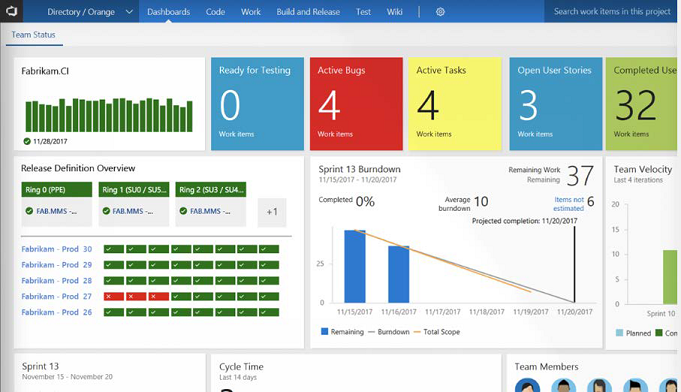
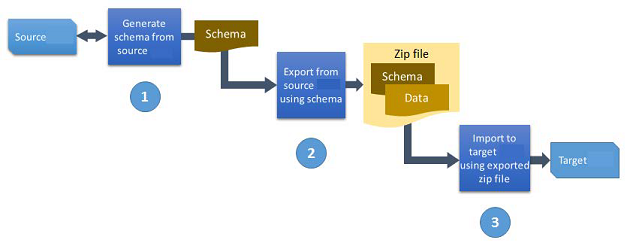

# Application lifecycle management

[!INCLUDE [cc-data-platform-banner](../includes/cc-data-platform-banner.md)]

Application lifecycle management (ALM) is important as the applications your organization builds become more complex and as more of your company depends on their stability. In this topic we discuss using ALM to handle more complex scenarios.

> [!NOTE]
> Check out our new [application lifecycle management (ALM) guide for Power Platform](/power-platform/alm)!

ALM is not a one-size-fits-all concept. It can vary from organization to organization and even within, based on the type of solution being built. If you were to look at a typical mission-critical solution, the following would be a good health check of your current Power Platform ALM maturity:

- **Are you deploying managed solutions?** Managed solutions are how Microsoft intends for solutions to be deployed to environments beyond development. All ALM tooling and solution features from Microsoft to support deployment will be targeted toward this goal.
- **Are your development environments single purpose?** As much as capacity allows, you should try to have individual development environments for each solution. This ensures you don't get cross-solution contamination.
- **Are your development environments disposable?** You should at any point be able to easily recreate the development environment. This could be due to someone making corrupting changes or just because you finished development and deleted the old environment and now you're ready to build V2 of the solution. 

  The key to success here is having the unmanaged solution and any dependent managed solutions to import to recreate the environment. Don't forget any reference data that might be needed. Ideally, these assets are stored in source control, which we will discuss next.
- **Is source control/version control your definitive source of truth?** Using a tool like Azure DevOps Git repos or another source/version control to track your solution assets allows tracking of changes made and by whom across releases. 

  While you can check in the whole solution file, this works best in combination with Solution Packager, which shares out to a source control friendly and readable format. This also enables you to quickly recreate your dev environment or deploy to production since the solution assets come from the source control repo, ensuring a consistent process.
- **Are you using Solution Packager?** Solution Packager allows taking a solution file and breaking it down into individual files for each solution component. This allows what you check in to source control to be traced at a very granular level and helps avoid conflicts with multiple people checking in changes. 

  Solution Packager is also how you take individual files from source control and repackage them for managed solution deployment to other environments like test and production.
- **Can you service (bug fix) production while working on your next version?** A key concept of a healthy ALM practice is not making changes in test or production. By having a good source control and environment strategy, you can ensure your dev–test–production release pipeline stays viable even while you are working on the next version.
- **Do you have automated ALM?** While all of the above can be done manually, having an automated, repeatable process is ideal. Using the tooling like Microsoft Power Platform Build Tools (which we will discuss later) with Azure DevOps, much of the ALM process, including the approvals, can be automated to progress through the release pipeline.

Use the above ALM health check to measure where you are in your goal of having healthy ALM practices for your solutions.

Next, let's look at some of the things you should consider as an administrator to help guide the application through its lifecycles from new to production and then ongoing maintenance and enhancements. For purposes of this section, application refers to the whole set of components from Power Apps canvas or model-driven apps, workflows, and any Microsoft Dataverse customizations.

|New applications  |Existing applications being upgraded  |
|---------|---------|
|Who is the application owner, and who is involved in maintaining it?     | Are any new connectors being used by the application?        |
|Who are the users of the apps? Are they already licensed?     | Is there any new reference data to update?        |
|What environment did you build the app in?     | Are there any new canvas, Power Automate flows, or Dataverse solutions added in this update?        |
|Are there any Power Apps canvas or model-driven apps as part of the application?     | Any changes to how users are assigned security roles?        |
|Are there any flows?     | Any impact on existing Dataverse data?        |
|What connectors are the apps using?     |Any changes in the required licenses?         |
|Does anything require an on-premises gateway?     | Potentially any of the considerations from the New Application column, if it was not a consideration at the time.       |
|Does the application use Dataverse entities?     | Is any ALM automation needed?    |
|Is the application dependent on any other existing applications or external services?     |         |
|Are there different security roles for different types of users?     |         |
|Is there any existing data that must be migrated into the new production system?     |         |
|Does the application have reference data that needs to be in the production environment?     |         |
|Who will be testing the application? Will it be in a separate environment?     |         |
|How will users report problems or enhancements?     |         |
|How frequently do you plan to do updates?     |         |
| How will ALM be handled? |    |

The answers to these questions will help you put together an application profile and decide how best to support the team with deploying the application. This is not an exhaustive list, but a starting point for you to develop your own set of questions for applications.

## Getting ready for a new application

Armed with the above information, consider each of the following as you get ready to deploy the new application:

- **Licensing.** Acquire licenses and assign them for users.
- **Azure AD Group.** Consider whether having a group that has all the app users would help with sharing the application's components with them. In fact, you might find having a few groups with subsets of the overall application users allows sharing with just the right subset that needs the components.
- **Environments.** If necessary, create new environments, considering how the application will be tested prior to production deployment.
- **Data Loss Prevention policies.** Do current ones support the app? Are new ones needed? Do you need to adjust for how the application components are using connectors?
- **Automation.** Is there any automation that would help with ongoing app administration?

## Tools to help manage, plan, track, and deploy

Depending on the complexity of the application, anything from using a SharePoint List to track work and new features, and OneDrive to store exported assets, to a more complete solution like Visual Studio Team Services can help add some structure to your application life cycle process. What is appropriate for your organization depends on the size and maturity of the team that is building the overall application. The less technical will probably find a solution like OneDrive and SharePoint more approachable. Azure DevOps Services has several features that are tailored to support application lifecycle management. Azure DevOps Services is also free to get started. See [Azure DevOps](https://visualstudio.microsoft.com/team-services/). The following are some of those features:

- Work item planning and tracking.
- Version control. Offers a way to store exported assets. Using SDK tools like Solution Packager allows this to scale up to larger teams working on Dataverse solution package customizations. For more details, review [SolutionPackager tool](https://docs.microsoft.com/powerapps/developer/common-data-service/compress-extract-solution-file-solutionpackager).
- Build and release automation. This can be helpful for automating everything from exporting of Dataverse solutions for backup, to compiling developer-built components. The release automation can take solutions and developer assets and coordinate deploying to test and production environments. These deployments can also leverage approval checkpoints as appropriate. Microsoft has released a preview of a Power Apps build tool that includes a number of Azure DevOps tasks for automating deployment of Dataverse solutions. There are also community tools like [Xrm.CI.Framework](https://marketplace.visualstudio.com/items?itemName=WaelHamze.xrm-ci-framework-build-tasks) with which you can deploy Dataverse solutions.

The following is an example of the Team Status Dashboards that give the team an all-up view of their progress.

> [!div class="mx-imgBorder"] 
> 

## Exporting from the source environment

We've covered the concept of exporting from Power Apps, Power Automate, and Dataverse in other content. Let's look at additional considerations when exporting as part of an application lifecycle management process:

- Always save a copy of the exported Power Apps canvas app, Power Automate or Dataverse solution file.
- For Dataverse solutions, if you are publishing a managed solution, make sure you also export an unmanaged solution. 
- For Dataverse solution export, you should always perform a publish on the solution or publish all for all solutions prior to export to ensure all changes are exported as expected. When possible, you should also run solution checker to ensure there are no problems.
- For workflows and canvas apps, review the connectors that are used. Any custom connectors will need to be recreated prior to import in the target environment or must be included in the Dataverse solution.

## Importing into the target environment

We also covered import, but let's look at a few more things to consider:

- Always evaluate what is already in the target environment.
- Create any necessary custom connectors prior to import.
- If you are importing a Dataverse solution that is dependent on other Dataverse solutions, make sure those are already imported into the Dataverse environment.
- If you import an unmanaged Dataverse solution, make sure you publish all after import has completed.
- Remember, when you import an update to a Power Apps canvas application, you must publish the new version before others can see it.
- If you are importing Dataverse changes that remove any entities and data, consider a proactive on-demand backup prior to the import.

## Updating existing applications

The import feature, shown earlier, allows the maker to update an existing app in the target environment. Here are some considerations:

- Custom connector updates must be performed first because your app might rely on new data definitions.
- Custom connector updates might take a few minutes to be reflected in the portal. During that time, new operations might return a 404 error when invoked.
- If extensive changes are being made, consider creating a new custom connector and leaving the old connector intact. This can also be beneficial in the event the maker needs to roll back, because the previous version of the app will use the old (existing) connector.
- Power Apps uses caching for the web and mobile clients, so changes might not be immediate. For the web client, be sure to clear your cache to see the new changes. On the mobile client, swipe down to refresh app metadata.

## Ongoing application maintenance

Once your application has been deployed you can mostly go into maintenance mode responding to user inquiries as needed. Here are a few things to consider while you are between updates:

- Power Apps canvas applications need to be periodically republished for best performance and stability. About every six months you should republish your deployed Power Apps canvas applications even if they haven't changed. This ensures the application picks up the latest runtime changes in the environments.
- Keep an eye on your Dataverse environment storage usage as well as your API quotas and adjust resources and licensing as needed.

## Retiring and removing an application

As your organization evolves, it's likely one or more of the applications deployed will no longer be needed. In this section we will walk through some things to consider when retiring an application.

- Confirm that any users understand the shutdown. Consider shutdown notifications in advance to ensure business continuity and minimize impact.
- Removing access to the application components is often a good first step. Leaving it in this state for a period of time also helps to alert users and give them a chance to argue their case or save any data needed.
- Deleting an environment will remove all associated Power Apps, workflows, and Dataverse data. This is not the approach to take if you have multiple applications sharing the environment and you are retiring just a single application.
- When removing connections, you need to first consider the Power Apps canvas apps and workflows that might still be using them. This can be checked by looking at what is associated with the connection prior to deleting.
- Custom connections are sometimes better to be left if they might be reused later because they would require extra effort to re-establish in the future.
- To remove a Power Apps model-driven app depends on whether the Dataverse solution containing it was installed as managed or unmanaged. If it was installed as unmanaged, you can delete the application module to remove it from users. Removing unmanaged Dataverse solution components requires manually removing one item at a time from the environment. Removing the Dataverse solution itself in this situation only removes the container and not the components. This is one of the key benefits of managed solutions—the ability to uninstall them as a unit.
- If the solution installed is managed, you would uninstall/remove the Dataverse solution containing it from the instance. When you remove the Dataverse solution that contains that application, it's important to note that it also removes any other components and data as well. If you only want to remove the application, the best approach would be to remove the application in the development environment for that Dataverse solution and then import the update using the Stage for Upgrade option on import. This will remove only that component, leaving all other components and data intact.

## Moving reference data to another environment

Applications often have data that is configuration, or reference data. This could be, for example, a list of territories, product lists, or other data that configures and makes the app work. Often components in the application take dependencies on the IDs of this data. The Configuration Migration Tool is designed to move this type of data from one Dataverse environment to another. The key features of the tool allow you to:

- Select only the entities and fields for which you want to move data.
- Maintain unique IDs of the records as they are moved.
- Avoid duplicate records by defining a uniqueness condition for each entity based on a combination of fields.
- Support updating of existing records.
- Define a schema for what data is moved and use it over and over.
- Filter only the records you want to move.

The following image outlines the basic process for using the tool.

> [!div class="mx-imgBorder"] 
> 

The output from the tool is a .zip file containing the data and the schema file. The same tool can be used to import the data into the target Dataverse environment. You can also package the data with a Solution Deployer package that we will discuss shortly, allowing it to be deployed alongside one or more Dataverse solutions. There are also community tools like [Microsoft.Xrm.DevOps.Data](https://github.com/abvogel/Microsoft.Xrm.DevOps.Data) to manage, export, and import data packages by command line using PowerShell.

More information: [Move configuration data across environments](https://docs.microsoft.com/power-platform/admin/manage-configuration-data)

## Using the Package Deployer

So far, we've only talked about importing Dataverse solutions manually via the user interface. The Package Deployer also works for Dataverse solutions. The Package Deployer allows you to build a package that contains one or more Dataverse solutions as well as one or more data files to import after the solutions are imported. 

It is also possible for developers to build custom code that reacts to events from the package deployment process. This code can be used to handle updates to the target environment. Once the package is built, the package can be deployed interactively via the tool, or by command line using PowerShell. More information: [Create packages for the Package Deployer](https://docs.microsoft.com/powerapps/developer/common-data-service/package-deployer/create-packages-package-deployer)

