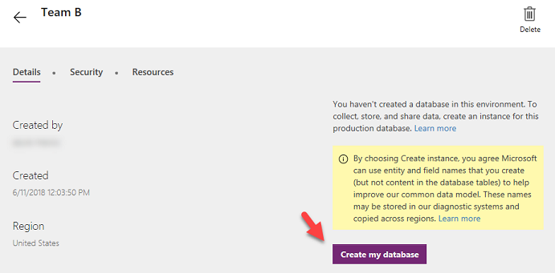
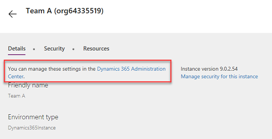
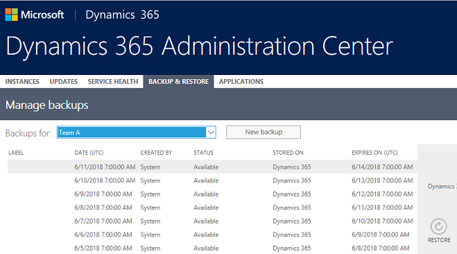
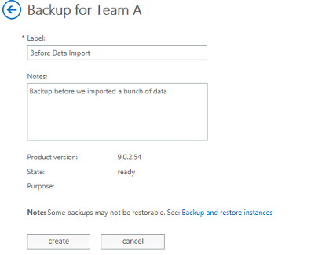

# About Common Data Service 

[!INCLUDE [cc-beta-prerelease-disclaimer](../includes/cc-beta-prerelease-disclaimer.md)]

## Common Data Service

The Common Data Service is a cloud scale database used to securely store data for business applications built on PowerApps. Common Data Service is an abstraction on top of underlying Azure cloud data management services to make it easier to build business applications. Common Data Service provides not just data storage, but a way to implement business logic that enforces business rules and automation against the data. Data in Common Data Service is organized as entities, for example account and contact would be two examples of entities. These entities can have relationships that define the business connection between the data stored in an entity. For example, John works for Contoso would be expressed as a relationship. The security model of Common Data Service enables data protection down to the field level on individual records. A more thorough discussion of security will be covered in the security section.

Common Data Service databases are created in the context of a PowerApps environment. Each environment can have only a single Common Data Service database. Common Data Service databases can be provisioned by you or licensed individuals in your organization to support their custom applications. Common Data Service databases are also automatically provisioned when a Dynamics 365 Customer Engagement application is added to your tenant.

## Managing Common Data Service database instances

The easiest way to know if you have a Common Data Service database associated with your environments is to look at the detail page of the environment from admin.powerapps.com. If you see the Create my database button then you don’t have one in that environment yet and can create one.

On the other hand, if you don’t see the Create my Database link then the Common Data Service database instance exists and you can click on the Dynamics 365 Administration center link to navigate to the list of all your Common Data Service databases.

From the Dynamics 365 Admin center you can open the instance as well as manage and view some of the instance details. The actions you can take on each instance depends currently on if it started as an instance for Dynamics 365 Customer Engagement or if you started it with just the core Common Data Service entities. For core Common Data Service instances, you can only copy or set notifications. On Dynamics 365 Common Data Service instances you also have the ability to reset the instance if it is of type sandbox, and potentially convert an instance to a sandbox to then test or reset.

## Common Data Service backups and restore

From here you can also see the database backups. As you can see from the following image, backups run automatically every day. No action is required by you, or any administrator to ensure daily backups.

You do however have the option to manually take a backup. A great use for this is before doing big data imports or changes or deploying new releases of applications.

> [!div class="mx-imgBorder"] 
> 

Once the manual backup is completed it will show in the list of other backups allowing you to select it as the restore point.

### See also
[Microsoft Learn: Introduction to Common Data Service](https://docs.microsoft.com/learn/power-platform/intro-common-data-service/)