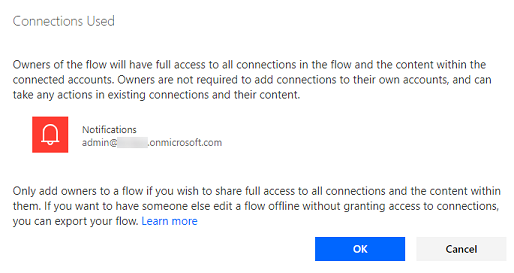
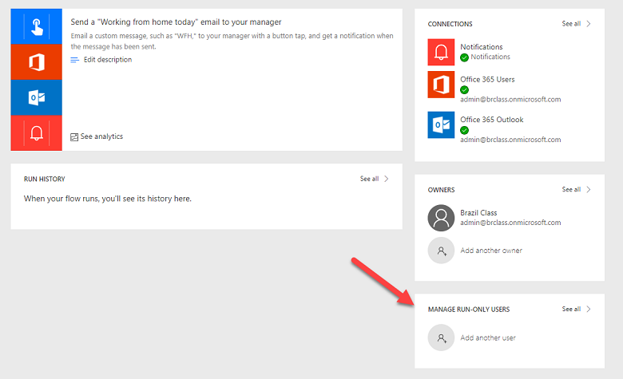
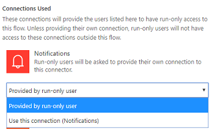
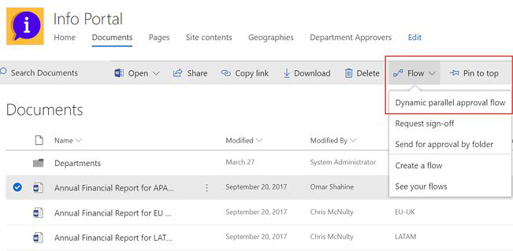
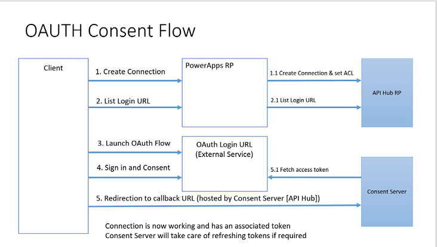
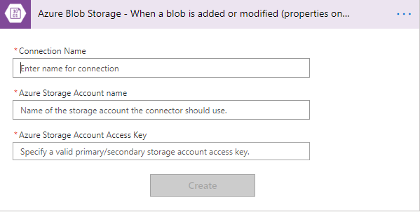
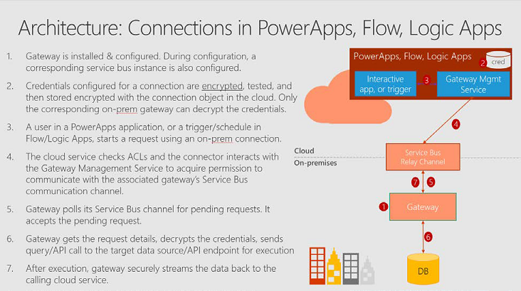

# About Connectors

Connectors are essentially proxy wrappers around the APIs provided by services that allow Power Automate, Power Apps, and Logic Apps to easily interact with the service. Connectors can be either public or custom. There are currently over 200+ public connectors that can be used by all organizations. Examples of public connectors are Microsoft 365, Common Data Service, Twitter, Dropbox and more. Custom connectors are defined in the context of an environment and are only available to apps and flows within that environment. Connectors make triggers and actions available that can be used by the apps and flows. Triggers are used by flow or Logic Apps to start the execution of the workflow. Actions are used by apps and flows to perform a defined set of actions during execution.

## Sharing of canvas apps that use Connectors

Some connectors are shared automatically when you share the app. Others require that the user the app is shared with create their own connections. From web.powerapps.com you can check the connection and see if the share tab is present, if it is then the connection will be shared automatically. Otherwise, the user will need to create their own connection. Custom connectors are shared, but users must create their own connection to it. This means that the user shared with needs to have credentials or key if required by the custom connector.

## Sharing of flows that use Connectors

Flows can be shared with other users either as co-owners or run-only users. When a user adds another user or group as an owner of a flow those users will have full access to all the connections used in the flow. This means if they run the flow it will take the action in the context of the user signed into the connection. Because they are co-owners of the flow they will also be able to modify the flow using the connections that already exist. They may also change the login on the connection, however they are not required to do so. Co-owners are limited to use the connection with that flow, they can't create a new flow and use the same connection. The following is an example of the warning that is presented when you add a co-owner.

> [!div class="mx-imgBorder"] 
> 

Now in this example notice it is an Admin account. Since it is sending a notification probably not a great concern but if it was a more sensitive connector this could allow escalation of privileges beyond what is intended in your security models.

Run-only sharing is an option when the flow is manually triggered. This option allows greater control because first of all the user does not have ability to edit the flow just to run it. Second, when you invite the user you can specify to reuse the existing connection or require the user to provide their own. To manage the Run-Only users drill down on the flow from the list of flows and you will see the following:

> [!div class="mx-imgBorder"] 
> 

From here you will see a dialog to specify the user or group as well as a list of the connections and the choice for each on how to grant access. The following shows the connection configuration and how you can choose to force the user to sign-in to their own connection.

> [!div class="mx-imgBorder"] 
> 

One of the more recent additions is the ability to share a flow with a SharePoint List or an Microsoft 365 Group. In this scenario, the flow is available to all members of the group in the case of Microsoft 365 groups. For SharePoint Lists, anyone with edit access to the list would have access to the flow. The flow would then show up with the ability to execute it from the application navigation.

> [!div class="mx-imgBorder"] 
> 

## Restricting Use of Connectors

Within each environment using data loss prevention policies you can limit what connectors can be used together in a single application or flow. More on this in the section where we cover Data Loss Prevention (DLP) policies.

## Connector Authentication Patterns

Power Apps and Power Automate authenticate with connectors to create a connection environment. It is that environment that contains the specific configuration information necessary for the app or flow to talk to the connector API that is used in each interaction. Connectors could choose to use no authentication, basic authentication, API key authentication or OAuth 2.0. The most common are OAuth and API Key.

OAuth if you aren't familiar with it is an authorization framework that allows external applications to obtain controlled access to a target service. Many APIs support it including Common Data Service, Facebook and Twitter to name a few. The goal of authentication is to allow the user to sign in to a familiar login dialog, consent to the application using the service, and then setup to allow tokens to be acquired. It is the tokens that are used on each request to prove who the user is and their right to use the API. In the Power Apps and Power Automate usage, a Consent Server is involved that helps manage the tokens and their lifecycle including storing the renewal token in the Consent Server and handling the refresh cycle. The following is a step by step look at what happens when you authenticate a connection using OAuth.

> [!div class="mx-imgBorder"] 
> 

The API Key is a little less complex as it typically involves the API assigning a key that is passed on each request. That key is provided when the connection is established for the connector and is stored in the environment with the other connection information in a secure way. An example of an API Key authentication connector is the Azure Storage Blob. As you can see below it wants the Storage Account Name as well as the Access Key.

> [!div class="mx-imgBorder"] 
> 

When on-premises gateways are involved the process is even a little more complex. The following diagrams what happens when you establish a connection with the gateway data source.

> [!div class="mx-imgBorder"] 
> 

### See also
[Custom Connectors](https://docs.microsoft.com/connectors/custom-connectors/)
