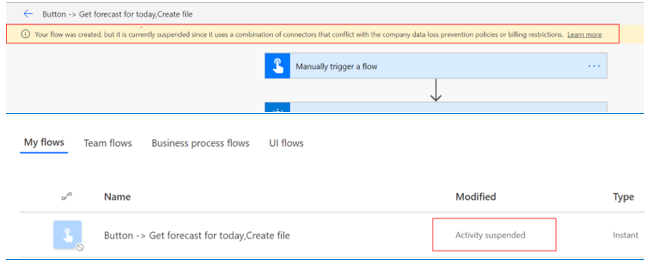

# Data loss prevention policies

Your organization's data is likely one of the most important assets you are responsible for safeguarding as an administrator. The ability to build apps and automation that uses the data allows your company to be successful. Power Apps and Power Automate allow rapid build and rollout of these high-value applications that allow users to measure and act on the data in real time. Applications and automation are increasingly becoming more connected across multiple data sources and multiple services. Some of these services might be external third-party services and might even include some social networks. Users will often have good intentions but might overlook the potential for exposure from data leakage to services and audiences that shouldn't have access to the data.

Data loss prevention (DLP) policies that help protect organizational data from unintended exposure are available for administrators to create. They can act as guardrails to help prevent users from unintentionally exposing the data. DLP policies can be scoped at the environment level or tenant level offering flexibility to craft policies that are sensible and strike the right balance between protection and productivity. For tenant-level policies you can define the scope to be all environments, only selected environments, or all but excluded environments. Environment-level policies can be defined for one environment at a time. 

DLP policies enforce rules of what connectors can be used together by classifying connectors as either **Business** or **Non-Business**. If you put a connector in the **Business** group, it can only be used with other connectors from that group in the same app or flow. Sometimes you may want to altogether block the usage of certain connectors by classifying them as **Blocked**.

DLP policies are created in the [Power Platform admin center](https://admin.powerplatform.microsoft.com/). They impact Power Platform canvas apps and Power Automate flows. In order to create a DLP policy you need to be a [tenant admin](use-service-admin-role-manage-tenant.md) or an [Environment Admin](environments-overview.md#environment-permissions). 

> [!NOTE]
> Connector blocking capability using a three-way classification - **Business**, **Non-Business**, and **Blocked** - as well as DLP user interface support in the Power Platform admin center are currently in public preview. There is new DLP PowerShell support for three-way DLP classification which is also in public preview. Legacy DLP support for two-way classification along with user interface and PowerShell support for two-way classification – **Business**, **Non-Business** - is currently generally available and will continue to be available for the foreseeable future. 
> 
> For detailed information on Power Platform Connectors, see [Connectors documentation](https://docs.microsoft.com/connectors/).

## Connector classification
Data groups are a simple way to categorize connectors within a DLP policy. The three data groups available are the **Business** data group, the **Non-Business** data group, and the **Blocked** data group. 

A good way to categorize connectors is to place them in groups based on the business centered or personal-use centered services that they connect to in the context of your organization. Connectors that host business-use data should be classified as **Business** and connectors that host personal-use data should be classified as **Non-Business**. Any connectors that you want to restrict usage of across one or more environments, should be classified as **Blocked**.

When a new policy is created, by default all connectors are placed in the **Non-Business** group. From there they can be moved to **Business** or **Blocked** based on your preference. You manage the connectors in a data group when you create or modify the properties of a DLP policy from the admin center. See [Create a data loss prevention (DLP) policy](create-dlp-policy.md). You can also change the initial classification of connectors by editing your DLP policy. See [Edit a DLP policy](prevent-data-loss.md#edit-a-dlp-policy).

> [!NOTE]
> Until recently, some HTTP connectors were not readily available for DLP configuration using the DLP user interface and PowerShell. As of May 2020, the following HTTP connectors can now be classified using the DLP user interface and PowerShell like any other Power Platform connector – **HTTP**, **HTTP Webhook**, **When a HTTP request is received**. 
>
> The **Content Conversion** connector is an integral feature of the Power Platform and is used to convert an HTML document to plain text. It is applicable for both Business and **Non-Business** scenarios and does not store any data context of the content converted through it. It is therefore not available for classification through DLP policies.

### How data is shared among data groups
Data cannot be shared among connectors located in different groups. For example, if you place SharePoint and Salesforce connectors in the **Business** group and you place Gmail in the **Non-Business** group, makers cannot create a Power App or Power Automate resource that uses both the SharePoint and the Gmail connector. This in turn restricts data flows between these two services using Power Platform. 

While data cannot be shared among services in different groups, you can share data among the services within a specific group. From the earlier example, since SharePoint and Salesforce were placed in the same data group, makers can create a Power App or Power Automate resource that uses both SharePoint and Salesforce connectors together. This in turn allows data flows between these two services using Power Platform.

The key point is connectors in the same group can share data, while connectors in different groups cannot share data through Power Platform.

### The impact of blocked data group
Data can be restricted altogether to flow to a specific service by marking that connector as **Blocked**. For example, if you place Facebook and Twitter in the **Blocked** group, makers cannot create a Power App or Power Automate resource that uses Facebook connector. This in turn restricts data flows to this service using Power Platform. 

All third-party connectors can be blocked. All Microsoft owned Premium connectors (except Common Data Service) can be blocked.

### List of connectors that cannot be blocked
**Standard** licensed connectors where the service is owned by Microsoft cannot be classified as **Blocked** through DLP policies. They can be classified into **Business** or **Non-Business** data groups. These connectors broadly fall into following categories:

1.	Enterprise class Microsoft 365 suite of services with no additional licensing implications. 
2.	Power Platform specific connectors which are part of the base platform capabilities.
3.	Private use only Microsoft connectors such as Outlook.com do not support corporate sign-ins through connectors and only support Microsoft account sign-ins. We recommend that these are classified in the **Non-Business** category by the admins.
4.	For other standard Microsoft services such as Bing Search and Microsoft Translator, the privacy policy statement for Microsoft hosted services can be found [here](https://privacy.microsoft.com).
5.	Common data service connectors that are the only Premium connectors that cannot be blocked since Common Data Service is an integral part of Power Platform,

Below are the connectors that cannot be blocked using DLP policies.

<table style="width:100%">
<tr>
<th>Business Use Office Connectors (Standard)</th>
<th>Power Platform Connectors (Standard)</th>
<th>Personal Use  Office Connectors (Standard)</th>
<th>Other Microsoft Connectors (Standard)</th>
<th>Exception for Premium Connector</th>
</tr>
<tr>
<td width="20%"> Excel Online (Business) </td>
<td width="20%"> Approvals</td>
<td width="20%"> OneDrive </td>
<td width="20%"> Azure AD</td>
<td width="20%"> Common Data Service</td>
</tr>
<tr>
<td width="20%"> Microsoft Forms </td>
<td width="20%"> Notifications</td>
<td width="20%"> Outlook.com </td>
<td width="20%"> Bing Maps</td>
<td width="20%"> Common Data Service  (current environment)</td>
</tr>
<tr>
<td width="20%"> Microsoft Forms Pro </td>
<td width="20%"> Power Automate Management</td>
<td width="20%"> Excel  </td>
<td width="20%"> Bing Search</td>
<td width="20%"> </td>
</tr>
<tr>
<td width="20%"> Microsoft Teams </td>
<td width="20%"> Power Automate for Admins</td>
<td width="20%"> Excel Online (OneDrive) </td>
<td width="20%"> Cloud App Security</td>
<td width="20%"> </td>
</tr>
<tr>
<td width="20%"> Microsoft To-Do (Business) </td>
<td width="20%"> Power BI</td>
<td width="20%">  </td>
<td width="20%"> Computer Vision API (Azure)</td>
<td width="20%"> </td>
</tr>
<tr>
<td width="20%"> Office 365 Groups </td>
<td width="20%"> Power Apps for Admins</td>
<td width="20%">  </td>
<td width="20%"> Content Conversion</td>
<td width="20%"> </td>
</tr>
<tr>
<td width="20%"> Office 365 Outlook </td>
<td width="20%"> Power Apps for App Makers</td>
<td width="20%">  </td>
<td width="20%"> Content Moderate</td>
<td width="20%"> </td>
</tr>
<tr> 
<td width="20%"> Office 365 Users </td>
<td width="20%"> PowerPlatform for Admins</td>
<td width="20%">  </td>
<td width="20%"> Custom Vision</td>
<td width="20%"> </td>
</tr>
<tr>
<td width="20%"> Office 365 Video </td>
<td width="20%"> Power Apps Notifications</td>
<td width="20%">  </td>
<td width="20%"> Face API</td>
<td width="20%"> </td>
</tr>
<tr>
<td width="20%"> OneDrive for Business </td>
<td width="20%"> </td>
<td width="20%">  </td>
<td width="20%"> GitHub</td>
<td width="20%"> </td>
</tr>
<tr>
<td width="20%"> OneNote (Business) </td>
<td width="20%"> </td>
<td width="20%">  </td>
<td width="20%"> LinkedIn V2</td>
<td width="20%"> </td>
</tr>
<tr>
<td width="20%"> Outlook Customer Manager </td>
<td width="20%"> </td>
<td width="20%">  </td>
<td width="20%"> LUIS</td>
<td width="20%"> </td>
</tr>
<tr>
<td width="20%"> Outlook Tasks </td>
<td width="20%"> </td>
<td width="20%">  </td>
<td width="20%"> Microsoft Kaizala</td>
<td width="20%"> </td>
</tr>
<tr>
<td width="20%"> Planner </td>
<td width="20%"> </td>
<td width="20%">  </td>
<td width="20%"> QnA Maker</td>
<td width="20%"> </td>
</tr>
<tr>
<td width="20%"> Project Online </td>
<td width="20%"> </td>
<td width="20%">  </td>
<td width="20%"> Microsoft School Data Sync</td>
<td width="20%"> </td>
</tr>
<tr>
<td width="20%"> SharePoint </td>
<td width="20%"> </td>
<td width="20%">  </td>
<td width="20%"> Microsoft Translator</td>
<td width="20%"> </td>
</tr>
<tr>
<td width="20%"> Skype for Business Online </td>
<td width="20%"> </td>
<td width="20%">  </td>
<td width="20%"> MSN Weather</td>
<td width="20%"> </td>
</tr>
<tr>
<td width="20%">  </td>
<td width="20%"> </td>
<td width="20%">  </td>
<td width="20%"> Text Analytics</td>
<td width="20%"> </td>
</tr>
<tr>
<td width="20%">  </td>
<td width="20%"> </td>
<td width="20%">  </td>
<td width="20%"> Video Indexer (V2)</td>
<td width="20%"> </td>
</tr>
<tr>
<td width="20%">  </td>
<td width="20%"> </td>
<td width="20%">  </td>
<td width="20%"> Wunderlist</td>
<td width="20%"> </td>
</tr>
<tr>
<td width="20%">  </td>
<td width="20%"> </td>
<td width="20%">  </td>
<td width="20%"> Yammer</td>
<td width="20%"> </td>
</tr>
<tr>
<td width="20%">  </td>
<td width="20%"> </td>
<td width="20%">  </td>
<td width="20%"> LinkedIn</td>
<td width="20%"> </td>
</tr>
<tr>
<td width="20%">  </td>
<td width="20%"> </td>
<td width="20%">  </td>
<td width="20%"> Microsoft Staffhub</td>
<td width="20%"> </td>
</tr>
<tr>
<td width="20%">  </td>
<td width="20%"> </td>
<td width="20%">  </td>
<td width="20%"> Form Recognizer</td>
<td width="20%"> </td>
</tr>
</table>

### Custom connector classification
By default, custom connectors are not part of the standard configuration capabilities of DLP policies in the Power Platform admin center. They can be set up for DLP across **Business**, **Non-Business** and **Blocked** groups using the DLP PowerShell commands listed [here](powerapps-powershell.md#data-loss-prevention-dlp-policy-commands). 

Unlike Standard and Premium connectors which are available to all environments in the tenant, custom connectors are scoped specific to an individual environment. Therefore, tenant-level DLP policies cannot be used to manipulate custom connectors. They are only available to categorize for environment-level DLP policies. Using PowerShell, you can configure DLP to include these connectors. Once added, these will then be manageable in the Admin Portal.

> [!NOTE]
> Only custom connectors stored in a tenant’s default environment will be displayed with its given icon and display name in the policy editor. All other custom connectors will be displayed with the default connector icon and their internal name.

### Default data group for new connectors
One data group must be designated as the default group to auto classify any new connectors added to Power Platform after your policy has been created. Initially, the **Non-Business** group is the default group for new connectors and all services. An administrator can change the default data group to the **Business** data group. See [Change the default data group](prevent-data-loss.md#change-the-default-data-group).

Any new services that are added to Power Apps will be placed in the designated default group. For this reason, we recommend you keep **Non-Business** as the default group and manually add services into the **Business** or **Blocked** group after your organization has evaluated the impact of allowing business data to be shared with the new service.

> [!NOTE]
> Microsoft owned Standard connectors are exempt from being marked as **Blocked** and can only be classified as **Business** or **Non-Business**. If Microsoft adds any new connectors that are not blockable and if the DLP policy’s default group setting is **Blocked**, then these connectors will be automatically marked as **Non-Business** instead of **Blocked**.

## Policy scope
Data policies can be created at both the tenant and environment level. While tenant admins have the permissions to create tenant-level policies, Environment Admins have the permissions to create environment-level policies.

### Tenant-level policies
Tenant admins can define three different types of scopes for tenant level data policies. 

1.	Add all environments
2.	Add multiple environments (but not all)
3.	Exclude certain environments (and apply to all others)

It is typical for tenant admins to define DLP policies for their entire tenant but exclude certain environments using option ‘3’ above. For the excluded environments, tenant admins can define alternate DLP policies and apply it on multiple environments using option ‘2’ above. DLP rules that admins want to apply across the entire tenant without making any exceptions can be enforced using add all environments option ‘1’ above.

Tenant admins can define more than one multiple tenant-level policy for their environments in their tenant. These policies can be for mutually exclusive or overlapping environment scopes.

### Environment-level policies
Environment Admins can define environment-level data policies for one environment at a time. Environment Admins cannot exclude their environments from tenant-level policies. Therefore, all the restrictions defined by the tenant admins scoped for their environment still apply in addition to the environment-level policy that they individually define for their environment. 

Like tenant-level policies, Environment Admins can define more than one environment-level policy for their environment.

Even though Environment Admins might manage more than one environment, unlike tenant-level policies, they are not able to include more than one environment in the environment-level policy. They will need to define individual environment-level policies for each environment that they manage. 

## Combined effect of multiple DLP policies
As tenant or Environment Admins, you can create more than one DLP policy and apply it on the same environment. At design and run time all policies applicable for the environment in which the app or flow reside, are evaluated together to decide if the resource is in compliance or violation of the DLP policies.

### Blocked classification impact across multiple policies
If any policy (tenant and/or environment-level) applicable to an environment marks a connector as **Blocked**, then no app or flow can use that connector in the environment. It doesn’t matter if any other policy classifies that connector as **Business** or **Non-Business**, since **Blocked** is the most restrictive classification for the connector therefore **Blocked** is always the final outcome of multiple policy evaluation. 

### Business/Non-Business classification impact across multiple policies
Evaluation of **Business** or **Non-Business** classification across multiple policies is a lot more complicated than **Blocked** classification. Note, **Business**/**Non-Business** is simply a grouping attribution. It is not a property that gets assigned to the connector. Admins can classify a given connector, such as SharePoint, as **Business** in policy A and as **Non-Business** in policy B. What matters is what other connectors SharePoint is grouped with across policy A and policy B. 

Note that the most restrictive grouping is finally imposed when all the policies applicable to an environment are evaluated together. Consider an example of three policies (A, B, and C) across ten connectors (SharePoint, Twitter, Salesforce, Facebook, Face API, Office 365 Outlook, Basecamp 3, Adobe Sign, Azure Blob Storage, Box) classifying them as **Business** or **Non-Business** represented through two categories each across the three policies (-E1-, -E2-, -E3-, -E4-, -E5-, -E6-).

**Policy A**  
-E1- **Business** – SharePoint, Twitter, Salesforce, Office 365 Outlook, Basecamp 3  
-E2- **Non-Business** – Facebook, Face API, Adobe Sign, Azure Blob Storage, Box

**Policy B**  
-E3- **Business**  – SharePoint, Facebook, Face API, Office 365 Outlook, Basecamp 3  
-E4- **Non-Business** – Twitter, Salesforce, Adobe Sign, Azure Blob Storage, Box

**Policy C**  
-E5- **Business**  – Facebook, Face API, Twitter, Salesforce, Office 365 Outlook  
-E6- **Non-Business** – SharePoint, Adobe Sign, Azure Blob Storage, Box, Basecamp 3

When all three policies are applied together on the same environment the net result is fragmentation of connectors across 2^3 = 8 groups as depicted below. Only connectors in the same group (out of 8 possible combinations) can be used in a given Power App or Power Automate resource. 

**Consolidated grouping**  
-E1-, -E2-, -E3- Group 1 – Office 365 Outlook  
-E1-, -E2-, -E6- Group 2 – SharePoint, Basecamp 3  
-E1-, -E4-, -E5- Group 3 – Twitter, Salesforce  
-E1-, -E4-, -E6- Group 4 – NULL  
-E2-, -E3-, -E5- Group 5 – Facebook, Face API  
-E2-, -E3-, -E6- Group 6 – NULL  
-E2-, -E4-, -E5- Group 7 – NULL  
-E2-, -E4-, -E6- Group 8 – Adobe Sign, Azure Blob Storage, Box

To summarize, an app or flow can only use connectors from these individual groups at any given time and not mix connectors across the eight different groups. From the examples above, note that multiple DLP policies applied on an environment will fragment your connector space in complicated ways. Therefore, it is highly recommended to have a minimum number of DLP policies applicable to any given environment. 

## Impact of DLP policies on apps and flows
If admins have disallowed certain connectors to be used together in an environment by classifying them as **Business** or **Non-Business**. Or, if admins have marked certain connectors as **Blocked** using tenant and/or environment-level DLP policies, then these restrictions impact makers and users of Power Apps and Power Automate. The restrictions are enforced at both design and at run time.

As an administrator, you should have a process and plan in place to handle these types of support needs if you are using DLP policies.

<!-- 
The policy creator should:
- understand the business need and risk profile of the connector that is needed by the app or flow 
- support the maker and user by:
  - either editing the DLP policies to make the accommodation for the connector 
  - or creating a dedicated/custom environment for the particular app and flow to facilitate the business scenario while keeping the exposure of the modified policy limited to a select set of makers.
-->

### Design-time impact on apps and flows
As expected, users creating or editing a resource impacted by the DLP policy will see an appropriate error message about the DLP policy conflict with existing policies. 

For example, Power Apps makers will see the following error upon using connectors in a flow that don’t belong together or are blocked using DLP policies. The application will not add the violating connection.

> [!div class="mx-imgBorder"] 
> 

Similarly, Power Automate makers will see the following error upon using trying to save a flow which is using connectors that don’t below together or are blocked using DLP policies. Flow itself will be saved but marked as ‘Suspended’ and will not execute unless DLP violation is resolved by the maker.

> [!div class="mx-imgBorder"] 
> 

### Run-time impact on apps and flows

As an admin you can decide to modify the DLP policies for your tenant or for specific environments at any point. If apps and flows were created and executed in compliance with the DLP policy earlier, some of them may be negatively impacted by the changes in the DLP policy that you make. 

Users using a resource in violation of the latest DLP policy will see an error message about the DLP policy conflict. For example, Power Apps makers and users will see the following error while launching an app that uses connectors that don’t belong together or are blocked using DLP policies. 

> [!div class="mx-imgBorder"] 
> 

Similarly, Power Automate makers and users will see that the flows which is using connectors that don’t below together or are blocked using DLP policies are marked as ‘Suspended’ by the background system process. Flows marked as ‘Suspended’ will not execute unless the DLP violation is resolved by the maker.

> [!NOTE]
> The flow suspension process works in a polling mode; it takes about 5 minutes for the latest DLP changes to reflect upon active flows in order to mark them as suspended due to DLP violations. This change is not instantaneous. 

> [!div class="mx-imgBorder"] 
> 

## Known issues

The DLP connector blocking ability and DLP user interface support in the Power Platform admin center is in public preview. There are the following known issues and limitations with the current offering that we're working to address:

1. Three-way DLP policy creation is not available through admin connectors.
2. If the default group is set as **Blocked** for policies created through DLP PowerShell, the not blockable connector list is not taking effect.
3. All check boxes present while creating a new policy appear completed on selecting the **Review** step directly on the **Data Policies** page.
4. Environment Admin is not able to view details of a tenant policy.
5. Environment Admin is not able to edit environment policies created by other Environment Admins.
6. Select environments messaging for Environment Admins is incongruent with behavior.
7. Power Platform for admins connector always blocks **LBI/Non-Business** group.
8. Policy list view search only working on the Name field.
9. The following are not marked as blockable but will not be blockable: Microsoft Teams, Power Apps Notifications, Computer Vision API, QnA Maker, LinkedIn, Microsoft Staffhub, Form Recognizer. Cloud PKI Management is marked as unblockable but will be blockable.
10. Some environment admin profiles are getting evaluated as tenant admin profiles. However, they are unable to save their changes as tenant admins.

### See also
[Create a data loss prevention (DLP) policy](create-dlp-policy.md)  
[Manage data loss prevention (DLP) policies](prevent-data-loss.md)  
[Data Loss Prevention (DLP) policy commands](powerapps-powershell.md#data-loss-prevention-dlp-policy-commands)