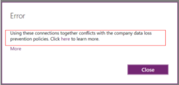
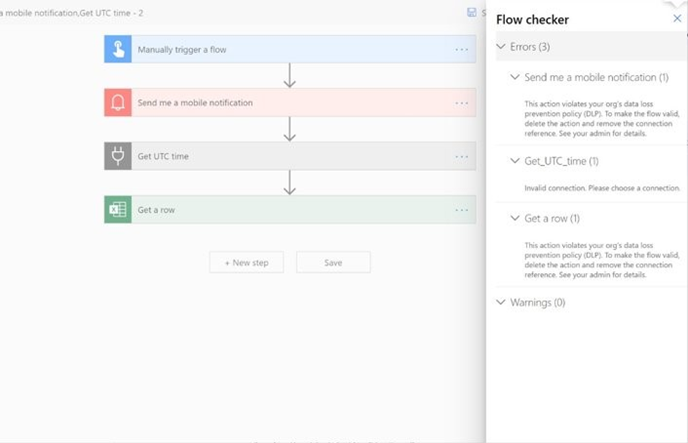
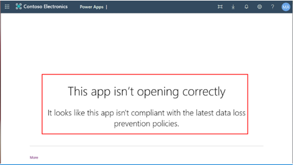
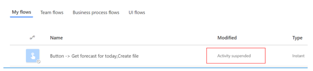

# Data loss prevention policies

Your organization's data is likely one of the most important assets you're responsible for safeguarding as an administrator. The ability to build apps and automation to use that data is a large part of your company's success. You can use Power Apps and Power Automate for rapid build and rollout of these high-value apps so that users can measure and act on the data in real time. Apps and automation are becoming increasingly connected across multiple data sources and multiple services. Some of these might be external, third-party services and might even include some social networks. Users generally have good intentions, but they can easily overlook the potential for exposure from data leakage to services and audiences that shouldn't have access to the data.

You can create data loss prevention (DLP) policies that can act as guardrails to help prevent users from unintentionally exposing organizational data. DLP policies can be scoped at the environment level or tenant level, offering flexibility to craft sensible policies that strike the right balance between protection and productivity. For tenant-level policies you can define the scope to be all environments, selected environments, or all environments except ones you specifically exclude. Environment-level policies can be defined for one environment at a time. 

DLP policies enforce rules for which connectors can be used together by classifying connectors as either **Business** or **Non-Business**. If you put a connector in the **Business** group, it can only be used with other connectors from that group in any given app or flow. Sometimes you might want to block the usage of certain connectors altogether by classifying them as **Blocked**.

DLP policies are created in the [Power Platform admin center](https://admin.powerplatform.microsoft.com/). They affect Power Platform canvas apps and Power Automate flows. To create a DLP policy, you need to be a [tenant admin](use-service-admin-role-manage-tenant.md) or have the [Environment Admin role](environments-overview.md#environment-permissions). 

> [!NOTE]
> The ability to block connectors by using a three-way classification&mdash;**Business**, **Non-Business**, and **Blocked**&mdash;in addition to DLP policy UI support in the Power Platform admin center is now generally available. There is new DLP policy PowerShell support for three-way DLP policy classification, which is also generally available. Legacy DLP policy support for two-way classification (**Business** and **Non-Business**), along with admin center UI and PowerShell support for two-way classification, is currently generally available and will continue to be available for the foreseeable future. More information: [Connectors documentation](https://docs.microsoft.com/connectors/)

## Connector classification

Data groups are a simple way to categorize connectors within a DLP policy. The three data groups available are the **Business** data group, the **Non-Business** data group, and the **Blocked** data group. 

A good way to categorize connectors is to place them in groups based on the business-centered or personal-use-centered services that they connect to in the context of your organization. Connectors that host business-use data should be classified as **Business** and connectors that host personal-use data should be classified as **Non-Business**. Any connectors that you want to restrict usage of across one or more environments should be classified as **Blocked**.

When a new policy is created, by default all connectors are placed in the **Non-Business** group. From there they can be moved to **Business** or **Blocked** based on your preference. You manage the connectors in a data group when you create or modify the properties of a DLP policy from the admin center. See [Create a data loss prevention (DLP) policy](create-dlp-policy.md). You can also change the initial classification of connectors by editing your DLP policy. See [Edit a DLP policy](prevent-data-loss.md#edit-a-dlp-policy).

> [!NOTE]
> Until recently, some HTTP connectors weren't readily available for DLP policy configuration by using the DLP policy UI or PowerShell. As of May 2020, the following HTTP connectors can now be classified by using the DLP policy UI and PowerShell, like any other Power Platform connector: **HTTP**, **HTTP Webhook**, and **When a HTTP request is received**. If legacy DLP policies are being updated using the new DLP UI, a warning message will be displayed to admins indicating that these three HTTP connectors are now being added to the DLP purview and that they should ensure that these connectors are placed in the right DLP grouping.
>
> Since child flows share an internal dependency with HTTP connector, the grouping that admins choose for HTTP connector in a DLP policy might impact the ability to run child flows in that environment/tenant. Make sure your HTTP connectors are classified in the appropriate group for your child flows to function. If there are any concerns in classifying it as **Business** in shared environments such as the default environment, our advice is to classify it as **Non-Business** or to block it. Then, create dedicated environments where makers can use HTTP connector, but restrict the maker list so that you can unblock makers from building child flows.
>
> The **Content Conversion** connector is an integral feature of Microsoft Power Platform, used to convert an HTML document to plain text. It applies both to **Business** and **Non-Business** scenarios and doesn't store any data context of the content converted through it; therefore, it's not available for classification through DLP policies.

### How data is shared among data groups

Data can't be shared among connectors that are located in different groups. For example, if you place SharePoint and Salesforce connectors in the **Business** group and you place Gmail in the **Non-Business** group, makers can't create an app or flow that uses both the SharePoint and Gmail connectors. This in turn restricts data flows between these two services in Microsoft Power Platform. 

Although data can't be shared among services in different groups, it can be shared among services within a specific group. From the earlier example, because SharePoint and Salesforce were placed in the same data group, makers can create an app or flow that uses both SharePoint and Salesforce connectors together. This in turn allows data flows between these two services in Microsoft Power Platform.

The key point is that connectors in the same group can share data in Microsoft Power Platform, whereas connectors in different groups can't share data.

### The effect of the Blocked data group

Data flow to a specific service can be blocked altogether by marking that connector as **Blocked**. For example, if you place Facebook in the **Blocked** group, makers can't create an app or flow that uses the Facebook connector. This in turn restricts data flows to this service in Microsoft Power Platform. 

All third-party connectors can be blocked. All Microsoft-owned premium connectors (except Microsoft Dataverse) can be blocked.

### List of connectors that can't be blocked

All connectors driving core Microsoft Power Platform functionality (like Dataverse, Approvals, and Notifications) as well as connectors enabling core Office customization scenarios like Microsoft Enterprise Plan standard connectors will remain non-blockable to ensure core user scenarios remain fully functional.

However, these non-blockable connectors can be classified into Business or Non-Business data groups. These connectors broadly fall into the following categories:

-	Microsoft Enterprise Plan standard connectors (with no additional licensing implications).
-	Microsoft Power Platform–specific connectors that are part of the base platform capabilities. Within this, Common Data Service connectors are the only premium connectors that can't be blocked, because Dataverse is an integral part of Microsoft Power Platform. 

The following connectors can't be blocked by using DLP policies.

|Microsoft Enterprise Plan standard connectors | Core Power Platform connectors  |
|---------|---------|
|Excel Online (Business)      | Approvals        |
|Microsoft Forms Pro      | Notifications        |
|Microsoft Teams      | Dataverse         |
|Microsoft To-Do (Business)      | Dataverse  (current environment)        |
|Microsoft 365 Groups      | Power Apps Notifications (v1 and v2)        |
|Microsoft 365 Outlook      |         |
|Microsoft 365 Users      |         |
|OneDrive for Business      |         |
|OneNote (Business)      |         |
|Planner     |         |
|Shifts     |         |
|SharePoint     |         |
|Skype for Business Online      |         |
|Power BI      |         |
|Yammer      |         |
|Kaizala      |         |
|Microsoft 365 Groups Mail (Preview)      |         |
|Cloud App Security      |         |

> [!NOTE]
> If a currently unblockable connector is already in the **Block** group (for example, because it was blocked when restrictions were different), it will remain in the same group until you edit the policy. You will get an error message stopping you from saving the policy until you move the unblockable connector to a **Business** or **Non-Business** group.

### Custom connector classification

By default, custom connectors aren't part of the standard configuration capabilities of DLP policies in the Power Platform admin center. However, you can use DLP policy PowerShell commands to set them up into **Business**, **Non-Business**, and **Blocked** groups. More information: [Data Loss Prevention (DLP) policy commands](powerapps-powershell.md#data-loss-prevention-dlp-policy-commands) 

Unlike standard and premium connectors, which are available to all environments in the tenant, custom connectors are scoped specifically to an individual environment. Therefore, you can't use tenant-level DLP policies to manipulate custom connectors, you must use environment-level DLP policies. By using PowerShell, you can configure DLP policy to include these connectors. After they're added, they can then be managed in the admin center.

> [!NOTE]
> Only custom connectors that are stored in a tenant's default environment will be displayed with their associated icon and display name in the policy editor. All other custom connectors will be displayed with the default connector icon and their internal name.

### Default data group for new connectors

One data group must be designated as the default group to automatically classify any new connectors added to Microsoft Power Platform after your policy has been created. Initially, the **Non-Business** group is the default group for new connectors and all services. You can [change the default data group](prevent-data-loss.md#change-the-default-data-group) to the **Business** or **Blocked** data group, but we don't recommend that you do so.

Any new services that are added to Power Apps will be placed in the designated default group. For this reason, we recommend you keep **Non-Business** as the default group and manually add services into the **Business** or **Blocked** group after your organization has evaluated the impact of allowing business data to be shared with the new service.

> [!NOTE]
> Microsoft 365 enterprise license connectors and a few core Microsoft Power Platform connectors are exempt from being marked as **Blocked** and can only be classified as **Business** or **Non-Business**. If Microsoft adds any new connectors that can't be blocked and if you've set the default group for the DLP policy as **Blocked**, these connectors will be automatically marked as **Non-Business** instead of **Blocked**.

## Policy scope

DLP policies can be created at both the tenant and environment level. Tenant admins have the permissions to create tenant-level policies; environment admins have the permissions to create environment-level policies.

### Tenant-level policies

Tenant admins can define three types of scopes for tenant-level data policies: 

Option 1: Apply to all environments. 
Option 2: Apply to multiple environments (but not all). 
Option 3: Apply to all environments except certain specifically excluded ones.

It's typical for tenant admins to define DLP policies for their entire tenant but exclude certain environments, as described in option 3. For the excluded environments, tenant admins can define alternate DLP policies and apply them to multiple environments, as described in option 2. Option 1 is for DLP policy rules that must apply across the entire tenant, without exception.

Tenant admins can define more than one multiple-tenant&ndash;level policy for the environments in their tenant. These policies can be set for mutually exclusive or overlapping environment scopes.

### Environment-level policies

Environment admins can define environment-level data policies for one environment at a time. Environment admins can't exclude their environments from tenant-level policies. Therefore, all the restrictions defined by the tenant admins scoped for their environment still apply, in addition to any environment-level policy that they have individually defined for their environment. 

As is true of tenant admins with tenant-level policies, environment admins can define more than one environment-level policy for their environment.

Even though environment admins might manage more than one environment, they can't include more than one environment in the environment-level policy. They must define individual environment-level policies for each environment that they manage. 

## View policy

Using the view policy feature, environment admins can view tenant-level policies and policies within environments that the admin has access to, at an individual policy level. Non-admins can also view tenant-level policies using this feature.

:::image type="content" source="media/dlp-view-policies2.png" alt-text="View DLP policies list":::

## Combined effect of multiple DLP policies

As tenant or environment admins, you can create more than one DLP policy and apply it to the same environment. At design and runtime, all policies that are applicable to the environment in which the app or flow resides are evaluated together to decide whether the resource is in compliance or violation of DLP policies.

### Blocked classification impact across multiple policies

If any policy (tenant-level or environment-level) that's applicable to an environment marks a connector as **Blocked**, no app or flow can use that connector in the environment. It doesn't matter whether any other policy classifies that connector as **Business** or **Non-Business**, because **Blocked** is the most restrictive classification for the connector; therefore, **Blocked** is always the final outcome of multiple policy evaluations. 

### Business/Non-Business classification impact across multiple policies

Compared to evaluating the effect of the **Blocked** classification, evaluating the effect of the **Business** or **Non-Business** classification across multiple policies is more complex. You can classify a given connector, such as SharePoint, as **Business** in policy A and as **Non-Business** in policy B. What matters is what other connectors SharePoint is grouped with across policy A and policy B. 

Note that the most restrictive grouping is finally imposed when all the policies applicable to an environment are evaluated together. Consider an example of three policies (A, B, and C) across 10 connectors (SharePoint, Twitter, Salesforce, Facebook, Face API, Microsoft 365 Outlook, Basecamp 3, Adobe Sign, Azure Blob storage, and Box). These connectors are classified as **Business** or **Non-Business** as represented by two categories each across the three policies (-E1-, -E2-, -E3-, -E4-, -E5-, and -E6-).

**Policy A**  
-E1- **Business** – SharePoint, Twitter, Salesforce, Microsoft 365 Outlook, Basecamp 3  
-E2- **Non-Business** – Facebook, Face API, Adobe Sign, Azure Blob storage, Box

**Policy B**  
-E3- **Business**  – SharePoint, Facebook, Face API, Microsoft 365 Outlook, Basecamp 3  
-E4- **Non-Business** – Twitter, Salesforce, Adobe Sign, Azure Blob storage, Box

**Policy C**  
-E5- **Business**  – Facebook, Face API, Twitter, Salesforce, Microsoft 365 Outlook  
-E6- **Non-Business** – SharePoint, Adobe Sign, Azure Blob storage, Box, Basecamp 3

When all three policies are applied together to the same environment, the net result is fragmentation of connectors across eight (23 = 8) groups, as depicted below. Only connectors in the same group (out of eight possible combinations) can be used in a given app or flow. 

**Consolidated grouping**  
-E1-, -E3-, -E5- Group 1 – Microsoft 365 Outlook  
-E1-, -E3-, -E6- Group 2 – SharePoint, Basecamp 3  
-E1-, -E4-, -E5- Group 3 – Twitter, Salesforce  
-E1-, -E4-, -E6- Group 4 – NULL  
-E2-, -E3-, -E5- Group 5 – Facebook, Face API  
-E2-, -E3-, -E6- Group 6 – NULL  
-E2-, -E4-, -E5- Group 7 – NULL  
-E2-, -E4-, -E6- Group 8 – Adobe Sign, Azure Blob storage, Box

To summarize: an app or flow can only use connectors from these individual groups at any given time, and not mix connectors across the eight different groups. From the examples above, note that multiple DLP policies applied to an environment will fragment your connector space in complicated ways. Therefore, we highly recommended that you apply a minimum number of DLP policies to any given environment. 

## Impact of DLP policies on apps and flows

If admins have disallowed certain connectors to be used together in an environment by classifying them as **Business** or **Non-Business**&mdash;or marked certain connectors as **Blocked** by using tenant-level or environment-level DLP policies&mdash;these restrictions can negatively affect makers and users of Power Apps and Power Automate. The restrictions are enforced at both design time and at runtime.

As an admin, you should have a process and plan in place to handle these types of support needs if you're using DLP policies.

### Design-time impact on apps and flows

Users who create or edit a resource affected by the DLP policy will see an appropriate error message about any DLP policy conflicts. For example, Power Apps makers will see the following error when they use connectors in an app that don't belong together or have been blocked by DLP policies. The app won't add the connection.

> [!div class="mx-imgBorder"] 
> 

Similarly, Power Automate makers will see the following error when they try to save a flow that uses connectors that don't belong together or have been blocked by DLP policies. The flow itself will be saved, but it will be marked as **Suspended** and won't be executed unless the maker resolves the DLP violation.

> [!div class="mx-imgBorder"] 
> 

### Runtime impact on apps and flows

As an admin, you can decide to modify the DLP policies for your tenant or for specific environments at any point. If apps and flows were created and executed in compliance with an earlier DLP policy, some of them might be negatively affected by any policy changes you make. 

Users who use a resource that's in violation of the latest DLP policy will see an error message about the DLP policy conflict. For example, Power Apps makers and users will see the following error when they try to open an app that uses connectors that don't belong together or have been blocked by DLP policies. 

> [!div class="mx-imgBorder"] 
> 

Similarly, Power Automate makers and users won't be able to start a flow that uses connectors that don't belong together or have been blocked by DLP policies. A background system process marks the flow as **Suspended**, and the flow won't be executed until the maker resolves the DLP policy violation.

> [!NOTE]
> The flow suspension process works in a polling mode. It takes about five minutes for the latest DLP policy changes to be assessed against active flows to mark them as suspended due to DLP policy violations. This change isn't instantaneous.

> [!div class="mx-imgBorder"] 
> 

## Known issues

We are working to address the following known issues and limitations: 

1. Tenant-level policies created through the new UI enforce default grouping (typically non-business) on custom connectors. Currently there is no way to explicitly classify custom connectors in tenant-level policies or ignore them altogether. In order to manage custom connector settings explicitly using environment-level policies, exclude these environments from the tenant-level policies.
2. Sorting by Created and Modified fields on Data Policy list view doesn’t work correctly.
3. Three-way DLP policy creation isn't available through admin connectors. Also, the Power Platform for Admins connector always blocks LBI/Non-business group.
4. Canvas apps assessment for DLP violations at launch time/runtime does not work as expected.

### See also

[Create a data loss prevention (DLP) policy](create-dlp-policy.md)  
[Manage data loss prevention (DLP) policies](prevent-data-loss.md)  
[Data loss prevention (DLP) policy commands](powerapps-powershell.md#data-loss-prevention-dlp-policy-commands)
