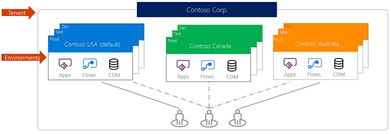
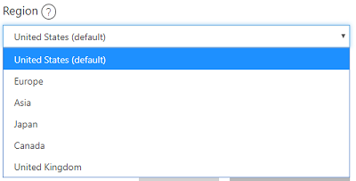
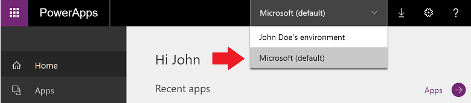

# About environments

Environments are containers that administrators can use to manage apps, flows, connections, and other assets; along with permissions to allow organization users to use the resources. Environments are tied to a geographic location that is configured at the time the environment is created. Environments can be used to target different audiences and/or for different purposes such as dev, test and production. The actual number and purpose of environments in your tenant is up to you as an administrator. In the ALM section we will cover some potential scenarios to help you choose what is best for you.

Common Data Service databases are created in the context of environments. Each environment, if you are licensed for Common Data Service, can have at most one database. If your organization signs up one of the environments with a Common Data Service database will be created to support that application.

## Environment security roles

Environments use security roles to determine what a user is able to do in the scope of that environment. The default roles that are available differ depending on if a Common Data Service database has been created in the environment.

Environments without a Common Data Service database have two built-in security roles: Environment Administrator and Environment Maker. Environment Makers can create and share apps, connectors, gateways etc. in the environment. Users in the Environment Maker, or Microsoft 365 tenant Global Administrator role can all manage the environment which includes adding/removing users, creating the Common Data Service environment, viewing and managing all resources created and setting Data Loss Prevention policies.

Once a Common Data Service database has been created in an environment all users of the Environment Admin role will now be members of the System Administrator role instead. The Common Data Service security roles will now take over for controlling security in the environment. Users or groups previously assigned Environment Maker role will need to be re-assigned manually one of the Common Data Service security roles. The following are the initial Common Data Service security roles that exist prior to you creating any custom roles.

|Role  |Description  |
|---------|---------|
|System Administrator     |This role takes over for the Environment Admin and has complete ability to customize and administer the environment. Users of the role also have full read-write access to data in the database. The role cannot be updated to change the privileges granted. Care should be taken in assigning this to the right people.         |
|System Customizer     |This role has full permission to customize the environment. The role’s data access is focused only on data owned by the user. This role can be modified but it is not recommended to modify.         |
|Environment Maker     |Can create new resources associated with the environment including apps, connections, gateways and flows. There is no default privileges to data included. This role can be modified but it is not recommended to modify.         |
|Common Data Service User     |This is a basic user role, with ability to run apps and perform common tasks but no ability to customize the system. The data access is focused on Read access to most Common Data Model core entities with full access to records owned by the user. This is a good role to consider copying to make a custom security role for users.         |
|Delegate     |This is a special role really design to give a user permission to Act on behalf of another user. For more information, see [Impersonate another user](https://docs.microsoft.com/powerapps/developer/common-data-service/impersonate-another-user).        |

In addition to these default roles, you can also create custom security roles. Custom security roles should be created to support applications built in your organization. Custom security roles can also come with applications you install from App Source or if your users sign up for model-driven apps in Dynamics 365, such as Dynamics 365 Sales and Customer Service.

## Types of environments

There are multiple types of environments. The type of environment indicates the purpose and determines the environment characteristics. The following table summarizes the current types of environments that you might encounter.

<table style="width:100%">
<tr>
<th>Settings</th>
<th>Description</th>
<th>Security</th>
</tr>
<tr>
<td width="20%"> Production</td>
<td width="50%">  This is intended to be used for permanent work in an organization. It can be created and owned by an administrator or anyone with a Power Apps license, provided there is 1GB available database capacity. These environments are also created for each existing Common Data Service database when it is upgraded to version 9.0 or later. Production environments are what you should use for any environments on which you depend.        </td>
<td width="30%"> Full control.  </td>
</tr>
<tr>
<td width="20%"> Default</td>
<td width="50%"> These are a special type of production environments. Each tenant will have a default environment created automatically and it has special characteristics described below in further detail. </td>
<td width="30%">  Limited control - all licensed users1 are Environment Makers.</td>
<tr>
<td width="20%"> Sandbox</td>
<td width="50%">   These are non-production environments and offer features like copy and reset. Sandbox environments are used for development and testing, separated from production. Provisioning sandbox environments can be restricted to admins (since production environment creation can be blocked), but conversion from production cannot be blocked.   </td>
<td width="30%">  Full control.  If used for testing, only end user access is needed.  Developers require Environment Maker access to create resources.</td>
</tr>
<tr>
<td width="20%"> Trial</td>
<td width="50%">  Trial environments are intended to support short term testing needs and are automatically cleaned up after a short period of time. Expires after 30 days and are limited to 1 user. Provisioning trial environments can be restricted to admins.</td>
<td width="30%">  Full control.</td>
</tr>
<tr>
<td width="20%"> Developer</td>
<td width="50%">  Developer environments are created by users with the Community Plan license. They are special environments intended only for use by the owner. Sharing with other users is not possible. Provisioning developer environments can't be restricted unless through a support ticket. </td>
<td width="30%">  Only a single user account with the Community Plan has access.</td>
</tr>
</table>

1Users licensed for Power Apps, Power Automate, Microsoft 365, and Dynamics 365 Online, stand-alone licenses, free and trial licenses.

## Default environment

Each tenant will have a default environment created automatically in the region nearest the Azure Active Directory (Azure AD) tenant. This environment has a few unique characteristics from other environments that you create. 

1. This environment can’t be disabled or deleted. 
2. All tenant users are added automatically to the maker role for the default environment and you can’t remove them from that role. 
3. Only Microsoft 365 tenant global administrators, Dynamics 365 admin, and Power Platform admins are added to Environment Administrator role.
4. As the default environment is the preferred place for individual users to start off building personal productivity apps and workflows, you should consider renaming the default environment to “Personal Productivity (default)” or another suitable name for your organization.

The default environment should not be used to host production solutions. It’s designed to be an open environment that allows users to extend Microsoft 365 and trusted applications or to build personal productivity applications that don’t affect many people. You can restrict to this usage by adding a DLP policy that only allows data flow between trusted first party connectors.

## Environment regions

When you create an environment, you will pick a geographic location. Application components, including the Common Data Service database will reside in that region. Generally, you will want to choose a location closest to the majority of your users that will be using applications in the particular environment. If you are connecting to other existing external resources, you should consider their location as well. You should also consider any data residency issues when choosing a location.

## Who can create environments

As a global administrator in the admin portal you will be able to see a list of all environments created by users in your tenant. Any administrators and users will be able to create new environments, provided there is 1GB available database capacity. Also users with the Community plan license can also create one developer environment.

## Impact of multiple environments on users

While it might be tempting to have users partitioned off into smaller environments it is important to consider the impact on the users in that decision. When users access the Power Apps Canvas App Player or the Power Automate application from the Web Browser or Windows Store the user will select and work within a single environment. By default, that environment will be set to the tenant default environment. Users can change their environment in the players and portals using the environment selector.

Having users’ applications and other assets spread across multiple environments will result in the user frequently having to adjust their environment setting. The best user experience is when the user stays within a single environment for most of their daily use.

In the mobile applications the user is presented with a consolidated list of applications across the environments they have access to. Each application indicates the environment. This reduces the need to switch, however it introduces the need for the user to choose the correct application. For example, imagine if you had an application Device Ordering and it was deployed to environment Test and environment production. If the user had access to both environments it would show up twice on the list. The user would have to differentiate between the two. Some of this can be minimized by only granting access as needed and then only temporarily to the Test environment.

## Impact of multiple environments on Connectors

When an application uses a public connector (available for all tenants), the connector is configured for use within the context of an environment. Custom connectors are also configured in the context of an environment. If an app is moved to another environment the public connector references will be recreated upon import. Custom connectors must be re-configured manually in that target environment.

Applications that use the Common Data Service connector currently only can communicate with Common Data Service databases in the same environment. This works well for apps that need to move between a dev, test and production environment because it adjusts automatically when imported into the next environment. Where this can be challenging is if you have two environments; one named Team Apps and another named CRM Data (which held your environment) an application using the Common Data Service connector in the Team Apps environment would not be able to access data in the CRM Data environment. A current work around for this is to use the connector instead of the Common Data Service connector since it can connect to multiple environments. That flexibility does result in more complexity if the application is moved from a dev, test to production and the environment needs to change as it is promoted, this must be done manually in the app once imported.

## Impact of multiple environments on Common Data Service

When thinking about how to organize your environments you should consider where your data lives. Having a single production environment with your Common Data Service is the simplest configuration as it makes accessing data from apps the easiest. Having multiple environments, each with their own Common Data Service database, might make sense in a few different scenarios. First, users have data that is geographically separated, and they don’t share across those boundaries. Second, data from different applications that have conflicting incompatible use of Common Data Service. Third, where users are building personal or team productivity applications that need Common Data Service data but as an organization you aren’t ready to mix that with the rest of your enterprise data.

### See also
[Microsoft Learn: Create and manage environments in Common Data Service](https://docs.microsoft.com/learn/modules/create-manage-environments/)
