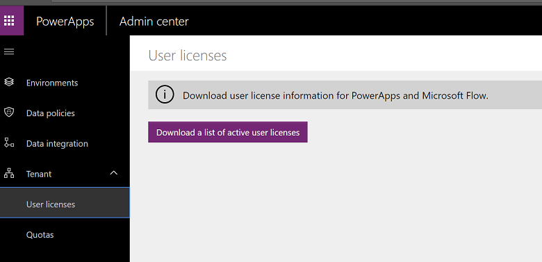
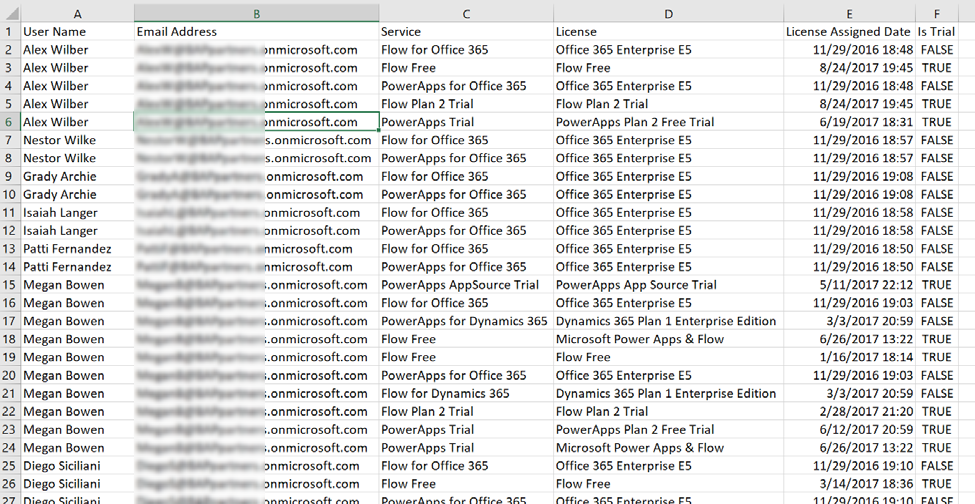

# About licensing and license management

[!INCLUDE [cc-beta-prerelease-disclaimer](../includes/cc-beta-prerelease-disclaimer.md)]

> [!NOTE]
> For information about licensing changes coming to PowerApps and Microsoft Flow in October 2019, see [PowerApps and Microsoft Flow licensing FAQs for October 2019](powerapps-flow-licensing-faq.md).

Organizations can obtain licenses by either licensing Microsoft PowerApps or Flow specifically or by it being included in the license of another Microsoft cloud service offering. For example, both Office 365 and Dynamics 365 provide entitlements for PowerApps and Microsoft Flow. As with most Microsoft licensing, you can mix and match for users as appropriate giving some additional entitlements.

Regardless of how obtained all licenses are user based. In the rest of this section we will highlight some of the key points of licensing, but it is not the product licensing documentation, you should consult that for any of the latest details. Links for pricing and specific plan details can be found later in this section.

First, let’s look at what you, as the administrator, will need to have the best administrator experience. While you can do basic administration with any of the licenses with PowerApps entitlements, the best experience is with PowerApps P2 and that is what Microsoft recommends for administrators. This provides the ability to create additional environments as well as Common Data Service. It also provides the best experience in the administration centers for controlling the environments.

The following summarizes the access based on various administrator role and license combination, as you can probably easily tell Global Admin with a PowerApps P2 license provides the most complete administrator experience. Without a PowerApps P2 the administrator can view some information but only able to administer their own assets.

|License type  |User/license management |PowerApps Admin Portal  |Manage environments  |Data loss policies  |Dynamics 365 Admin Center  |
|---------|---------|---------|---------|---------|---------|
|Global Admin without PowerApps P2     |Yes      |Sees only DLP policies and Tenant level user reports and statistics         |No         |Can create but only for all environments         |Can view Common Data Service environments         |
|Global Admin with PowerApps P2      | Yes        | Full access        | Yes - all environments        | Full ability to view, create, modify and remove        | Full access        |
|User Management Role      | Yes        | No access         |  No       |   No access      | No access        |
|User Management role with PowerApps P2     |Yes         | No tenant level info, only own environments        | Only own        |Only own         | No access        |
|Dynamics Admin role     | View only        | No access        | No        | No access        |No access        |
|Dynamics Admin role with PowerApps P2     |View only         | No tenant level info, only own environments        |Only own         |Only own        |  Full access       |

PowerApps has two primary standalone licensing tiers. PowerApps P1 which is best suited for business users who need to use basic PowerApps applications. PowerApps P2 is more focused towards Makers and Administrators who want to create data models in the Common Data Service. Each PowerApps P2 user is entitled to create two Production environments each having a Common Data Service database. Users of the apps built on the Common Data Service only require PowerApps P1 unless they use advanced features like plug-ins and real-time workflows or work with Dynamics 365 restricted entities ( a list of these can be found here https://docs.microsoft.com/powerapps/maker/common-data-service/data-platform-restricted-entities).

For example, John could create a PowerApps Canvas application that stores data in the Contact entity and two custom entities in a Common Data Service environment he created. For this, he would need a PowerApps P1 or P2 license to build the application and customize Common Data Service. Mary and Henry are users of the application John built. John had shared the application with them, so they could use it. Mary and Henry would be ok with just a PowerApps P1 license or a license that came with Dynamics 365. If either of them had only PowerApps that came with Office 365 they would however need to upgrade their license to at least a PowerApps P1.

Building on that example, John asked George, a developer at the company to create a plug-in on one of the custom entities. The business logic would do some automated processing every time the data was updated. This advanced business logic usage would require now for all users that wanted to use the canvas app to be upgraded to a PowerApps P2 license. You can find additional Entity Licensing examples here https://docs.microsoft.com/powerapps/maker/common-data-service/data-platform-entity-licenses.

PowerApps licenses include an equivalent Microsoft Flow license. It is also possible however to license flow by itself. Flow also has a free plan. All Flow plans offer unlimited creation of Flows but vary based on number of runs included and the time delay for checking for new work to perform. In addition to the key differences documented in the chart below, it is important to note that with the free plan the runs are per person where runs for other licenses aggregate at the tenant level.

|Flow plan |Number of runs |Check for new work  |
|---------|---------|---------|
|Free     |750         |Every 15 minutes         |
|Office and Dynamics 365     | 2,000        |Every 5 minutes             |
|P1     | 4,500       |Every 3 minutes             |
|P2     |  15,000       |Every 1 minute             |

## Organization level accumulated entitlements

Licenses for Flow include a specific number of executions of the automation for each user. These allowances are accumulated for all users in your organization on all plans except for the Free plan. For example, if you had 100 users each with 2000, your organization would have 200,000 monthly runs. That means if one user uses a large number you will not be penalized as long as you stay under your organization total accumulated allowance.

## Use of connectors

Apps and Flows use connectors to interact with services. Connectors can be standard, premium or custom. To use premium connectors users must be licensed with PowerApps P1 or P2 licenses. 

## Trial Plans

Trial plans are available for both PowerApps and Microsoft Flow plans 1 and 2. Free trials last 30 days for PowerApps and 90 days for Microsoft Flow plans. Users can self-service sign up for these trials in your organization. This can be done by explicitly visiting the pricing pages or by being prompted when they attempt an action in the apps that require additional licensing.

For Microsoft Flow, an unlicensed user that signs in to flow.microsoft.com will be setup with the free Flow plan. If later they try to perform an action like sharing a Flow, they will be prompted to sign up for a trial. In this example, if the user accepted the offer for trial they would be signed up for a Flow Plan 2 trial. This trial would not show up under the user licenses in the Office 365 Portal, however you would be able to see it in the PowerApps license report discussed later in this security section.

For PowerApps, if a user signs up for a PowerApps P1 trial they will be upgraded to a PowerApps P2 trial if needed for any of the actions they take such as creating an environment. If they sign up for the trial by visiting web.powerapps.com it will start as a PowerApps P2 trial.

As the administrator, you will likely be assisting users that had started in a trial and either want to continue experimenting or are ready to get a regular license to keep working with the app they are building. If you are moving to a regular license for a user, it would also be a good time to work with them to see if their app should stay where it was built or should be moved according to the environment strategy you adopt. For those not ready to get a full license but want to keep experimenting you could help them get setup on the community plan and help them move their application and flow assets into their new developer environment.

## PowerApps Community Plan

In addition to the trial plans, there is also a free PowerApps Community Plan. This is a special plan that allows individual self-service sign up and it provides an individual environment that the user can use to build apps and flows. These environments will show up on the administrator’s list of environments and will list the type of environment as “Developer”. The environments are for individual use, so there is no ability to share with other users. Users in your organization can self-service signup for this plan even if they have PowerApps and Flow license entitlements via another licensing plan. Signup for the community plan can be found here https://powerapps.microsoft.com/communityplan/ and more details on its features here https://docs.microsoft.com/powerapps/maker/dev-community-plan 

## What users are licensed

You can always look at individual user licensing in the Microsoft 365 admin center by drilling into specific users. From the PowerApps administration center you can also produce a report focused on PowerApps licenses. This is one of the steps we recommend you do right away as a new administrator trying to understand your current licensing. 

You can download the report from admin.powerapps.com -> **Tenant** -> **User Licensing**

> [!div class="mx-imgBorder"] 
> 

The report is an Excel workbook that once downloaded you can use all of Excel’s features to filter the data to what you are looking for. The following is an example of the downloaded workbook.

> [!div class="mx-imgBorder"] 
> 

