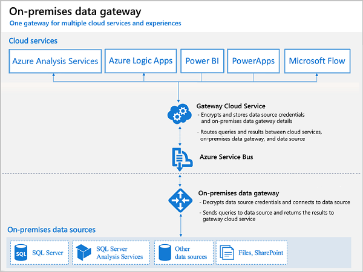

# About on-premises gateway

The on-premises gateway allows Power Apps and Power Automate to reach back to on-premises resources to support hybrid integration scenarios. The gateway leverages Azure Service Bus relay technology to security allow access to on-premises resources.

> [!div class="mx-imgBorder"] 
> 

## Gateway on-premises install

The gateway service must run on a local server in your on-premises location. The server does not have to be the same one as the resources it will proxy access to, however it should be on the same local network to reduce latency. It does however need to be able to access the target resource with as low of latency as possible. Multiple application and flow connections can use the same gateway install. You can only install one gateway on a server.

During the install the gateway is set up to use NT Service\PBIEgwService for the Windows service signin. You can switch this to a domain user or managed service account if you’d like.

You can use the same gateway in multiple environments as long as the gateway region and the environment region match. See [FAQ for regions in Power Automate](https://docs.microsoft.com/power-automate/regions-overview) 

## Gateway administration access

By default, you have this permission on any gateway that you install. As the administrator you can grant another user permission to coadministrate the gateway. It's recommended you always have multiple administrators specified to handle employee events in your organization.

## Use of stored credentials

When you set up a data source on the gateway you'll need to provide credentials for that data source. All actions to that data source will run using these credentials. Credentials are encrypted securely, using asymmetric encryption before they're stored in the cloud. The credentials are sent to the machine running the gateway on-premises where they're decrypted when the data source is accessed.

## Port usage

The gateway service creates an outbound connection to Azure Service Bus so there are no inbound ports required to be open. The outbound connection communicates on ports: TCP 443 (default), 5671, 5672 9350 through 9354.

It's recommended that you add the IP addresses to an approval list for the data region in your firewall. You can download the latest list here: https://www.microsoft.com/download/details.aspx?id=41653. These IP addresses are used for outbound communication with Azure Service Bus.

## Gateway access

Most of the Power Apps and Power Automate licenses have access to use the gateway with the exception of some of the lower end Microsoft 365 licenses (Business and Office Enterprise E1 SKUs).

## Updates to the data gateway

Updates are not auto-installed for the on-premises data gateway. It's highly encouraged to remain current with the latest data gateway version as the updates to the gateway are released on a monthly basis.

## Gateway disaster recovery

A recovery key is assigned (that is, not auto-generated) by the administrator at the time the on-premises data gateway is installed. The recovery key is required if the gateway is to be relocated to another machine, or if the gateway is to be restored. Therefore, the key should be retained where other system administrators can locate it if necessary.

### See also
[On-premises data gateway](https://docs.microsoft.com/power-bi/service-gateway-onprem)  
[On-premises server cipher suites and TLS requirements](onpremises-server-cipher-tls-requirements.md)