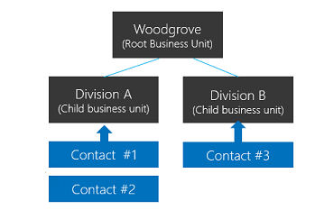
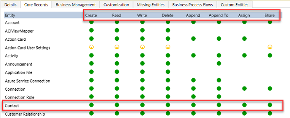

# Security concepts in Microsoft Dataverse

[!INCLUDE [cc-data-platform-banner](../includes/cc-data-platform-banner.md)]

One of the key features of [Dataverse](/powerapps/maker/common-data-service/data-platform-intro) is its rich security model that can adapt to many business usage scenarios. This security model is only in play when there is a Dataverse database in the environment. As an administrator, you likely won't be building the entire security model yourself, but will often be involved in the process of managing users and making sure they have the proper configuration as well as troubleshooting security access related issues.

## Role based security

Dataverse uses role-based security to group together a collection of privileges. These security roles can be associated directly to users, or they can be associated with Dataverse teams and business units. Users can then be associated with the team, and therefore all users associated with the team will benefit from the role. A key concept of Dataverse security to understand is all privilege grants are accumulative with the greatest amount of access prevailing. Simply put, if you gave broad organization level read access to all contact records, you can’t go back and hide a single record.

## Business Units

Business units work in conjunction with security roles to determine the effective security that a user has. Business units are a security modeling building block that helps in managing users and the data they can access. Business units define a security boundary. Every Dataverse database has a single root business unit.

You can [create child business units](https://docs.microsoft.com/power-platform/admin/create-edit-business-units) to help further segment your users and data. Every user assigned to a Dataverse environment will belong to a business unit. While business units could be used to model 1:1 a true organization hierarchy, more often they lean more towards just defined security boundaries to help achieve the security model needs.

To better understand let’s look at the following example. We have three business units. Woodgrove is the root business unit and will always be at the top, that is unchangeable. We have created two other child business units A and B. Users in these business units have very different access needs. When we associate a user with this Dataverse environment, we can set the user to be in one of these three business units. Where the user is associated will determine which business unit owns the records that user is the owner of. By having that association allows us to tailor a security role to allow the user to see all records in that business unit.

> [!div class="mx-imgBorder"] 
> 

## Entity/Record Ownership

Dataverse supports two types of record ownership. Organization owned, and User or Team owned. This is a choice that happens at the time the entity is created and can’t be changed. For security purposes, records that are organization owned, the only access level choices is either the user can perform the operation or can’t. For user and team owned records, the access level choice for most privileges are tiered Organization, Business Unit, Business Unit and Child Business Unit or only the user’s own records. That means for read privilege on contact, I could set user owned, and the user would only see their own records.

To give another example, let’s say User A is associated with Division A, and we give them Business Unit level Read access on Contact. They would be able to see Contact #1 and #2 but not Contact #3.

When you configure or edit security role privileges you are setting the access level for each option. The following is an example of the Security Role privilege editor.

> [!div class="mx-imgBorder"] 
> 

In the above you can see the standard privilege types for each entity Create, Read, Write, Delete, Append, Append To, Assign and Share. You can edit each of these individually. The visual display of each will match the key below as to what level of access you have granted.

> [!div class="mx-imgBorder"] 
> 

In the above example, we have given organization level access to Contact which means that the user in Division A could see and update contacts owned by anyone. In fact, one of the most common administrative mistakes is getting frustrated with permissions and just over granting access. Very quickly a well-crafted security model starts looking like swiss cheese (full of holes!).

## Teams

Teams are another important security building block. Teams are owned by a Business Unit. Every Business Unit has one default team that is automatically created when the Business Unit is created. The default team members are managed by Dataverse and always contain all users associated with that Business Unit. You can’t manually add or remove members from the default team, they are dynamically adjusted by the system as [new users are associated/disassociated with business units] (https://docs.microsoft.com/power-platform/admin/create-edit-business-units). There are two types of teams, owning teams and access teams. Owning Teams can own records, which gives any team member direct access to that record. Users can be members of multiple teams. This will allow it to be a powerful way of granting permissions to users in a broad way without micromanaging access at the individual user level. Access teams are discussed below as part of Record Sharing.

## Record Sharing

Individual records can be shared on a one by one basis with another user. This is a powerful way of handling exceptions that don’t fall into the record ownership or member of a business unit access model. It should be an exception though because it is a less performant way of controlling access. Sharing tougher to troubleshoot because it is not a consistently implemented access control. Sharing can be done at both the user and team level. Sharing with a team is a more efficient way of sharing. A more advanced concept of sharing is with Access Teams which provides auto creation of a team and sharing of record access with the team based on an Access Team Template (template of permissions) which is applied. Access teams can also be used without the templates, with just manual add/remove of it’s members. Access teams are more performant because they don’t allow owning records by the team or having security roles assigned to the team. Users get access because the record is shared with the team and the user is a member.

### Record-level security in Dataverse

You might be wondering – what determines access to a record? That sounds like a simple question but for any given user it is the combination of all their security roles, the business unit they are associated with, the teams they are members of and the records that are shared with them. The key thing to remember is all access is accumulative across all those concepts in the scope of a Dataverse database environment. These entitlements are only granted within a single database and are individual tracked in each Dataverse database. This all of course requires they have an appropriate license to access Dataverse.

### Field-level security in Dataverse

Sometimes record-level control of access is not adequate for some business scenarios. Dataverse has a field-level security feature to allow more granular control of security at the field level. Field-level security can be enabled on all custom fields and most system fields. Most system fields that include personal identifiable information (PII) are capable of being individually secured. Each field’s metadata defines if that is an available option for the system field.

Field-level security is enabled on a field by field basis. Access is then managed by creating a Field Security Profile. The profile contains all fields that have field-level security enabled and the access granted by that specific profile. Each field can be controlled within the profile for Create, Update and Read access. Field Security Profiles are then associated with a user or Teams to grant those privileges to the users to the records they already have access to. It’s important to note that field-level security has nothing to do with record-level security, a user must already have access to the record for the Field Security Profile to grant them any access to the fields. Field-level security should be used as needed and not excessively as it can add overhead that is detrimental if over used.

### Managing Security Across Multiple Environments

Security roles and Field Security Profiles can be packaged up and moved from one environment to the next using Dataverse solutions. Business Units and Teams must be created and managed in each Dataverse environment along with the assignment of users to the necessary security components.

### Configuring Users Environment Security

Once roles, teams and business units are created in an environment it is time to assign the users their security configurations. First, when you create a user you will associate the user with a business unit. By default, this is the root business unit in the organization. They are also added to the default team of that business unit.

In addition, you would assign any security roles that user needs. You would also add them as members of any teams. Remember teams can also have security roles, so the effective rights of the user is the combination of directly assigned security roles combined with those of any teams they are members of. Security is always additive offering the least restrictive permission of any of their entitlements. The following is a good walkthrough of [configuring environment security](database-security.md).

If you have used field-level security, you would need to associate the user or a team of the user to one of the Field Security Profiles you created.

Security is a complex topic and is best accomplished as a joint effort between the application makers and the team administering the users permissions. Any major changes should be coordinated well in advance of deploying the changes into the environment.

### See also
[Configure environment security](database-security.md)
