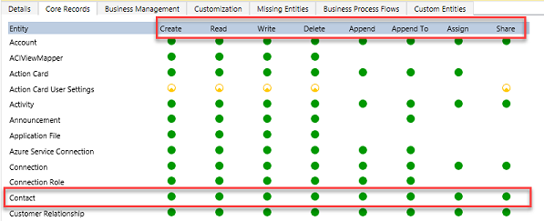
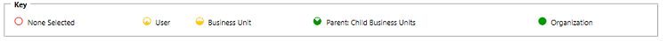

# Security concepts in Microsoft Dataverse

[Dataverse](/powerapps/maker/common-data-service/data-platform-intro) provides a rich security model that adapts to many business scenarios. The security model applies only to environments with a Dataverse database. As an admin, you often manage users, configure their security settings, and troubleshoot access issues.

> [!TIP]
> Watch [Microsoft Dataverse – Security Concepts Shown In Demos](https://youtu.be/8UWSj-vvxzU).  

## Role-based security

Dataverse uses role-based security to group privileges. You can associate these [security roles](security-roles-privileges.md) directly to users, or associate them with Dataverse teams and business units. Users can then be associated with the team, so all users associated with the team benefit from the role. A key concept of Dataverse security to understand is all privilege grants are accumulative with the greatest amount of access prevailing. If you give broad organization-level read access to all contact records, you can't go back and hide a single record.

## Business units

> [!TIP]
>  Check out the following video: [Modernize business units](https://learn-video.azurefd.net/vod/player?id=66e9e218-232d-4559-afb6-100433531b47). 

Business units and security roles determine a user's effective security. Business units define security boundaries that help manage users and the data they can access. Every Dataverse database has one root business unit.

[Create child business units](./create-edit-business-units.md) to further segment users and data. Every user in an environment belongs to a business unit. Although business units can model an organizational hierarchy one-to-one, they more often define boundaries that support your security model.

Consider an environment with three business units. Woodgrove is the root business unit and always remains at the top. Child business units A and B serve users with different access needs. Assign each user to one of these business units. The user's business unit owns the records that the user creates. Security roles grant access to records in that business unit.

### Hierarchical data access structure  

Use a tree-like organizational structure to compartmentalize users and data.  

Assign the user to one of the three business units and give the user a security role from that business unit. The user's business unit owns the records that the user creates. Configure the security role to grant access to records in that business unit. 

User A belongs to Division A and has security role Y from Division A. This role grants user A access to the Contact #1 and Contact #2 records. User B belongs to Division B and can't access Division A's contact records but can access the Contact #3 record. 

:::image type="content" source="media/example-business-unit0.png" alt-text="Diagram that shows hierarchical access to contact records by business unit." lightbox="media/example-business-unit0.png":::

### Matrix data access structure (modernized business units)

Use a tree-like organizational structure to compartmentalize data while giving users access to data from any business unit, regardless of their assigned business unit. 

Assign the user to one of the three business units. For every business unit whose data the user needs to access, assign the user a security role from that business unit. When creating a record, the user can select its owning business unit.  

User A can belong to any business unit, including the root business unit. Security role Y from Division A grants user A access to the Contact #1 and Contact #2 records. Security role Y from Division B grants user A access to the Contact #3 record. 

:::image type="content" source="media/example-business-unit.png" alt-text="Diagram that shows matrix access to contact records across business units." lightbox="media/example-business-unit.png":::

#### Enable the matrix data access structure

> [!NOTE]
> Publish all customizations before you enable this feature so that it supports every new table. If unpublished tables don't work after you turn on the feature, use the [OrgDBOrgSettings tool for Microsoft Dynamics CRM](https://support.microsoft.com/help/2691237/orgdborgsettings-tool-for-microsoft-dynamics-crm) to set **RecomputeOwnershipAcrossBusinessUnits** to true. This setting lets Dataverse set and update the [Owning Business Unit](#owning-business-unit) field.

1. Sign in to the [Power Platform admin center](https://admin.powerplatform.com) as an admin (Dynamics 365 admin or Microsoft Power Platform admin).
1. In the navigation pane, select **Manage**.
1. In the **Manage** pane, select **Environments**, and then choose the environment that you want to enable this feature for.
1. Select **Settings** > **Product** > **Features**.
1. Turn **On** the **Record ownership across business units** switch.
1. Select **Save**.

After you turn on this feature, select **Business unit** when you [assign a security role to a user](assign-security-roles.md). This selection lets you assign the user security roles from different business units. To run model-driven apps, the user also needs a security role from their assigned business unit with [user settings privileges](assign-security-roles.md#user-settings-privileges-for-record-ownership-across-business-units). See the [Basic User](database-security.md#predefined-security-roles) security role for the required privileges. 

You can assign a user as record owner in any business unit without the need to assign a security role in the record's owning business unit as long as the user has a security role that has Read privilege to the record table. See [Record Ownership in Modernized Business Units](wp-security-cds.md#record-ownership-in-modernized-business-units). 

> [!NOTE]
> This feature switch is stored in the **EnableOwnershipAcrossBusinessUnits** setting and can be set using the [OrgDBOrgSettings tool for Microsoft Dynamics CRM](https://support.microsoft.com/help/2691237/orgdborgsettings-tool-for-microsoft-dynamics-crm).

### Associate a business unit with a Microsoft Entra security group

You can use a Microsoft Entra security group to map your business unit for streamlining your user administration and role assignment.  

**Create a Microsoft Entra security group for each business unit and assign the respective business unit security role to each group team.**

:::image type="content" source="media/business-unit-with-aad-sec-group2.png" alt-text="Create a Microsoft Entra security group for each business unit.":::

For each business unit, create a Microsoft Entra security group. Create a [Dataverse group team](manage-group-teams.md) for each Microsoft Entra security group. Assign the respective security role from the business unit to each Dataverse group team. When the user accesses the environment, Dataverse creates the user in the root business unit. The user and Dataverse group teams can remain in the root business unit. Their security roles grant access only to data in the corresponding business units.  

Add users into the respective Microsoft Entra security group to grant them access to the business unit. The users can immediately run the app and access its resources/data. 

For [matrix data access](wp-security-cds.md#matrix-data-access-structure-modernized-business-units), add users to the Microsoft Entra security groups that map to the business units whose data they need.  

### Owning business unit

Each record has an **Owning Business Unit** column that identifies the business unit that owns the record. By default, the column uses the user's business unit. Users can change the value only when the feature is on. 

> [!NOTE]
> When you change which business unit owns a record, be sure to check out the following for cascade effects: [Using SDK for .NET to configure cascading behavior](/powerapps/developer/data-platform/configure-entity-relationship-cascading-behavior#using-organization-service-to-configure-cascading-behavior).

You can manage whether you want to allow your user to set the Owning Business Unit column when the feature switch is ON. To set the Owning Business Unit column, you need to grant the user's security role the Business Unit table's **Append To** privilege with local level permission.  

To let users set this column:
1. Add it to form bodies and headers.
1. Add it to views.
1. Add it to [column mappings](/powerapps/developer/data-platform/customize-entity-attribute-mappings). If you use [AutoMapEntity](/powerapps/developer/data-platform/customize-entity-attribute-mappings#auto-mapping-columns-between-tables), specify the column in the mapping. 

> [!NOTE]
> If a job or process syncs data between environments and includes **Owning Business Unit** in the schema, the job fails with a **Foreign KEY** constraint violation when the target environment lacks the same value.
> 
> Remove the **Owning Business Unit** column from the source schema, or change its source value to a business unit that exists in the target environment.
>
> If a job or process copies data to an external resource, such as Power BI, include **Owning Business Unit** only if the resource supports it.

## Table/record ownership

Dataverse supports two types of record ownership: *organization-owned* and *user- or team-owned*. You choose the ownership type when you create a table, and you can't change it later. For organization-owned records, each privilege either allows or denies an action. For records owned by a user or team, most privileges support the Organization, Business Unit, Business Unit and Child Business Unit, and User access levels. For example, setting the read privilege for contacts to User limits users to their own records.

For example, User A belongs to Division A and has business unit-level read access to contacts. User A can see Contact #1 and Contact #2, but not Contact #3.

When you configure security role privileges, you set the access level for each privilege. The following screenshot shows the security role privilege editor.

> [!div class="mx-imgBorder"] 
> 

The security role privilege editor shows the standard privilege types for each table: Create, Read, Write, Delete, Append, Append To, Assign, and Share. Edit each privilege separately. Each symbol matches an access level in the key.

> [!div class="mx-imgBorder"] 
> 

The example grants organization-level access to contacts, so a user in Division A can view and update contacts owned by anyone. Avoid granting more access than users need because doing so weakens the security model.

### Filtered table record ownership (preview)

[!INCLUDE [preview](../includes/cc-preview-features-definition.md)]

Filtered record ownership lets admins control access to Dataverse records with column-value filters. For example, grant access only to records where the `City` column equals *Redmond*. Users can create, read, update, and delete only records that match filters in their security roles.

Unlike traditional Dataverse tables, tables with filtered record ownership don't support record ownership, sharing, or assignment. Filter-based privileges control record access and provide granular row-level access without restricting tables, columns, or other model objects.

> [!NOTE]
> Use filtered record ownership to grant row-level access to records that meet filter criteria. Apply filter-based privileges to filtered record ownership tables and existing user-owned or organization-owned tables. For existing tables, this approach retains the underlying ownership model.

## Record ownership in modernized business units

In **Modernized Business units**, users can own records across business units. They need only a security role in any business unit with Read privilege for the record table. They don't need a security role in each business unit where the record resides.

If your production environment retains the preview configuration for **Record ownership across business units**, follow these steps to enable record ownership across business units:

1. Install the [Organization Settings editor](environment-database-settings.md#install-the-organizationsettingseditor-tool).
1. Set the `RecomputeOwnershipAcrossBusinessUnits` organization setting to `true`. This setting locks the system for up to five minutes while the system recomputes ownership. After recomputation, users can own records across business units without separate security roles in each business unit. Record owners can also assign their records to users outside the records' owning business units.
1. Set `AlwaysMoveRecordToOwnerBusinessUnit` to `false`. Records then remain in their original owning business units when ownership changes.

For nonproduction environments, set `AlwaysMoveRecordToOwnerBusinessUnit` to `false` to enable record ownership across business units.

> [!NOTE]
> If you turn off the **Record ownership across business units** feature or set `RecomputeOwnershipAcrossBusinessUnits` to `false` using the [OrgDBOrgSettings tool for Microsoft Dynamics CRM](https://support.microsoft.com/help/2691237/orgdborgsettings-tool-for-microsoft-dynamics-crm), you can't set or update the [Owning Business unit](wp-security-cds.md#owning-business-unit) field. The system also updates the [Owning Business Unit](#owning-business-unit) field for each record to match the owner's business unit when the values differ. 

## Teams (including [group teams](manage-group-teams.md))

Teams are security building blocks that belong to a business unit. When you create a business unit, Dataverse automatically creates its default team. Dataverse manages the default team's membership, which includes all users associated with that business unit. You can't manually add or remove members. Dataverse updates membership as [users become associated with or disassociated from business units](./create-edit-business-units.md). Dataverse supports two team types: owner teams and access teams.
- Owner teams can own records. Team members get direct access to records owned by the team. Users can belong to multiple teams, which grants broad permissions without managing access for each user.
- The next section explains access teams as part of record sharing.

## Record sharing

Share individual records with a user or team to handle exceptions that don't fit the record ownership or business unit membership access models. Use sharing sparingly because it can reduce performance and make access issues harder to troubleshoot. Sharing with a team is more efficient than sharing with individual users.

Access teams provide more advanced sharing. Dataverse automatically creates an access team and shares record access based on an access team template, which defines permissions. Access teams also support manual membership management without a template. Dataverse doesn't let access teams own records or have security roles, which improves performance. Users gain access when someone shares the record with an access team that they belong to.

### Record-level security in Dataverse

Several factors determine a user's access to a record. Dataverse combines access from the user's security roles, business unit, team memberships, and shared records. These permissions apply only within one environment's database, and Dataverse tracks them separately in each database. The user also needs an appropriate Dataverse license.

### Column-level security in Dataverse

Use column-level security when record-level access doesn't meet a business scenario's requirements. Column-level security gives you more granular control over access. It supports all custom columns and most system columns. Most system columns that contain personally identifiable information (PII) support individual security. Each system column's metadata indicates whether column-level security is available.

Enable column-level security separately for each column. Then create a column security profile to manage access. The profile lists columns that have column-level security enabled and defines create, update, and read permissions for each column. Associate the profile with users or teams to grant access to secured columns in records they can already access. Column-level security doesn't grant record-level access. Use it only when needed because excessive use can reduce performance.

### Managing security across multiple environments

Use Dataverse solutions to move security roles and column security profiles between environments. Create and manage business units and teams separately in each environment, and assign users to the required security components.

### Configure user security in an environment

After you create roles, teams, and business units in an environment, assign each user's security settings. When you create a user, associate the user with a business unit. By default, Dataverse associates the user with the organization's root business unit and adds the user to that business unit's default team.

Assign the user any required security roles, and add the user to the appropriate teams. Because teams can also have security roles, the user's effective privileges combine directly assigned roles with roles from team memberships. Dataverse applies the least restrictive permission from these privileges. For a walkthrough, see [configuring environment security](database-security.md).

If you use column-level security, associate the user or one of the user's teams with a column security profile.

Security is a complex topic. Application makers and the team that administers user permissions should collaborate on security. Coordinate major changes well before deployment.

### See also
- [Configure environment security](database-security.md)
- [Security roles and privileges](security-roles-privileges.md)
