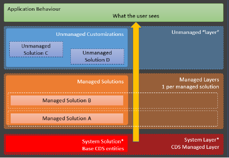
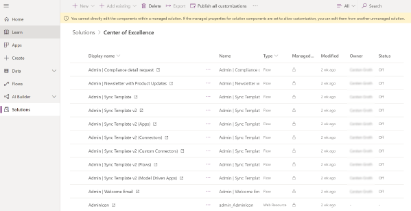
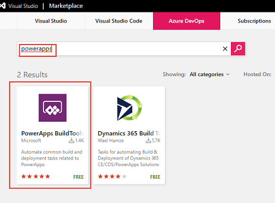
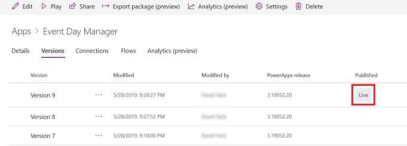
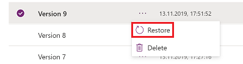
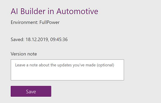
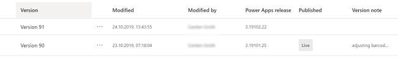
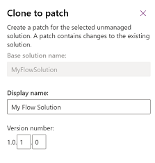

# About solution packages 

The Common Data Service Solutions Framework provides solutions as containers to track and manage customizations in a Common Data Service instance. This includes flows, canvas and model apps, entity metadata, forms, views, and other resources required to run the app including developer-compiled code assets. 

A solution starts in the Common Data Service instance where the app or a flow is created, and the container is used to track any change made to support the app or the flow. Solutions are created and authored by a publisher. Furthermore, solutions allow DevOps engineers taking care of code evaluation, code source control, and other tasks that typically would be referred to as application lifecycle management (ALM) process.

This means a solution can be exported from that Common Data Service instance for transit to other Common Data Service instances. This is commonly used to promote an application from a development instance to test and then finally to a production Common Data Service instance. Exporting and unpackaging solutions also allows source code evaluation (for instance, using a solution checker toolkit) and source code check-in to source control systems, such as Azure DevOps or LiveOps.

## Types of solutions

There are two types of solutions, *managed* and *unmanaged*. Solutions start out as unmanaged, meaning their components can be modified. Adjustments being done in terms of the Common Data Model such as added attributes to an out-of-the-box entity or creation of a new custom entity typically start off in a solution called Common Data Service Default solution.

- Unmanaged solutions are typically used in development environments while you are making configuration changes to your application. Solutions are exported as unmanaged and checked in to your source control system. Unmanaged solutions should be considered your source.

- Managed solutions are used to deploy to any environment outside of development. This includes test, UAT, SIT, and production environments. Managed solutions should be generated by a build server and considered as a build artifact. There is a manual UI guided process for creating managed solutions and manually deploying them to different environments. Managed solutions are locked down, meaning you can’t directly modify the components.

Managed solutions could be manually created by exporting an unmanaged solution and requesting it be exported as managed. That solution, when imported into another target Common Data Service instance, is then installed in a managed state. Components in the managed solution can’t be directly modified, but they can be added into another unmanaged solution that tracks changes as a separate layer. Multiple managed solutions that are installed in the same Common Data Service instance create layers that combine for what the users see as the effective set of customizations.

> [!div class="mx-imgBorder"] 
> 

## Creating Solutions

Each Power Apps environment has a default solution created automatically as an empty solution when the Common Data Service instance is created in the environment. This solution is called Common Data Service Default solution.

You can create additional unmanaged solutions directly in the Common Data Service instance and manage their components using solution explorer.

> [!div class="mx-imgBorder"] 
> 

## Installing solutions

Solutions can be installed into a Common Data Service instance if all their dependencies have been met. A solution becomes dependent when it uses something from another solution. Those dependent solutions must be installed first. Solutions can be installed directly into a target Common Data Service instance from the solution explorer. Solutions can also be deployed using the package deployer tool that can deploy a set of solutions along with data into a Common Data Service instance. Package deployer can be run interactively or from PowerShell. Package deployer is how Microsoft AppSource marketplace installs apps.

Importing a managed solution is different than importing an unmanaged solution. When you import an unmanaged solution, the changes are merged with other unmanaged changes in that Common Data Service instance. These merged changes can only be removed by manually removing each item individually. The administrator must also publish the unmanaged changes to have any non-schema (such as display labels) changes be visible to other users. Microsoft recommends using unmanaged solutions only during development. When installing into test and production environments, use managed solutions.

Solutions also could be installed using Microsoft Power Platform Build Tools for Azure DevOps. Those can be found in the AppSource Marketplace and installed from there. Think of it as the automated way of provisioning your solutions from a dev/test environment to your production environment.

> [!div class="mx-imgBorder"] 
> 

## Uninstalling solutions

Solutions are uninstalled by deleting them from the Common Data Service instance. The result of the delete action varies greatly between managed and unmanaged solutions. Because unmanaged solutions are merged with other changes, it is not possible to remove them as a unit. Removing an unmanaged solution simply removes the solution container but all the components that the solution introduced remain in the instance. The remaining components must manually be removed one by one. In fact, some unmanaged changes must be reverted manually such as a label change.

Managed solutions act more like a true uninstall, which removes all the solution components that were installed if nothing new has taken a dependency on them. This includes any data from entities that were only defined and used by that solution being removed. So, when removing solutions, be sure you no longer need the data. In many cases, you might want to first export the data before the remove/uninstall. Again, this process can be automated with the help of the Azure DevOps toolkit.

## Versioning

Saving a **canvas app** creates a new version of the application which is published for the owner of the application and anyone who has permission to edit the app. Any other user that that application is shared with will still see the “live” version. Once ready, the new version can be published by explicitly selecting the **Publish this version** link.

> [!div class="mx-imgBorder"] 
> 

In the event the new version has problems, a prior version can be restored by selecting a prior version and then selecting **Restore** next to that version or from the toolbar.

> [!div class="mx-imgBorder"] 
> 

In the example above, there are nine versions of an app. If **Restore** is clicked on Version 8, Power Apps will create a new Version 10 of the application that is identical to Version 8. In this way history and audit information is preserved and the maker could elect to return to Version 9 and fix issues at a later date. It’s important to remember that the published version is the version end users are using. This lightweight application lifecycle management (ALM) is good for productivity applications built by your organization’s users without introducing them to the additional overhead of deploying to multiple environments. As apps become more critical to the organization, you should establish more formal application lifecycle management practices. If using this lightweight ALM, we recommend also using the version notes, which is a convenient way of keeping note of what has been added or changed in that version and helps in terms of multiple developers acting on the same app. A version note can be maintained before saving a canvas application.

> [!div class="mx-imgBorder"] 
> 

Version notes can be seen and reviewed by app makers having access to the apps via application details. The versions tab provided here, would offer a column name version note.

> [!div class="mx-imgBorder"] 
> 

For **model-driven apps** there is also the concept of publish that happens after change of most visual components in the application plus a concept of versioning. For model-driven apps, though, the versioning would be done via the solution “container” by either:

- Manually cloning the solution to patch and providing a new minor version number.

  > [!div class="mx-imgBorder"] 
  > 

- Cloning the solution to a new solution and offering a new major version number, as shown in the following dialog box.

  > [!div class="mx-imgBorder"] 
  > 

For example, if you change the application navigation, users in the same environment will not see the change until the publish is complete. Restore is typically accomplished with model-driven apps by exporting a solution version and reimporting it to restore. Therefore, the concept of clone to patch or clone to solution should be understood by every maker working on or with solutions.
