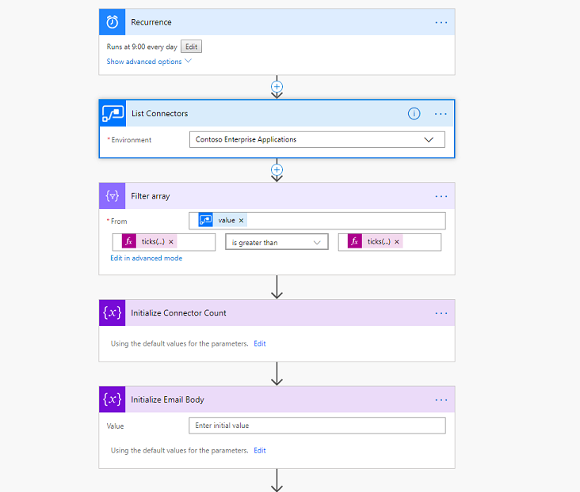

# Automation of tasks with Microsoft Power Automate 

One of the unique things about Power Automate is you can use it to manage itself along with other parts of Microsoft Power Platform. The following connectors can be helpful to automate administrator tasks with Power Automate.

|Connector  |Possible uses  |
|---------|---------|
|Power Automate Management connector   https://docs.microsoft.com/connectors/flowmanagement/     |Can be used to automate working with workflows including getting lists of new workflows or connectors in your environments.         |
| Power Automate for Admins connector   https://docs.microsoft.com/connectors/microsoftflowforadmins/  |Allows you to perform typical admin actions, such as disabling a flow or deleting a flow.   |
| Power Apps for Admins connector   https://docs.microsoft.com/connectors/powerappsforadmins/ |To set permissions on Power Apps or set permissions to a certain connector being used by this app.  |
| Power Apps for app makers connector  https://docs.microsoft.com/connectors/powerappsforappmakers/  | Can be used by makers although some actions could be admin tasks, such as settings permissions to a Power Apps app. Therefore, admins might also use this connector.    |
|Power Platform for Admins connector  https://docs.microsoft.com/connectors/powerplatformforadmins/    |To perform tasks against platform components, such as creating an environment or provisioning a Microsoft Dataverse database or creating a DLP policy for a specific environment.    |
|Microsoft 365 Users connector  https://docs.microsoft.com/connectors/office365users/     |Useful for automating actions around users. For example, you could use the connector to get the manager of a user who owns an environment to be able to send them an email for approval.         |
|Approvals connector  https://docs.microsoft.com/connectors/approvals/     | Often administrators need to get approvals and Power Automate offers a rich approval set of tasks that enable you to automate this process.        |
|Microsoft Forms   https://docs.microsoft.com/connectors/microsoftforms/     | Forms is an easy way to collect information to start an admin task. This can be combined with the Approval connector to get manager approval.        |
|Azure AD connector   https://docs.microsoft.com/connectors/azuread/     |Useful to perform tasks such as adding a user to a group or even creating the group.         |

## Common Power Automate tasks

<!--from editor: The link in this paragraph goes to "List New Microsoft Flow Connectors". Should it be "List new connectors created"? -->

*List new Microsoft Flow connectors* is a simple template you can get started with right away. It triggers daily on schedule, and uses the Power Automate Management connector to get a list of the connections in the environment and sends you an email. You can add it to your flows quickly using the template at https://us.flow.microsoft.com/galleries/public/templates/5a6ef26db3b749ed88b7afb377d11ecf/list-new-microsoft-flow-connectors/.

> [!div class="mx-imgBorder"] 
> 

If you want to try building it yourself, here is a good walkthrough of creating the flow from scratch: https://flow.microsoft.com/blog/new-flow-connector-notifications/

