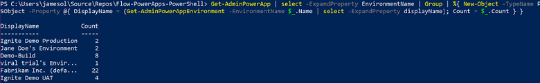

# Automation of tasks with PowerShell 

The PowerShell cmdlets allow you to do similar tasks that you would do with the admin portals but do them in scripting where you can sequentially execute multiple commands or pipe output from one to automate common tasks. Using the PowerShell cmdlets or the management connectors, you can build flows and apps that help you to implement your governance policies. There are multiple PowerShell cmdlets that you can work with. The following is an overview of each that you would likely interact with.

|PowerShell cmdlet library  |Common tasks  |
|---------|---------|
|Power Apps cmdlets <br/>[PowerShell support for Power Apps](powerapps-powershell.md)  |Designed for app makers and administrators to automate tasks with environments and associated apps, flows, and connectors.      |
|Microsoft 365 cmdlets<br/> https://docs.microsoft.com/office365/enterprise/powershell/getting-started-with-office-365-powershell    |These are focused on Microsoft 365 related tasks and can be used to automate user-related actions and tasks; for example, assignment of licenses.         |
|Dynamics 365 cmdlets<br/> https://docs.microsoft.com/powershell/dynamics365/customer-engagement/overview     |These are useful if you have any environments with Microsoft Dataverse databases. Modules include support for using the Dataverse online admin API, as well as to automate solution deployment to the Dataverse environments.         |
|Microsoft Azure cmdlets <br/> https://docs.microsoft.com/powershell/azure/overview     | The Azure cmdlets are useful if you are including any Azure components in your overall solution. This could also be used to script setup of the on-premises application gateway.        |

You can use a combination of all the above cmdlets to build PowerShell scripts to do bulk operations on users, environments or their resources.

> [!TIP]
> Examples can also be found when installing and testing the [Center of Excellence Starter Kit](../guidance/coe/starter-kit.md) or using the Admin-in-a-Day hands-on labs that can be found on GitHub ([https://aka.ms/powerapps/admininaday](https://aka.ms/powerapps/admininaday)).

## Common PowerShell tasks

**Displaying a list of environments**

```powershell
Get-AdminPowerAppEnvironment
```

This will give you key information such as the Display Name and GUID of the environment. This is often what is needed for follow-on operations.

Adding parameters such as -Default will allow you to generically find the default environment in the tenant.

```powershell
Get-AdminPowerAppEnvironment -Default
```

Using the GUID you got back (which is the non-display name for the environment), you can drill into details of that specific environment
Get-AdminPowerAppEnvironment -Environment 'EnvironmentName'.

That would produce the following detailed information:

> [!div class="mx-imgBorder"] 
> 


Another useful one is getting a list of connections in an environment. The following lists all the connections in the tenant's default environment.

```powershell
Get-AdminPowerAppEnvironment -Default | Get-AdminPowerAppConnection
```

And finally, a little more complex example. This one pipes the output from one cmdlet to others and presents a nice list of number apps in each environment in the tenant.

```powershell
    Get-AdminPowerApp | select -ExpandProperty EnvironmentName | Group | %{ New-Object -TypeName PSObject -Property @{ DisplayName = (Get-AdminPowerAppEnvironment -EnvironmentName $_.Name | select -ExpandProperty displayName); Count = $_.Count } }
```

That would produce the following detailed information:

> [!div class="mx-imgBorder"] 
> 


