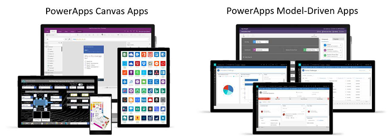
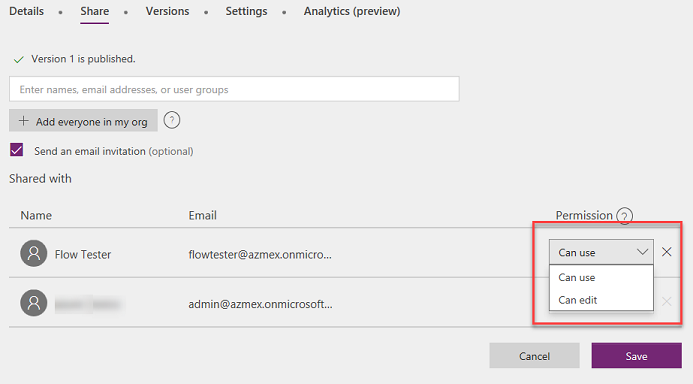
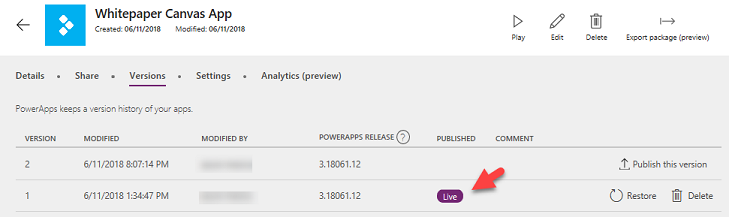
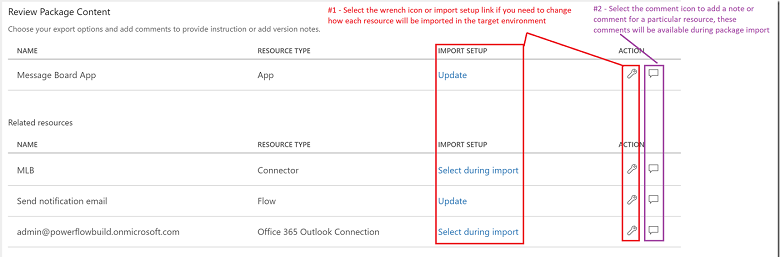

# Types of Power Apps

In the overview we hinted that there are two distinct types of applications Power Apps Canvas apps and Power Apps Model-driven apps and in this section, we will drill deeper into what you should be concerned with as an administrator. First, model-driven apps require a Common Data Service database and are built on top of the data modeled in that database environment. Model-driven apps materialize views and detail screens based on the data structure. Because of this, they offer users a more consistent look and feel from one screen to the next without much effort by the creator. Canvas apps on the other hand can be built with or without a Common Data Service database. They use connectors to access data and services. Canvas apps start with a blank screen like an artist’s canvas and the creator manually lays out each screen. This allows the creator to have complete control of placements of controls on the canvas. Regardless of the two types, apps will be built in the context of a Power Apps environment.

It is also possible as the scenarios get more complex that your solution contains both types of apps.

## User access to apps

Users obtain access to apps by having them shared with them. The technical specifics of how that sharing works is different between canvas apps and model-driven apps. For canvas apps they are shared with users, Azure AD Security Groups or with the whole organization. Model-driven apps you share by adding a user to a Common Data Service security role that is associated with the application. We will cover more on Common Data Service security roles in the Security section of this paper. The following is an example of sharing an app, where you can choose to also allow them access to edit in addition to using the app.

When you share an app the user will need access to the resources the app depends on. Some of the resources are shared automatically, others require the users you shared the app with to take action prior to use. We will cover more connectors shortly in the Connectors section.

## Application players

Both types of applications can be used as web applications from mainstream web browsers. Both types of applications can be discovered from web.powerapps.com. Users can also discover them from home.dynamics.com application list as well as in the common application navigation list. Mobile users can run the application in a device installed player app on both phones and tablet devices. 

## Versions of the application

When you save a Power Apps canvas app it creates a new version of the application and it is published for the owner of the application and anyone that has permission to edit the app. Any other user that that application is shared with will still see the “live” version. Once ready, the new version can be published by explicitly clicking on the “Publish this version” link.

In the event the new version has problems, a prior version can be restored by clicking the Restore button next to that version. In the example above, there are two versions of an app. If the Restore button is clicked on version 1, Power Apps will create a new version 3 of the application that is identical to version 1. In this way history and audit information is preserved and the maker could elect to return to version 2 and fix issues at a later date. This light weight application lifecycle management (ALM) is perfect for productivity applications built by your organizations users without introducing them to the additional overhead of deploying to multiple environments.

For model-driven applications there is also a concept of publish that happens after change of most visual components in the application. For example, if you change the application navigation, users in the same environment will not see the change until Publish is completed. Restore is typically accomplished with model-driven applications by exporting a solution version and re-importing it to restore. 

## Exporting and importing apps

Both types of applications can be exported and then re-imported into other environments, both in the same tenant and in different tenants. Both export into a zip file, however the organization of the apps are different in their respective packaging. Canvas apps export standalone and model-driven will export along with any related Common Data Service components. In the future, canvas app export functionality will be included in the Common Data Service solution framework allowing you to have one solution package that represents all the components in your application. Exporting and Importing would allow a more complete application lifecycle management (ALM) than the light weight ALM versioning we described previously.

Today, when you export a canvas app, you will choose the action that will be taken in the target environment. You can also choose to add a comment on each resource.

On import, prior to completion of the import the related resources will need to be configured to have the proper connections established in the target environment. Custom Connectors and Common Data Service customizations will need to be established prior to the import. If the Update action is chosen on import, the new version will be saved as a draft and will need to be “Published” before users will be able to use it. This allows an opportunity to test the application in the environment without impacting existing users.

## What apps already exist?

From the Admin Center admin.powerapps.com you can look at each environment and inside the Resources see a list of any apps that are associated with that particular environment.

