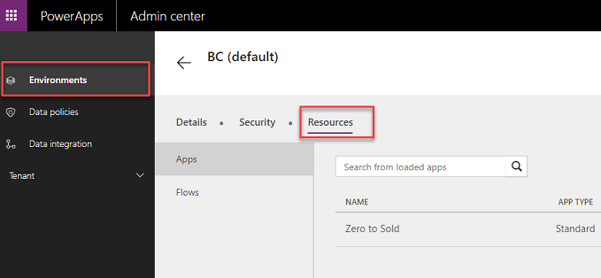
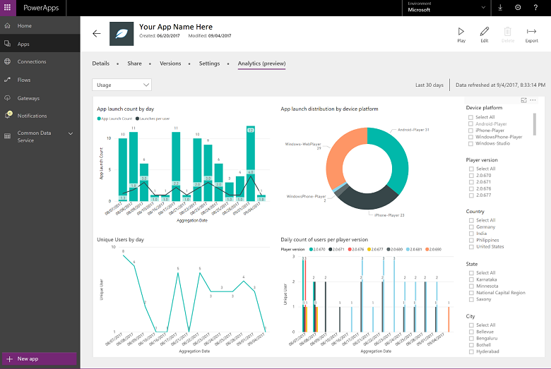
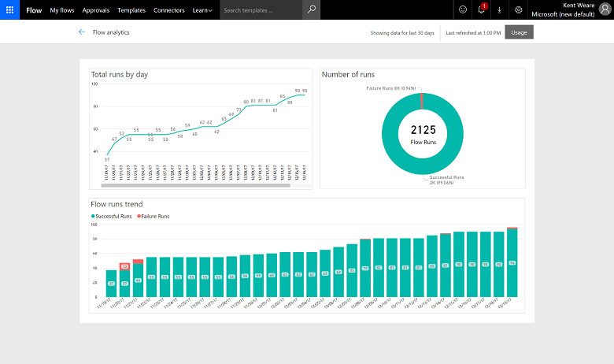

# Working with the admin portals

[!INCLUDE [cc-beta-prerelease-disclaimer](../includes/cc-beta-prerelease-disclaimer.md)]

In a perfect world as an administrator you would only visit a single portal to perform all your administrative tasks but given the scope and breadth of the different products involved and their differing release cycles, there are multiple portals with which you will interact. The following outlines the different portals and the most common tasks you perform there.

|Portal  |Common Tasks  |
|---------|---------|
|Power Platform Admin center  https://admin.powerplatform.microsoft.com     |The new unified administrative portal for Power Platform admins. Currently this portal can be used for Common Data Service Instance Management, to submit Dynamics 365 & flow focused support tickets, and to view PowerApps and Flow admin analytics. Over time the following admin experience will be migrated & replaced by the [Power Platform Admin center](https://admin.powerplatform.microsoft.com/):  <ol><li>PowerApps Admin Portal</li>   <li>Microsoft Flow Admin Portal</li>  <li>Business platform admin center</li>  <li>Dynamics 365 admin center</li> </ol>   |
|PowerApps Admin Portal  https://admin.powerapps.com     |Creating and managing environments including security starts here. Within each environment you can manage the apps and flows. Monitoring to see who is licensed and building things. Managing Data Loss Prevention Policies. Manage Common Data Service Data Integration projects. Over time this will migrated & replaced by the [Power Platform Admin center](https://admin.powerplatform.microsoft.com/).         |
|PowerApps Maker Portal  https://web.powerapps.com     |This portal is focused on building PowerApps but can also view and manage Common Data Service components, manage connectors and gateways. You can also see application statistics from details on apps here.         |
|Microsoft Flow Admin Portal https://admin.flow.microsoft.com     |This points to the same site as admin.powerapps.com. Over time this will migrated & replaced by the [Power Platform Admin center](https://admin.powerplatform.microsoft.com/).         |
|Business platform admin center  https://admin. businessplatform.microsoft.com     |This points to the same site as admin.powerapps.com. Over time this will migrated & replaced by the [Power Platform Admin center](https://admin.powerplatform.microsoft.com/).        |
|Dynamics 365 admin center https://port.crm. dynamics.com/G/manage/index.aspx     |The Dynamics 365 Admin Center, that can be leveraged to perform certain Common Data Service Environment management activities like renaming, deleting, and resetting.         |
|Dynamics 365 Instance Management  https://port.crm<N>.dynamics.com /G/Instances/InstancePicker.aspx     |This instance management portal is reached from admin.powerapps.com when managing the Common Data Service database or from the Dynamics 365 admin center. Here you will see a list of all the Common Data Service databases and can perform actions such as backup, as well as other actions on a per instance basis.         |
|Microsoft 365 admin center  https://admin.microsoft.com/AdminPortal     |Here you will manage users and their license assignment as well as you can launch into many of the individual admin centers from here.         |
|Microsoft Azure https://portal.azure.com     |Advanced Azure AD management tasks like conditional access is managed here. Also if you support any developer application registration it is also done here. This is also where you start setup of your on-premises gateways.         |
|Security & Compliance Center https://protection.office.com     |In addition to the general compliance tasks, administrators can come here to search the Audit log to see Flow audit events         |

Over the near-term future we will see consolidation of the PowerApps, Flow and the Dynamics 365 administration portals into a more unified administrative portal experience.
For partners helping their customers manage their cloud services using delegated administration capabilities you will not be able to use delegated access to the PowerApps and Flow portals. Currently, you would need to have a user in the customers tenant and assign that user a P2 license.

## Common portal tasks

**Managing Flows and Applications in an Environment**

> [!div class="mx-imgBorder"] 
> 

**View Application Analytics**

> [!div class="mx-imgBorder"] 
> 

View Flow Analytics can be found from drilling down from the list of flows.

> [!div class="mx-imgBorder"] 
> 

From here you will see the following details for that specific flow.

> [!div class="mx-imgBorder"] 
> 

