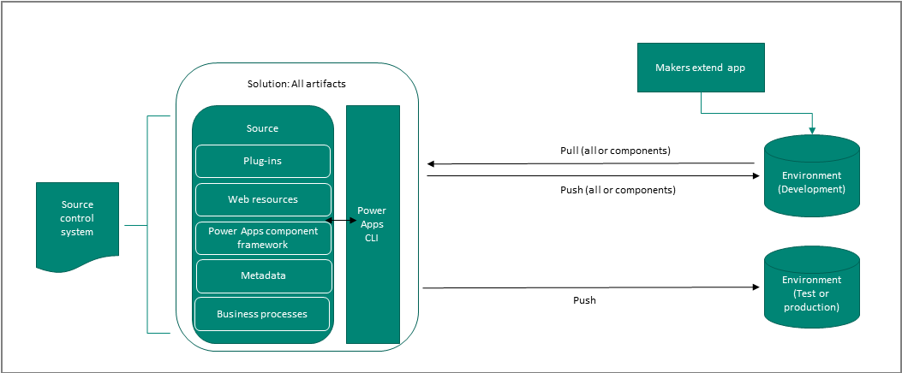

# Application lifecycle management with Power Apps basics 
This article describes the components, tools, and processes needed to implement application lifecycle management (ALM). 

## Environments
Environments are a space to store, manage, and share your organization's
business data, apps, and business processes. They also serve as containers to
separate apps that might<!--Style Guide.--> have different roles, security requirements, or target
audiences. Each environment can have only one Common Data Service database.

> [!IMPORTANT]
> When you create an environment, you can choose to install Dynamics 365 apps, such as Dynamics 365 Sales and Dynamics 365 Marketing. If you aren't building on these apps, we recommend that you not install them in your environments. This will help<!--Suggested.--> avoid dependency complications when you distribute solutions between environments.  

### Types of environments used in ALM

Using the Power Platform admin center, you can create these types of Common Data
Service environments:

-   **Sandbox**  A sandbox environment is any non-production environment of Common
    Data Service. Isolated from production, a sandbox environment is the place
    to safely develop and test application changes with low risk. Sandbox
    environments include capabilities that would be harmful in a production
    environment, such as reset, delete, and copy operations. More information:
    [Manage sandbox environments](https://docs.microsoft.com/power-platform/admin/sandbox-environments)

-   **Production**  The environment where apps and other software are put into
    operation for their intended use.

-   **Community**  The Power Apps Community Plan gives you access to Power Apps
    premium functionality, Common Data Service, and Power Automate for
    individual use. This plan is primarily meant for learning purposes or
    creating business solutions to be distributed for AppSource Test Drive.
    Although you can't share assets from a Community Plan developer environment
    with anyone else, you can participate in the Azure DevOps pipeline. A developer environment is a single-user environment, and can't be used to run or share production apps. 

Create and use an environment for specific a purpose, such as development, test,
or production.

### Who should have access? 

Define and manage the security of your resources and data in Common Data
Service. Microsoft Power Platform provides environment-level admin roles to perform
tasks. Common Data Service includes security roles that define the level of
access to apps, app components, and resources app makers and users have within
Common Data Service.

| **Environment purpose** | **Roles that have access**      | **Comments**     |
|-------------------------|---------------------------------|------------------|
| Development             | App makers and developers.       | App users shouldn't have access. Developers require at least the Environment Maker security role to create resources.       |
| Test                    | Admins and people who are testing.  | App makers, developers, and production app users shouldn't have access. Test users should have just enough privileges to perform testing. |
| Production              | Admins and app users. Users should have just enough access to perform their tasks for the apps they use. | App makers and developers shouldn't have access, or should only have user-level privileges.                                                       |

More information: 
- [Manage environment roles](https://docs.microsoft.com/power-platform/admin/environments-administration#manage-security-for-your-environments)
- [Create users and assign security roles](https://docs.microsoft.com/power-platform/admin/create-users-assign-online-security-roles) 
- [Create environments](https://docs.microsoft.com/power-platform/admin/create-environment)

### Default environment 
A single default environment is automatically created for each tenant and shared
by all users in that tenant. The tenant identifies the customer, which can have one or more Microsoft subscriptions and services associated with it. Whenever a new user signs up for Power Apps, they're automatically added to the Maker role of the default environment. The
default environment is created in the closest region to the default region of
the Azure Active Directory (Azure AD) tenant and is named: "{Azure AD tenant name} (default)"

> [!WARNING]
> By default, every user in your tenant can create and edit apps in
> a Common Data Service default environment that has a database<!--Edit okay? I take it that a default environment might NOT have a database, so "a" seemed better than "the" here.-->. We strongly
> recommend that you create environments for a specific purpose, and grant the
> appropriate roles and privileges only to those people who need them.

## Solutions
Solutions are used to transport apps and components from one environment to
another, or to apply a set of customizations to existing apps.

Solutions have these features:

-   They include metadata and certain entities with configuration data. Solutions don't contain any business data.

-   They can contain many different Microsoft Power Platform components, such as model-driven
    apps, canvas apps, site maps, flows, entities, forms, custom connectors, web
    resources, option sets, charts, and fields. Notice that not all entities can be included in a solution. For example, the account and contact entities aren't solution components.

-   They're packaged as a unit to be exported and imported to other environments, or
    deconstructed and checked into source control as source code for assets.
    Solutions are also used to apply changes to existing solutions.

-   Managed solutions are used to deploy to any environment that isn't a
    development environment for that solution. This includes test, user
    acceptance testing (UAT), system integration testing (SIT), and production
    environments. Managed solutions can be serviced (upgrade, patch, and delete)
    independently from other managed solutions in an environment. As an ALM best
    practice, managed solutions should be generated by a build server and
    considered a build artifact.

-   Updates to a managed solution are deployed to the previous version
    of the managed solution. This doesn't create an additional solution layer.
    You can't delete components by using an update.

-   A patch contains only the changes for a parent managed solution. You
    should only use patches when making small updates (similar to a hotfix) and
    you require it to possibly be uninstalled. When patches are imported,
    they're layered on top of the parent solution. You can't delete
    components by using a patch.

-   Upgrading a solution installs a new solution layer immediately above the
    base layer and any existing patches.

    -   Applying solution upgrades involves deleting all existing patches and the
        base layer.

    -   Solution upgrades will delete components that existed but are no longer
        included in the upgraded version.

More information: [Solution concepts](solution-concepts-alm.md)

## Source control
Source control, also known as version control, is a system that maintains and
securely stores software development assets and tracks changes to those assets.
Change tracking is especially important when multiple app makers and developers
are working on the same set of files. A source control system also gives you
the ability to roll back changes or restore deleted files.

A source control system helps organizations achieve healthy ALM because the
assets maintained in the source control system are the "single source of truth"&mdash;or, in other words, the single point of access and modification for your
solutions.

### Branching and merging strategy 

Nearly every source control system has some form of branching and merging
support. Branching means you diverge from the main line of development and
continue to do work without changing the main line. The process of merging
consists of combining one branch into another, such as from a development branch
into a main line branch. Some common branching strategies are trunk-based
branching, release branching, and feature branching. More information: [Adopt a Git branching strategy](https://docs.microsoft.com/azure/devops/repos/git/git-branching-guidance?view=azure-devops)

### Source control process using a solution

There are two main paths you can use when working with solutions in a source control system: 
- Export the unmanaged solution and place it as unpacked in the source control system. The build process imports the packed solution as unmanaged into a temporary build environment (sandbox environment). Then, export the solution as managed and store it as a build artifact in your source control system. 
- Export the solution as unmanaged and also export the solution as managed, and place both in the source control system. Although this method doesn't require a build environment, it does require maintaining two copies of all components (one copy of all unmanaged components from the unmanaged solution and one copy of all managed components from the managed solution).<!--note from editor: I added placeholder alt text; please make it better.-->

More information: [Build tool tasks](devops-build-tools.md#build-and-release-pipelines)

## Automation 

Automation is a key part of the application lifecycle that improves the
productivity, reliability, quality, and efficiency of ALM. Automation tools and
tasks are used to validate, export, pack, unpack, and export solutions in addition to creating and resetting sandbox environments. 

More information: [What are Power Apps build tools?](../developer/common-data-service/build-tools-overview.md)

## Team development using shared source control

It's important to consider how you and your development team will work together
to build the project. Breaking down silos and fostering views and conversations
can enable your team to deliver better software. Some tools and workflows&mdash;such as those provided in Git, GitHub, and Azure DevOps&mdash;were
designed for the express purpose of improving communication and software
quality.<!--Suggested, to avoid duplication.--> Note
that working with configurations in a solution system can create challenges for
team development. Organizations must orchestrate changes from
multiple developers to avoid merge conflicts as much as possible, because source
control systems have limitations on how merges occur. We recommend that you
avoid situations where multiple people make changes to complex components&mdash;such
as forms, flows, and canvas apps&mdash;at the same time.

More information: [Scenario 5: Supporting team development](team-development-alm.md)<!--This is how the H1 in the file is worded, but it's "Support team development" in the TOC. IS that okay?-->

## Continuous integration and deployment 

You can use any source control system and build a pipeline to start with for
continuous integration and continuous deployment (CI/CD). However, this guide
focuses on GitHub and Azure DevOps. GitHub is a development platform used by
millions of developers. Azure DevOps provides developer services to support
teams to plan work, collaborate on code development, and build and deploy
applications.

To get started, you need the following:

-   A GitHub account, where you can create a repository. If you don't have one,
    you can create one for free.

-   An Azure DevOps organization. If you don't have one, you can create one for
    free.

More information: [Create your first pipeline](https://docs.microsoft.com/azure/devops/pipelines/create-first-pipeline?view=azure-devops)

## Licensing
To create or edit apps and flows by using Power Apps and Power Automate,
respectively, users will be required to have a per-user license for Power Apps or
Power Automate or an appropriate Dynamics 365 application license. For more
information, see [Licensing overview for Microsoft Power Platform](https://docs.microsoft.com/power-platform/admin/pricing-billing-skus). We also recommend contacting your Microsoft account representative to discuss your licensing needs. 

## ALM considerations
When you consider ALM as an integral part of building apps on Microsoft Power Platform, it can drastically improve speed, reliability, and user experience of
the app. It also ensures that multiple developers, both traditional developers
writing code and citizen developers, can jointly contribute to the application
being built.

See the following articles that discuss several items to consider at the outset of any
application development: 

- [ALM environment strategy](environment-strategy-alm.md) 
- [Solution concepts](solution-concepts-alm.md)

