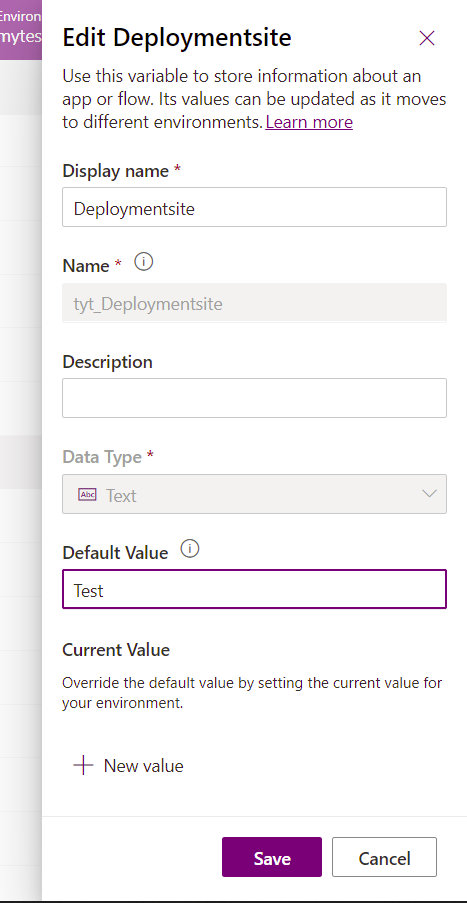

# Pre-populate connection references and environment variables for automated deployments (preview)

[This topic is pre-release documentation and is subject to change.]

*Connection references* and *environment variables* enable you to interactively specify the connection details and configuration settings specific to the target environment where your app or solution is deployed.

More information:
- [Connection reference overview](/powerapps/maker/data-platform/create-connection-reference)
- [Environment variables overview](/powerapps/maker/data-platform/environmentvariables)

After importing a solution containing connection reference and environment variable information, you are prompted to provide information specific to your environment in the UI. However, entering this information does not work well for fully automated Continuous Integration/ Continuous Delivery (CI/CD) scenarios.

To enable a fully automated deployment, you can now pre-populate the connection reference and environment variable information specific to the target environment so that you don't have to interactively provide it after importing a solution.

## Deployment settings file

To pre-populate the connection reference and environment variable information for your deployment, use the deployment settings file (JSON) to store the information, and
pass it as a parameter when importing the solution using Power Platform Build Tools. You can store the JSON file in your source control system to update and manage as required for your organization.

Below is an example of the deployment settings file:

```json
{
  "EnvironmentVariables": [
    {
      "SchemaName": "tst_Deployment_env",
      "Value": ""
    },
    {
      "SchemaName": "tst_EnvironmentType",
      "Value": ""
    }
  ],
  "ConnectionReferences": [
    {
      "LogicalName": "tst_sharedtst5fcreateuserandjob5ffeb85c4c63870282_b4cc7",
      "ConnectionId": "",
      "ConnectorId": "/providers/Microsoft.PowerApps/apis/shared_tst-5fcreateuserandjob-5ff805fab2693f57dc"
    },
    {
      "LogicalName": "tst_SharepointSiteURL",
      "ConnectionId": "",
      "ConnectorId": "/providers/Microsoft.PowerApps/apis/shared_sharepointonline"
    },
    {
      "LogicalName": "tyt_AzureDevopsConnRef",
      "ConnectionId": "",
      "ConnectorId": "/providers/Microsoft.PowerApps/apis/shared_visualstudioteamservices"
    },
    {
      "LogicalName": "tyt_GHConn",
      "ConnectionId": "",
      "ConnectorId": "/providers/Microsoft.PowerApps/apis/shared_github"
    }
  ]
}
```

In the above example JSON file, the values shown as "" are missing and will need to be populated. We will address doing that later in this article.

## Step 1: Generate the deployment settings file

The deployment setting file can be generated using the [Power Platform CLI](/powerapps/developer/data-platform/powerapps-cli). You can generate the file while exporting or cloning the solution.

### Option 1: Generate deployment settings file using create-settings property

Use the `create-settings` property with Power Platform CLI:

```powershell
C:\> pac solution create-settings –solution -zip <solution_zip_file_path> --settings-file <settings_file_name>
```

This command will generate a JSON file as shown below.

:::image type="content" source="media/cref-evar-figure3.png" alt-text="PAC CLI create-settings command with solution zip file" lightbox="media/cref-evar-figure3.png":::

In the JSON file, few values are empty in the `ConnectionReferences` section. These values need to be gathered after creating them in the target environment.

:::image type="content" source="media/cref-evar-figure4.png" alt-text="Missing connection ID" lightbox="media/cref-evar-figure4.png":::

### Option 2: Generate deployment settings file by cloning the solution

A project solution clone is needed for this step because it renders the original solution into a buildable format. After you have cloned a solution using Power Platform CLI, you get the following directory structure created on your computer:

:::image type="content" source="media/cref-evar-figure5.png" alt-text="pac solution clone result" lightbox="media/cref-evar-figure5.png":::

Proceed to create the settings file in the context of the current
folder and populate the value of the settings file as shown below.

:::image type="content" source="media/cref-evar-figure5b.png" alt-text="Populated settings file" lightbox="media/cref-evar-figure5b.png":::

## Step 2: Get the connection reference and environment variable information

To populate the deployment settings file, you will need to obtain the connection reference and environment variable information of the target solution.

### Get the connection reference information

To get the connection ID of the target environment, use one of the following ways:

- Sign in to [Power Apps](https://make.powerapps.com) and select your target environment. In the left navigation pane, select **Data** > **Connections**, select the connection you want to get the connection ID for and then look at the URL to get the connection ID.

    :::image type="content" source="media/cref-evar-figure6.png" alt-text="Connection ID captured in the URL" lightbox="media/cref-evar-figure6.png":::

- Create a canvas app on the connection reference entity. The steps are as follows:

    1. Sign in to [Power Apps](https://make.powerapps.com) and select your target environment.

    1. In the left navigation pane, select **Apps**, and then select **New app** > **Canvas**.

    1. Select Dataverse as your data source.

        :::image type="content" source="media/cref-evar-figure8.png" alt-text="Selecting a Dataverse application" lightbox="media/cref-evar-figure8.png":::

    1. Select the **Connection References** table and select **Connect**.

        :::image type="content" source="media/cref-evar-figure9.png" alt-text="Select the Connection reference table" lightbox="media/cref-evar-figure9.png":::

    1. This will create a gallery application that will list out all the connections and their connection IDs within the environment.

        :::image type="content" source="media/cref-evar-figure10.png" alt-text="Connection ID in a Power App" lightbox="media/cref-evar-figure10.png":::

### Get the environment variable information

To get the values of the environment variable in the target environment, sign in to [Power Apps](https://make.powerapps.com), select the target environment, and right-click on the ellipsis and
choose to edit. This will provide the information needed to populate the
deployment settings file (the underlined values are the values needed for the
file):



Otherwise, you can provide the appropriate value for the target environment based on your knowledge of the target environment.

## Step 3: Update the values in the deployment settings file

Manually edit the deployment settings file (JSON) to add the connection and environment variable information appropriately. Below is an example settings file with the (previously) missing values added.

```json
{
  "EnvironmentVariables": [
    {
      "SchemaName": "tst_Deployment_env",
      "Value": "Test"
    },
    {
      "SchemaName": "tst_EnvironmentType",
      "Value": "UAT"
    }
  ],
  "ConnectionReferences": [
    {
      "LogicalName": "tst_sharedtst5fcreateuserandjob5ffeb85c4c63870282_b4cc7",
      "ConnectionId": "4445162937b84457a3465d2f0c2cab7e",
      "ConnectorId": "/providers/Microsoft.PowerApps/apis/shared_tst-5fcreateuserandjob-5ff805fab2693f57dc"
    },
    {
      "LogicalName": "tst_SharepointSiteURL",
      "ConnectionId": "ef3d1cbb2c3b4e7987e02486584689d3",
      "ConnectorId": "/providers/Microsoft.PowerApps/apis/shared_sharepointonline"
    },
    {
      "LogicalName": "tyt_AzureDevopsConnRef",
      "ConnectionId": "74e578ccc24846729f32fcee83b630de",
      "ConnectorId": "/providers/Microsoft.PowerApps/apis/shared_visualstudioteamservices"
    },
    {
      "LogicalName": "tyt_GHConn",
      "ConnectionId": "d8beb0fb533442c6aee5c18ae164f13d",
      "ConnectorId": "/providers/Microsoft.PowerApps/apis/shared_github"
    }
  ]
}
```

## Step 4: Use the deployment settings file for Build Tools tasks

Pass the deployment settings file as parameter when importing the
solution into the target environment. This will create the required connection reference and environments with appropriate values upon import without having the user to interactively specify the value.

When using the [Import Solution task](/power-platform/alm/devops-build-tool-tasks#power-platform-import-solution) in Power Platform Build Tools, select **Use deployment settings file** and provide the path to the deployment settings file. Next, initiate the pipeline.

:::image type="content" source="media/cref-evar-figure13.png" alt-text="Using the deployment settings file" lightbox="media/cref-evar-figure13.png":::

### See also

[What is Microsoft Power Platform CLI?](/powerapps/developer/data-platform/powerapps-cli)  
[Microsoft Power Platform Build Tools tasks](devops-build-tool-tasks.md)

