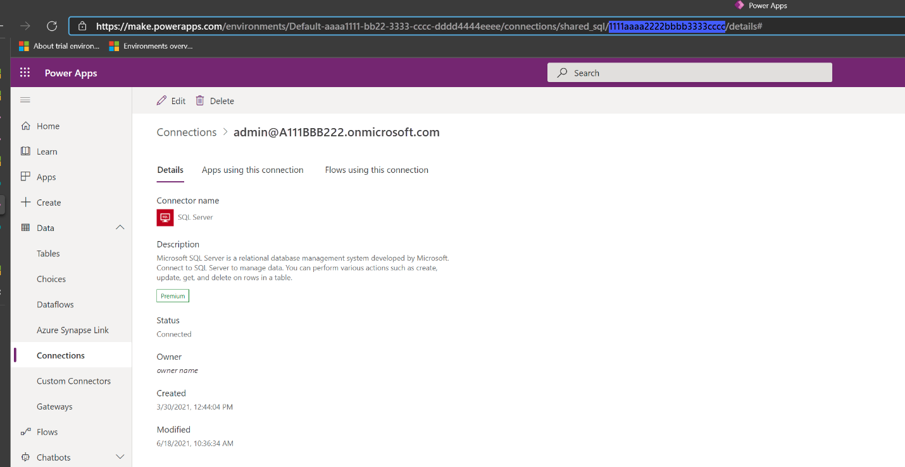
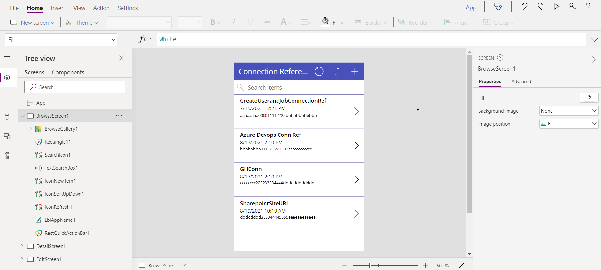

# Pre-populate connection references and environment variables for automated deployments (preview)

[This topic is pre-release documentation and is subject to change.]

*Connection references* and *environment variables* enable you to interactively specify the connection details and configuration settings specific to the target environment where your app or solution is deployed.

More information:
- [Connection reference overview](/powerapps/maker/data-platform/create-connection-reference)
- [Environment variables overview](/powerapps/maker/data-platform/environmentvariables)

After importing a solution containing connection reference and environment variable information, you are prompted to provide information specific to your environment in the UI. However, this does not work well for fully automated Continuous Integration/ Continuous Delivery (CI/CD) scenarios.

To enable a fully automated deployment, you can now pre-populate the connection reference and environment variable information specific to the target environment so that you don't have to interactively provide it after importing a solution. 

## Use the deployment settings file

To pre-populate the connection reference and environment variable information for your deployment, you can use the deployment settings file (JSON) that you can check in to source control, and
pass it as a parameter when importing the solution using Power Platform Build Tools.

Here is an example of the deployment settings file:


## Step 1: Generate the deployment settings file

The deployment setting file can be generated using the [Power Platform CLI](/powerapps/developer/data-platform/powerapps-cli). You can generate the file while exporting or cloning the solution.


### Option 1: Generate deployment settings file using create-settings property

Use the `create-settings` property with Power Platform CLI:

```
C:\> pac solution create-settings –solution-zip <path to the
solutionzipfilelocation> --settings-files <name for the settings file>
```
This will generate json file as shown here. 


In the JSON file, few values are empty in the `ConnectionReferences` section. These values need to be gathered after creating them in the target environment.


### Option 2: Generate deployment settings file by cloning the solution

After you have cloned a solution using Power Platform CLI, you get the following directory structure created on your computer:


Proceed to create the settings file in the context of the current
folder and populate the value of the settings file as shown here.


## Step 2: Get the connection reference and environment variable information

To populate the deployment settings file, you will need to obtain the connection reference and environment variable information of the target solution.

### Get the connection reference information

To get the connection id of the target environment, use one of the following ways:

- Sign in to [Power Apps](https://make.powerapps.com) and select your target environment. In the left navigation pane, select **Data** > **Connections**, select the connection you want to get the connection id for and then look at the URL to get the connection id.

    

- Create a canvas app on the connection reference entity. The steps are as follows:

    1.  Sign in to [Power Apps](https://make.powerapps.com) and select your target environment.

    1. In the left navigation pane, select Apps, and then select **New app** > **Canvas**.   

    1.  Select Dataverse as your data source.

        

    1.  Select the **Connection References** table and select connect.

        

    1.  This will create a gallery application that will list out all the
    connections and their connection ids within the environment

        

### Get the environment variable information

To get the values of the environment variable in the target environment, sign in to [Power Apps](https://make.powerapps.com), select the target environment, and right-click on the ellipsis and
choose to edit. This will provide the information needed to populate the
deployment settings file (the underlined values are the values needed for the
file):


Otherwise, you can provide the value expected to have for the target environment, update the values of the environment variables based on your knowledge of the target environment

## Step 3: Update the values in the deployment settings file

Manually edit the deployment settings file (JSON) to add the connection and environment variable information appropriately. 

## Step 4: Use the deployment settings file for Build Tools tasks 

Pass the deployment settings file as parameter when importing the
solution into the target environment. This will create the required connection reference and environments with appropriate values upon import without having the user to interactively specify the value.

When using the [Import Solution task](/power-platform/alm/devops-build-tool-tasks#power-platform-import-solution) in Power Platform Build Tools, select **Use deployment
settings file** and provide the path to the deployment settings file. Next,
initiate the pipeline.


### See also

[Microsoft Power Platform Build Tools tasks](devops-build-tool-tasks.md)

