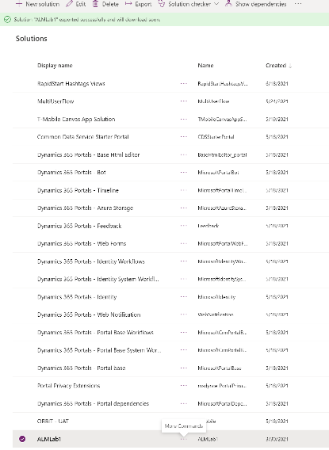
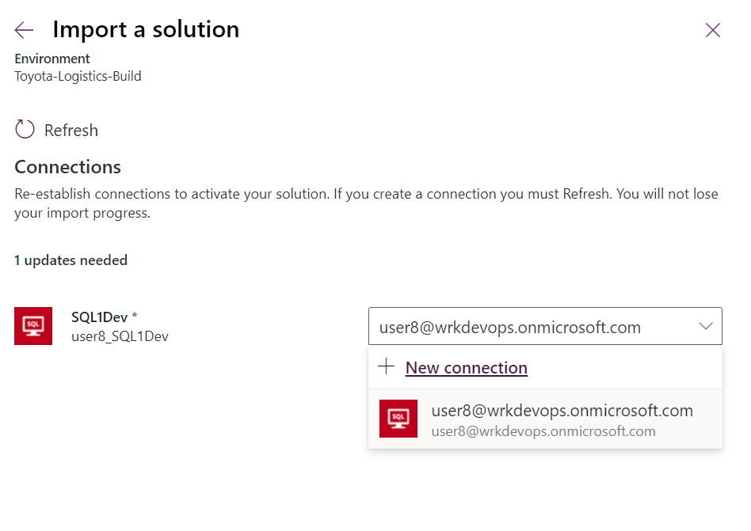
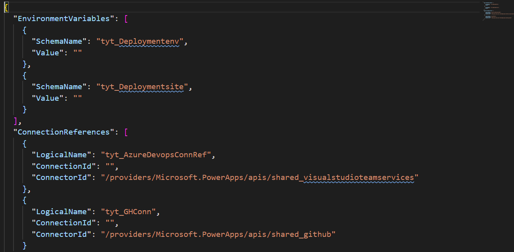
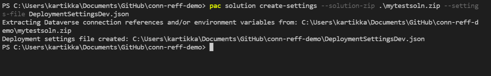
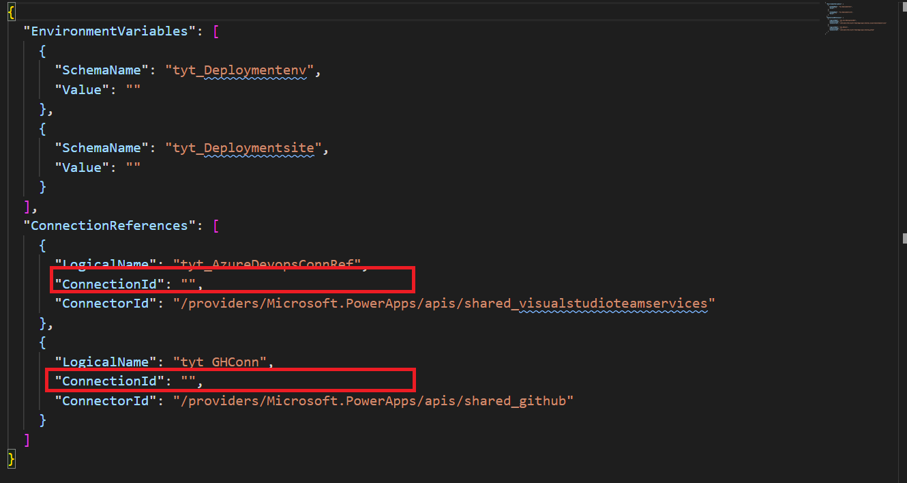
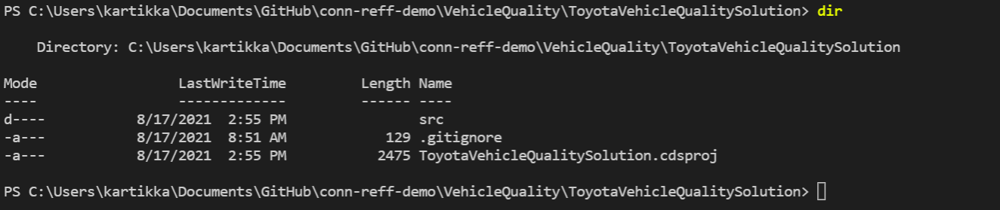

# Use connection references and environment variables

## Connection details

Not to be confused with the Connections entity in Dataverse, a **connection** is
a wrapper around an API that allows the underlying service to talk to
applications within Power Platform i.e. Power Apps, Power Automate and so on.
This **connection** wrapper does not exist in the context of a solution.

**Connection references** are a **new solution component** that add a layer of
abstraction between the **connection** and component leveraging the
**connection**.  Because **connections are unique per environment**, connection
references ensure that connections can participate in ALM by removing hard-coded
identifiers within components and allowing new connections to be associated as
you migrate solutions across environments. Mapping a connection reference to a
connection in a target environment, was recently introduced in the modern import
experience and we are now enabling an option to create the mapping in an
automated manner.

## Why are connection references important from a CI/CD perspective?

When moving your solution across environments, each environment may have
different connections to access a data source i.e. Development environment may
reference a different Azure SQL data source than the test environment. In other
words, they will both access an Azure SQL environment but with a different
connection. Now, in the context of the UI, this process is simple.

As a user I can export a solution that includes different connection references
each pointing to a different connection.

Figure 1: Interactive behavior for changing connection references upon solution
import.

When I import the solution into a different environment, the UI gives me an
option to change the connection reference to another data source that is
relevant to the target environment. As you can observe this is an interactive
capability. When doing this over a Continuous Integration/ Continuous Delivery
(CI/CD) pipeline, such interaction does not work for a fully automated CI/CD
scenarios, since there is no user interaction.

To enable a fully automated deployment, in this public preview, we provide a way
to deploy such changes in the connection reference without needing to have user
interaction. However, it does require a lot of pre-work with populated data to
make it happen and we will improve this experience over time.

## Deployment setting JSON file 

To assist in the process, for this public preview we provide the ability to
provide a deployment settings file that you can check-in to source control and
pass it as a parameter when importing the solution in your pipeline.

Figure 2: Example of a sample deployment setting files

This deployment setting files, can be generated using the power platform command
line interface (pac cli)

## How to generate the deployment settings files

### When the solution zip file is available

When using pac cli and you do a pac solution export, it will generate a zip file
for you.

Figure 3: pac cli create-settings command with solution zip file

C:\\\> pac solution create-settings –solution-zip \<path to the
solutionzipfilelocation\> --settings-files \<name for the settings file\>

This will generate json file as shown in Figure 1. If you notice in the json
file that few values are empty in the connection references section

Figure 4: Missing connection id

These values of the connection id need to be gathered, after creating them in
the target environment.

### Using the solution clone folder to generate the settings file

After you have done a pac solution clone you get the following directory
structure created on your local filesystem

Figure 5: pac solution clone result

Then you proceed to create the settings file in the context of the current
folder and populate the value of the settings file as shown in Figure 4

### How to get the connection ID for the deployment settings file

To get the connection id in the target environment, we can get such information
via various means.

To get the connection id you can either go into maker portal in your target
environment -\> select connections-\> select the connection you want to get the
connection id for and then look at the URL to get the connection id

Figure 6: Connection id captured in the URL

Or you can go directly into the target environment and query the connection
references entity:

In the query editor, select edit columns and add connection id and then click he
results button.

And now you have the connection id for the connection reference.

A simpler way to get this information, without needing to navigate a across the
power platform environment is to a create a Canvas on the connection reference
entity. The steps are as follows:

1.  Go to the maker portal in your tenant and within your target environment
    select New App-\> Canvas App

Figure 7: New Canvas App

1.  Then in the Power Apps studio environment select data verse application.

Figure 8: Selecting a dataverse application.

1.  Select the connection references Table and select connect

    

Figure 9: Select the Connection reference table

1.  This will create a gallery application that will list out all the
    connections and their connection ids within the environment

    

Figure 10: Connection id in a Power App

As you can observe there are various ways to get the connection id information
for the connections in various environments

### Environment variable information

To get the values of the environment variable in the target environment, go to
the maker portal in the target environment and right click on the ellipsis and
choose to edit. This will provide the information needed to populate the
deployment settings file (the underlined values are the values needed for the
file):

Figure 11: Values of the environment variables in the target environment

Otherwise you can provide the value expect to have for the target environment,
update the values of the environment variables based on your knowledge of the
target environment and pass the settings file as parameter when importing the
solution into the target environment. This process will create the environment
variable and assign it value upon import.

Figure 12: updating the deployment settings file with the environment variable
values

This completes the update of the deployment settings file. Now proceed to Azure
DevOps

## Azure Devops tasks

When creating your pipeline in Azure DevOps as document
[here](https://docs.microsoft.com/en-us/power-platform/alm/devops-build-tools).
When creating the import task in your pipeline select the “Use deployment
settings file” and provide the path to the deployment settings file. Once done,
initiate the pipeline

Figure 13: using the deployment settings file

### See also

[!INCLUDE[footer-include](../includes/footer-banner.md)]