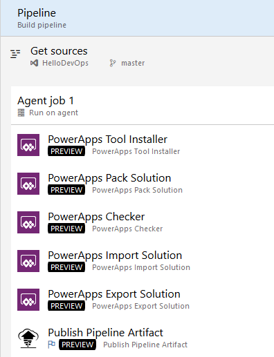

# Microsoft Power Platform Build Tools tasks

The available build tasks are described in the following sections. Afterwards, we will showcase some example Azure DevOps pipelines making use of these tasks. For information about the build tools and how to download them, see [Microsoft Power Platform Build Tools for Azure DevOps](devops-build-tools.md).

## Helper task

The available helper tasks are described below.

### Power Platform Tool Installer

This task is required to be added once before any other Power Platform Build Tools tasks in build and
release pipelines. This task installs a set of Power Platform&ndash;specific tools required
by the agent to run the Power Platform build tasks. This task doesn't require any
additional configuration when added, but contains parameters for the specific versions
of each of the tools that are being installed.
To stay up to date with the tool versions over time, make sure these parameters correspond
to the versions of the tools that are required for the pipeline to run properly.

### Power Platform WhoAmI

Verifies a Power Platform environment service connection by connecting and making a WhoAmI request. This task can be useful to include early in the pipeline, to verify connectivity before processing begins.

| Parameters    | Description   |
|---------------|---------------|
| Power Platform environment URL | The service endpoint for the environment to connect to. Defined under **Service Connections** in **Project Settings**. |

## Quality check

Below are the available tasks for checking the quality of a solution.

### Power Platform Checker

This task runs a static analysis check on your solutions
against a set of best-practice rules to identify any problematic patterns that
you might have inadvertently introduced when building your solution.

| Parameters         | Description      |
|--------------------|------------------|
| Service Connection                         | (Required) A connection to a licensed Power Platform environment is required to use the Power Platform checker.  Service connections are defined in **Service Connections** under **Project Settings** using the **Power Platform** connection type.
Note: Service Principal is the only authentication method available for the checker task so if you are using username/password for all other tasks, you will have to create a separate connection to use with the checker task. For more information on how to configure service principals to be used with this task see [Configure service principal connections for Power Platform environments](devops-build-tools.md#configure-service-connections-using-a-service-principal). |
| User default Power Platform Checker endpoint       | By default, the geographic location of the checker service will use the same geography as the environment you connect to. By un-checking the default, you have an option to specify another geo to use, for example https://japan.api.advisor.powerapps.com. For a list of available geographies, see [Use the Power Platform Checker API](https://docs.microsoft.com/powerapps/developer/common-data-service/checker/webapi/overview#determine-a-geography).|
| Location of file(s) to analyze       | (Required) Specify whether to reference a local file or a reference file from a shared access signature (SAS) URL.
Note: It is important to reference an exported solution file and not the unpacked source files in your repository. Both managed and unmanaged solution files can be analyzed. |
| Local files to analyze/SAS URI for the file to analyze | (Required) Specify the path and file name of the zip files to analyze. Wildcards can be used. For example, enter \*\*\\*.zip for all zip files in all subfolders.
If **File from SAS URI** was chosen as location of files to analyze, simply enter the SAS URI. You can add more than one SAS URI through a comma (,) or semi-colon (;) separated list.     |
| Rule set                          | (Required) Specify which rule set to apply. The following two rule sets are available:<ul><li> Solution checker: This is the same rule set that is run from the Power Apps [maker portal](https://make.powerapps.com).</li><li>AppSource: This is the extended rule set that is used to certify an application before it can be published to [AppSource](https://appsource.microsoft.com/).</li></ul>    |
| Error Level | Combined with the Error threshold parameter defines the severity of errors and warnings that are allowed. |
| Error threshold | Defines the number of errors of specified level that are allowed for the checker to pass the solutions being checked. |

## Solution tasks

This set of tasks can automate solution actions. Note that the environment tasks outlined later in this section that create, copy or restore an environment will overwrite the service connections with the newly created environments. This makes it possible to perform solution tasks against environments that are created on demand. 

### Power Platform Import Solution
Imports a solution into a target environment.

| Parameters           | Description        |
|----------------------|--------------------------|
| Authentication type | (Required) Select whether to use username/password or service principal authentication. Note that username/password does not support multi-factor authentication. |
| Service connection | (Required) The service connection to the target environment that you want to import the solution into (e.g., [https://powerappsbuildtools.crm.dynamics.com](https://powerappsbuildtools.crm.dynamics.com)).  Service connections are defined in **Service Connections** under **Project Settings** using the **Power Platform** connection type .|
 | Solution input file        | (Required) The path and file name of the solution.zip file to import into the target environment (e.g., $(Build.ArtifactStagingDirectory)\$(SolutionName).zip). 
Note: Variables give you a convenient way to get key bits of data into various parts of your pipeline. See [Use predefined variables](https://docs.microsoft.com/azure/devops/pipelines/build/variables) for a comprehensive list.  |
 | Import solution as asynchronous operation | If selected, the import operation will be performed asynchronously. This is recommended for larger solutions as this task will automatically timeout after 4 minutes otherwise. |

### Power Platform Export Solution

Exports a solution from a source environment.

| Parameters      | Description     |
|-----------------|---------------------|
| Authentication type | (Required) Select whether to use username/password or service principal authentication. Note that username/password does not support multi-factor authentication. |
| Service connection | (Required) The service connection to the source environment that you want to export the solution from.  Service connections are defined in **Service Connections** under **Project Settings** using the **Power Platform** connection type.|
| Solution name              | (Required) The name of the solution to export.
Always use the solution *Name*, not its *Display Name*.    |
| Solution output file       | (Required) The path and file name of the solution.zip file to export the source environment to (e.g., $(Build.ArtifactStagingDirectory)\$(SolutionName).zip ). 
Note: Variables give you a convenient way to get key bits of data into various parts of your pipeline. See [Use predefined variables](https://docs.microsoft.com/azure/devops/pipelines/build/variables) for a comprehensive list.   |

### Power Platform Unpack Solution

Takes a compressed solution file and decomposes it into multiple XML files so that these files can be more easily read and managed by a source control system.

| Parameters    | Description       |
|---------------|-------------------|
| Solution input file              | (Required) The path and file name of the solution.zip file to unpack.     |
| Target folder to unpack solution | (Required) The path and target folder you want to unpack the solution into.      |
| Type of solution                 | (Required) The type of solution you want to unpack. Options include: **Unmanaged** (recommended), **Managed**, and **Both**. |

### Power Platform Pack Solution

Packs a solution represented in source control into a solution.zip file that can be imported into another environment.

| Parameters       | Description     |
|------------------|-----------------|
| Solution output file              | (Required) The path and file name of the solution.zip file to pack the solution into.     |
| Source folder of solution to pack | (Required) The path and source folder of the solution to pack.      |
| Type of solution                  | (Required) The type of solution you want to pack. Options include: **Unmanaged** (recommended), **Managed**, and **Both**. |

### Power Platform Publish Customizations

Publishes all customizations in an environment.

| Parameters     | Description    |
|----------------|----------------|
| Authentication type | (Required) Select whether to use username/password or service principal authentication. Note that username/password does not support multi-factor authentication. |
| Service connection | (Required) The service connection to the environment in which you want to publish customizations. Service connections are defined in **Service Connections** under **Project Settings** using the **Power Platform** connection type. |

### Power Platform Set Solution Version

Updates the version of a solution. 

| Parameters    | Description   |
|---------------|---------------|
| Authentication type | (Required) Select whether to use username/password or service principal authentication. Note that username/password does not support multi-factor authentication. |
| Service connection | (Required) The service connection to the target environment that holds the solution you want to update.  Service connections are defined in **Service Connections** under **Project Settings** using the **Power Platform** connection type.|
| Solution name              | (Required) The name of the solution you want to set the version number for.     |
| Solution Version Number              | (Required) Version number you want to set.     |

Note that while version number can be hardcoded in the pipeline, it is recommended to use an Azure DevOps pipeline variable like [BuildId](https://docs.microsoft.com/azure/devops/pipelines/build/variables#build-variables). 
This provides options to define the exact shape of version number under the "Options" tab, for example: $(year:yyyy)-$(Date:MM)-$(Date:dd)-$(rev:rr)-3

This definition can then be used in the Set Solution Version task by setting the Version Number property with: $(Build.BuildId) instead of hard coding 20200824.0.0.2.

### Power Platform Deploy Package

Deploys a package to an environment. Deploying a [package](/powerapps/developer/common-data-service/package-deployer/create-packages-package-deployer) as opposed to a single solution file provides an option to deploy multiple solutions, data, and code into an environment.

| Parameters      | Description    |
|-----------------|----------------|
| Authentication type | (Required) Select whether to use username/password or service principal authentication. Note that username/password does not support multi-factor authentication. |
| Service connection | (Required) The service connection to the target environment into which you want to deploy the package.  Service connections are defined in **Service Connections** under **Project Settings** using the **Power Platform** connection type.|
| Package file | (Required) The path and file name of the path and file name of the package file assembly (.dll). |

## Environment management tasks

Automate common Environment Lifecycle Management (ELM) tasks.

### Power Platform Create Environment

Creates a new environment. Creating a new environment also automatically creates the BuildTools.EnvironmentUrl which will be used as default service connection for subsequent tasks in the pipeline

> [!NOTE]
> A new environment can only be provisioned if your license or capacity
> allows for the creation of additional environments. For more information on how to view capacity see [Capacity page details](https://docs.microsoft.com/power-platform/admin/capacity-storage#capacity-page-details).

| Parameters        | Description     |
|-------------------|-----------------|
| Authentication type | (Required) Select whether to use username/password or service principal authentication. Note that username/password does not support multi-factor authentication. |
| Service connection | (Required) The service connection to the tenant for which you want to create the environment. Service connections are defined in **Service Connections** under **Project Settings** using the **Power Platform** connection type.|
| Display name | (Required) The display name of the environment created. |
| Deployment Region | (Required) The region that the environment should be deployed into.         |
| Environment Type     | (Required) The type of instance to deploy. Options are **Sandbox** or **Production**.      |
| Region | (Required) The region that the environment should be created in.  |
| Currency | (Required) Base currency for the environment created. Note that the currency cannot be updated after the environment is created. |
| Language     | (Required) The base language in the environment.      |
| Domain Name       | (Required) This is the environment-specific string that forms part of the URL. For example, for an environment with the following URL: [https://powerappsbuildtasks.crm.dynamics.com](https://powerappsbuildtasks.crm.dynamics.com/), the domain name would be 'powerappsbuildtasks'. 
Note: If you enter a domain name that's already in use, the task appends a numeric value to the domain name, starting with 0. For the example above, the URL might become [https://powerappsbuildtasks0.crm.dynamics.com](https://powerappsbuildtasks0.crm.dynamics.com/). |

### Power Platform Delete Environment

Deletes an environment.

| Parameters       | Description         |
|------------------|---------------------|
| Authentication type | (Required) Select whether to use username/password or service principal authentication. Note that username/password does not support multi-factor authentication. |
| Service connection | (Required) The service connection to the tenant for which you want to delete the environment. Service connections are defined in **Service Connections** under **Project Settings** using the **Power Platform** connection type. |

### Power Platform Backup Environment

Backs up an environment.

| Parameters   | Description   |
|--------------|---------------|
| Authentication type | (Required) Select whether to use username/password or service principal authentication. Note that username/password does not support multi-factor authentication.|
| Service connection | (Required) The service connection to the tenant for which you want to back up the environment. Service connections are defined in **Service Connections** under **Project Settings** using the **Power Platform** connection type. |
| Backup label               | (Required) The label to be assigned to the backup.                                                                         |

### Power Platform Copy Environment

Copies an environment to a target environment. Two
types of copies are available: full and minimal. A *Full* copy includes both data and
solution metadata (customizations), whereas a *minimal* copy only includes solution
metadata and not the actual data. 

| Parameters     | Description     |
|----------------|-----------------|
| Authentication type | (Required) Select whether to use username/password or service principal authentication. Note that username/password does not support multi-factor authentication. |
| Service connection | (Required) The service connection for the source environment that you want to copy from. Service connections are defined in **Service Connections** under **Project Settings** using the **Power Platform** connection type. |
| Target environment URL | (Required) The URL for the target environment that you want to copy to.  | 

## Build and release pipelines

Now that we've identified what can be done using the build tools, let's see
how you might apply these tools to your build and release pipelines. A
conceptual overview is shown below. Let's view some details of the pipeline implementation using the build tool tasks in the sub-sections that follow.

To learn more about creating these pipelines and actually do hands-on pipeline
authoring using the Microsoft Power Platform Build Tools, complete the [build tools labs](https://github.com/microsoft/PowerApps-Samples/tree/master/build-tools),
which you can download from GitHub.

More information about Azure DevOps pipelines: [Use Azure Pipelines](https://docs.microsoft.com/azure/devops/pipelines/get-started/pipelines-get-started)

### Build pipeline: Export a solution from a development environment (DEV)

The following figure shows the build tool tasks that you might add to a pipeline that exports a solution from a development environment.

")

### Build pipeline: Build a managed solution

The following figure shows the build tool tasks that you might add to a pipeline that builds a managed solution.

### Release pipeline: Deploy to a production environment (PROD)

The following figure shows the build tool tasks that you might add to a pipeline that deploys to a production environment.

")

### See Also

[Microsoft Power Platform Build Tools for Azure DevOps](devops-build-tools.md)

